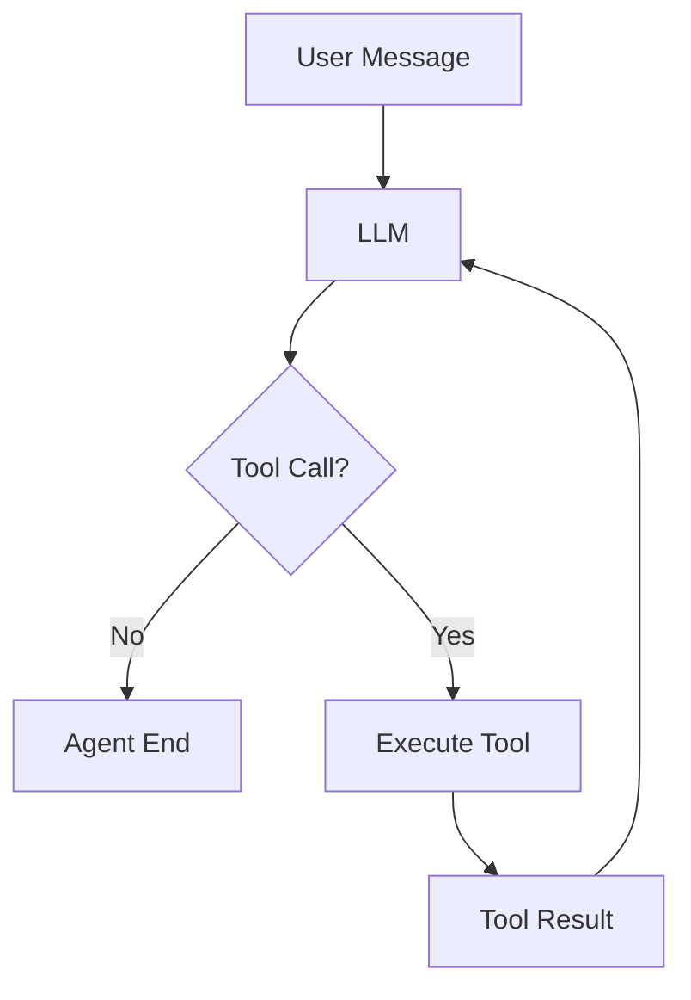

# Pi 源码学习指南

本文面向第一次阅读 `pi-mono` 源码的开发者。目标不是把所有文件读完，而是建立一条可以反复验证的主线，并通过动手实验把它转化成可以复用的心智模型：

```text
用户输入
  -> CLI / SDK
  -> AgentSession
  -> Agent
  -> Agent Loop
  -> pi-ai
  -> 模型提供商
  -> 流式事件
  -> 工具执行
  -> 下一轮模型调用
  -> TUI / Print / RPC 输出
```

Pi 是一个 monorepo，核心能力分布在多个 package 中：

| Package | 作用 | 学习重点 |
| --- | --- | --- |
| `packages/agent` | 通用有状态 Agent 运行时 + 通用 Agent Harness | Agent 状态、Agent Loop、事件、工具执行、harness、会话存储 |
| `packages/ai` | 统一 LLM 和多家模型提供商接口 | 消息类型、流式输出、工具调用、provider 适配 |
| `packages/coding-agent` | 面向终端编码场景的产品层 | 会话、认证、工具、扩展、压缩、CLI |
| `packages/tui` | 终端 UI 框架 | 组件、布局、键盘输入、差异化渲染 |
| `packages/protocol` | RPC 或跨进程通信协议 | 事件和命令的序列化 |
| `packages/client` / `packages/server` | 客户端和服务端封装 | 远程运行和集成 |

阅读顺序按下面的章节走，核心思想是：

```text
先跑 -> 再追调用链 -> 再画图 -> 再做实验 -> 再改源码 -> 最后自己重写最小版本
```

而不是"从 main.ts 第一行开始逐个文件读"。

---

## 一、先建立整体认识

### 1. Pi 的分层

可以把 Pi 看成四层：

```text
应用层       coding-agent
运行时层     agent（含 harness）
模型层       ai
展示层       tui
```

`packages/agent` 不知道终端界面长什么样；它只负责维护消息、调用模型、执行工具和发出事件。

`packages/coding-agent` 把通用 Agent 运行时组装成一个可使用的编码助手：读取项目资源、选择模型、加载扩展、创建默认工具、保存会话。

`packages/tui` 只关心如何把事件显示出来，以及如何把键盘输入转换成应用事件。

这个分层是阅读 Pi 的关键。遇到一个行为时，先问：它属于模型适配、Agent 运行时、产品组装，还是 UI？这样可以快速缩小搜索范围。

### 2. 一次普通请求的调用链

以用户输入：

```text
读取 package.json，然后告诉我项目使用什么技术栈
```

为例，核心链路如下：

1. `packages/coding-agent/src/main.ts` 解析命令行参数并创建运行环境。
2. `packages/coding-agent/src/core/sdk.ts` 的 `createAgentSession()` 创建模型运行时、资源加载器、会话管理器和 `Agent`。
3. 交互模式将输入交给 `AgentSession.prompt()`。
4. `AgentSession` 更新系统提示词、当前模型、工具和扩展上下文，然后调用底层 `Agent`。
5. `packages/agent/src/agent.ts` 的 `Agent.prompt()` 把字符串转换成 `{ role: "user", content: [...], timestamp }` 消息。
6. `Agent` 通过 `runPromptMessages()` 调用 `packages/agent/src/agent-loop.ts` 的 `agentLoop()`。
7. Agent Loop 每次调用模型前，先经过 `transformContext()`（AgentMessage[] 之间的变换），再经过 `convertToLlm()`（转换成模型能理解的 `Message[]`）。
8. Agent Loop 通过 `streamFn` 调用 `pi-ai` 的 `streamSimple()`。
9. `packages/ai/src/compat.ts` 根据 `model.provider` 选择具体 provider。
10. provider 解析 SSE 或 WebSocket 流，并统一转换成 `AssistantMessageEvent`（`start` / `text_delta` / `toolcall_delta` / `done` / `error`）。
11. 如果模型返回文本，增量通过 `message_update` 交给 UI；如果返回 tool call，Agent Loop 校验参数并执行工具。
12. 工具结果被追加到上下文，然后进入下一轮模型调用。
13. 没有新的工具调用后，Agent Loop 发出 `agent_end`，上层保存会话并更新 UI。

建议第一次阅读时只跟踪这条链，不要同时研究所有 provider、扩展和 TUI 细节。

---

## 二、环境准备

Pi 要求 Node.js `22.19.0` 或更高版本。进入 `pi` 目录执行：

```powershell
cd C:\Users\Administrator\Desktop\agent-lab\pi
npm install --ignore-scripts
npm run build:offline
```

`build:offline` 使用仓库里已有的模型数据，适合源码阅读和没有网络模型目录刷新条件的环境。

检查代码：

```powershell
npm run check
```

按仓库规则，普通源码修改后运行 `npm run check`。不要一开始运行完整测试套件；它包含可能依赖真实 provider 的测试。非 e2e 测试可以使用：

```powershell
.\test.sh
```

源码运行入口：

```powershell
.\pi-test.sh
```

如果只想观察非交互输出，可以使用 print 或 JSON 模式。具体参数查看：

```powershell
.\pi-test.sh --help
```

学习源码时优先使用 faux provider 或测试 harness，避免依赖真实 API key 和付费模型调用。

---

## 三、第一阶段：先读 Agent 与 Agent Loop

这是全文档最重要的一章。Agent Loop 是整个系统的核心，其他层（工具、事件、会话、模型）都是围绕它展开的。先掌握它，后面的章节都会变快。

### 1. `Agent` 是有状态的外壳

从 [`packages/agent/src/agent.ts`](packages/agent/src/agent.ts) 开始。

`Agent` 主要负责：

- 保存当前 `AgentState`（`systemPrompt`、`model`、`thinkingLevel`、`tools`、`messages`、`isStreaming`、`streamingMessage`、`pendingToolCalls`、`errorMessage`）
- 接收字符串或结构化消息（`prompt()` 把字符串转换成 user message，见 `normalizePromptInput()`）
- 启动和停止一次运行（`runWithLifecycle()` 管理 AbortController）
- 管理 steering 和 follow-up 两个队列
- 暴露事件订阅接口（`subscribe()`，监听器按订阅顺序被 await）
- 把配置传入底层 Agent Loop
- 维护工具执行前后的钩子（`beforeToolCall` / `afterToolCall`）

先读这些方法：

- `constructor()`
- `subscribe()`
- `prompt()`
- `continue()`
- `steer()` / `followUp()`
- `abort()` / `waitForIdle()`
- `runPromptMessages()`

不要先研究所有 compaction 和扩展逻辑。先弄清楚一次运行怎样开始和结束。

两个容易踩的语义点：

- **steering vs followUp**：steering 消息会在**当前运行的下一轮开始前**注入（内层循环每轮轮询）；followUp 消息只在 Agent **本来要结束之后**才触发新的一轮（外层循环才轮询）。
- **`continue()` 从 assistant 结束态恢复时，会先消费 steering 队列，再消费 followUp 队列**（`agent.ts:371-385`），两个队列都为空才会报错。

### 2. `agent-loop.ts` 是核心状态机

重点文件：

[`packages/agent/src/agent-loop.ts`](packages/agent/src/agent-loop.ts)

文件头注释直接说明了它的定位："Agent loop that works with AgentMessage throughout. Transforms to Message[] only at the LLM call boundary."（全程使用 AgentMessage，只在 LLM 调用边界才转成 Message[]）。

结构：

```text
agentLoop / agentLoopContinue（入口，包 EventStream）
  -> runAgentLoop / runAgentLoopContinue（发 agent_start、turn_start、prompt 的 message_start/end）
     -> runLoop（共享的主循环）
```

推荐阅读顺序：

1. `agentLoop()` —— 入口，理解 EventStream 如何以 `agent_end` 作为结束条件
2. `runAgentLoop()` —— 初始事件的发出
3. `runLoop()` —— 双层循环结构
4. `streamAssistantResponse()` —— 一次模型调用的完整过程
5. 工具准备和执行部分（`prepareToolCall` / `executeToolCallsParallel` / `executeToolCallsSequential`）
6. `shouldStopAfterTurn`、`prepareNextTurn` 等扩展点
7. 错误和 abort 处理

`runLoop()` 的实际结构是双层循环：

```text
外层循环（follow-up）:
  内层循环（tool calls + steering）:
    turn_start（第一轮不重复发，由 runAgentLoop 发过）
    -> 处理 pending 的 steering 消息
    -> 调用模型（streamAssistantResponse）
    -> stopReason 是 error / aborted？
         是 -> turn_end -> agent_end -> 结束
    -> 有 toolCall？
         stopReason 是 length -> 整个批次的工具调用按"参数可能被截断"失败
         否则 -> 校验 + 执行工具（并行或串行）
    -> 把 ToolResult 写回上下文
    -> turn_end
    -> prepareNextTurn（可换模型 / thinking level）
    -> shouldStopAfterTurn？是 -> agent_end -> 结束
    -> 取下一批 steering
  内层退出后检查 followUp 队列，非空则继续外层
  全部结束 -> agent_end
```

几个关键的精确行为：

- `streamAssistantResponse()` 内部顺序：`transformContext`（AgentMessage[] -> AgentMessage[]）-> `convertToLlm`（AgentMessage[] -> Message[]）-> `getApiKey` -> `streamFunction`。模型流式事件 `start` 映射成 `message_start`，增量映射成 `message_update`，`done`/`error` 映射成 `message_end`。
- `defaultConvertToLlm` 只保留 `user`、`assistant`、`toolResult` 三种角色的消息（`agent.ts:33-37`）。
- 工具调用数量为 0 或全部处理完后，内层循环结束；`shouldStopAfterTurn` 是给上层提前结束的钩子。
- abort 通过 AbortSignal 层层传入；`Agent.abort()` 最终让 provider 流返回 `stopReason: "aborted"` 的 assistant 消息。

### 3. 第一遍的验收问题

第一阶段只解决这几个问题：

1. 一次 Agent 运行从哪里开始？
2. 一次模型调用在哪里发生？
3. 模型返回 tool call 后发生什么？
4. toolResult 为什么会导致下一次模型调用？
5. 什么条件下 Agent Loop 结束？
6. abort / error / terminate 分别如何影响循环？

第一遍不要深入：

- Provider 请求格式
- TUI
- CLI 参数
- 完整 Extension API
- 所有 Compaction 策略

建议把每个函数归到以下几个阶段，以后读其他 Agent 框架（Codex、Claude Code、OpenCode）也可以沿用：

```text
Input / Context Prepare / Model Call / Streaming / Tool Detection
/ Tool Validation / Tool Execution / Tool Result / Next Turn / Stop
```

---

## 四、第二阶段：Event 协议

### 1. 事件是 Agent 与外部世界之间的协议

```text
Agent Runtime
     ↓
  Event Stream
  ┌────┼────────┐
  ↓    ↓        ↓
TUI   RPC      Log / Telemetry
```

也就是说：

```text
TUI ≠ Agent
RPC ≠ Agent
Print Mode ≠ Agent
```

它们只是同一套 Agent 事件的不同消费者。理解事件顺序后，TUI、RPC、日志和测试就会变成不同的事件消费者，而不是不同的 Agent 实现。

### 2. 两层事件流

Pi 有**两层**事件，这是最容易混淆的地方：

| 层 | 类型 | 定义位置 | 职责 |
| --- | --- | --- | --- |
| 模型层 | `AssistantMessageEvent` | `packages/ai/src/types.ts` | provider 流的统一抽象：`start` / `text_delta` / `thinking_*` / `toolcall_delta` / `done` / `error` |
| Agent 层 | `AgentEvent` | `packages/agent/src/types.ts` | 一次运行的生命周期：`agent_start` / `turn_start` / `message_start` / `message_update` / `message_end` / `tool_execution_start` / `tool_execution_update` / `tool_execution_end` / `turn_end` / `agent_end` |

关键细节：`message_update` 同时携带 `message`（AgentMessage 快照）和 `assistantMessageEvent`（底层增量事件），所以 UI 层既能拿到"当前完整消息"，又能拿到"本次增量"。Agent Loop 在 `streamAssistantResponse()` 里完成这层映射。

### 3. 事件顺序要自己画出来

普通文本回答（对照 `runAgentLoop` + `runLoop` + `streamAssistantResponse`）：

```text
agent_start
turn_start
message_start(user)
message_end(user)
message_start(assistant)      # 对应模型流的 start
message_update(text_delta)    # 多个增量
message_update(text_delta)
message_end(assistant)        # 对应模型流的 done
turn_end
agent_end
```

包含工具调用：

```text
agent_start
turn_start
message_start/end(user)
message_start/update/end(assistant with toolCall)
tool_execution_start          # 注意：在参数校验之前就发出
tool_execution_update         # 工具调用 update 回调时才有
tool_execution_end
message_start/end(toolResult)
turn_end
turn_start
message_start/update/end(assistant)
turn_end
agent_end
```

### 4. 必做实验：打印所有事件

```typescript
agent.subscribe((event) => {
  console.log(event.type, event);
});

await agent.prompt("Hello");
```

分别测试并记录事件顺序：

```text
普通文本回答
单工具调用
多工具调用
工具失败
abort
terminate
steering
follow-up
```

最后自己画一张 Mermaid 时序图。

---

## 五、第三阶段：工具调用

### 1. 三种概念必须区分

- **工具定义（AgentTool）**：发送给模型的 name、description、参数 schema，以及本地的 `execute` 实现
- **工具调用（AgentToolCall）**：模型返回的 name、id、arguments
- **工具结果（AgentToolResult）**：工具执行后的 content、details、isError、terminate

### 2. 精确流程

以"模型决定调用 `read` 工具"为例，对照 `agent-loop.ts`：

```text
tool_execution_start            # 最先发出
-> prepareToolCall:
     找工具（找不到 -> 立即错误结果）
     -> prepareArguments（可选）
     -> validateToolArguments（校验函数来自 pi-ai）
     -> beforeToolCall（可 block，block 可带 terminate）
-> execute（第 4 个参数是 update 回调，调用它发出 tool_execution_update）
-> afterToolCall（可覆盖 content/details/usage/isError/terminate）
-> tool_execution_end
-> createToolResultMessage
-> message_start(toolResult) / message_end(toolResult)
-> 结果按 assistant 原始顺序写回上下文
-> 下一轮模型调用
```

### 3. 四个必须记住的硬事实

1. `tool_execution_start` 在**参数校验之前**发出（`agent-loop.ts:445-452` 先 emit 再 prepareToolCall），所以校验失败的调用也有完整的 start/end 事件对。
2. 并行模式的真实语义是**校验串行、执行并行**：`prepareToolCall` 在循环里逐个执行，`execute` 通过 `Promise.all` 并行；工具结果仍按 assistant 原始顺序写回上下文（`agent-loop.ts:540-548`）。
3. `terminate: true` 的语义是**批次内所有**工具结果都 terminate 才终止批次（`shouldTerminateToolBatch`），单个 terminate 无效。
4. `stopReason === "length"`（输出被 token 上限截断）时，该消息里的所有工具调用直接按"参数可能被截断"失败，不执行（`failToolCallsFromTruncatedMessage`）。

### 4. 必做异常实验

不要只阅读，自己注册一个最小工具来验证。第一版甚至不需要真实 API：

```typescript
const getWeatherTool: AgentTool = {
  name: "get_weather",
  description: "Get the current weather for a city",
  parameters: {
    type: "object",
    properties: {
      city: { type: "string", description: "City name" },
    },
    required: ["city"],
  },
  execute: async (_toolCallId, args, _signal, _update) => {
    return {
      content: [{ type: "text", text: `合肥：28℃，晴` }],
    };
  },
};
```

注意真实签名是 `execute(toolCallId, args, signal, update)`，第四个参数是流式更新回调。

至少测试并记录每个场景的五个问题：

```text
场景：参数 JSON 错误 / 工具不存在 / 执行 throw / isError = true
     / terminate = true / 被 beforeToolCall 拦截 / 多个工具并行

每个场景回答：
- 错误发生在哪一层？
- Agent Loop 是否继续？
- 是否生成 ToolResult？
- 是否继续请求模型？
- 最终发出什么事件？
```

---

## 六、第四阶段：AgentSession 与 Harness

### 1. Agent 与 AgentSession 的区别

一句话：

```text
Agent         = 会运行（Runtime Core）
AgentSession  = 让 Agent 能作为一个真正的产品长期运行（Coding Agent Harness）
```

| Agent 关注 | AgentSession 关注 |
| --- | --- |
| messages、model、tools | session persistence、history restore |
| agent loop | system prompt、resource loading |
| events | model selection、tool configuration |
| steering、follow-up | compaction、extensions |
| | branch、retry、runtime configuration |

### 2. 从 SDK 开始

重点文件：

[`packages/coding-agent/src/core/sdk.ts`](packages/coding-agent/src/core/sdk.ts)

`createAgentSession()` 做的事情很多，但可以按四组理解：

```text
环境       cwd、agentDir、设置、项目资源
模型       ModelRuntime、认证、默认模型
会话       SessionManager、历史消息、分支
Agent      Agent、工具、system prompt、扩展钩子
```

读代码时可以在 `createAgentSession()` 里标记这四类变量。不要试图一次理解每个配置项。

**注意**：`sdk.ts` 正在被拆分。`createAgentSessionServices()` / `createAgentSessionFromServices()` 在 [`agent-session-services.ts`](packages/coding-agent/src/core/agent-session-services.ts)，`createAgentSessionRuntime()` 在 [`agent-session-runtime.ts`](packages/coding-agent/src/core/agent-session-runtime.ts)。读一个巨大函数之前，先浏览这两个文件的结构。

`sdk.ts` 里值得逐行看的一段是 `new Agent({...})`（`sdk.ts:297` 起）：它展示了产品层如何通过 `streamFn`（包装 retry、timeout、attribution header、扩展钩子）、`convertToLlm`（blockImages 包装）、`transformContext`（扩展上下文钩子）、`onPayload` / `onResponse`（provider 请求/响应钩子）把通用运行时变成编码助手。

### 3. 再读 `AgentSession`

重点文件：

[`packages/coding-agent/src/core/agent-session.ts`](packages/coding-agent/src/core/agent-session.ts)

主要关注：

- `prompt()` 如何准备一次请求
- 如何从会话恢复历史消息
- 如何更新 system prompt
- 如何启用或禁用 `read`、`write`、`edit`、`bash`
- 如何监听 Agent 事件并持久化 session entry
- 上下文过长时如何触发 compaction（`compact()`、`_autoCompactIfNeeded()`）
- 扩展如何介入 provider 请求和工具调用

`AgentSession` 是产品层和通用 Agent 层之间的适配器，是理解 Pi 功能为何这么多的关键文件。

### 4. 通用 Agent Harness（`packages/agent/src/harness/`）

这是**当前代码里最容易被遗漏的一层**：一个通用的 Agent Harness 正在从 coding-agent 上移到 pi-agent-core。它比 `AgentSession` 更抽象——没有 TUI、没有具体工具集，只有运行一个编码 Agent 所需的全部通用能力：

```text
packages/agent/src/harness/
├── agent-harness.ts        # AgentHarness 门面：lane 并发控制、TaggedError 错误族、
│                           # run / compaction / navigation / abort / queue 操作
├── reducer.ts              # 会话记录日志的恢复与一致性校验（RecordLogCorruption）
├── session/                # 会话存储：Entry / SessionTree / BranchBounds，
│                           # jsonl 落盘（jsonl/）、context 重建（context.ts）
├── compaction/             # 通用压缩（CompactionEntry.details 记录 read/modified 文件）
├── tools/                  # 通用工具集：read / write / edit / bash / image
├── skills.ts               # 技能
├── system-prompt.ts        # 系统提示词
├── prompt-templates.ts     # 提示词模板
├── telemetry.ts            # 事件遥测
├── result.ts               # TaggedError + Result 错误处理
├── events.ts / messages.ts
└── env/nodejs.ts           # 环境适配
```

读法建议：先读 `agent-harness.ts` 的公开 API 和错误类型（理解"操作"和"lane"的概念），再读 `session/` 的存储模型，最后读 `reducer.ts` 的恢复逻辑。

这一层的意义：`Agent` 回答"一轮运行怎么转"，`AgentSession` 回答"产品怎么组装"，`AgentHarness` 回答"可持久化、可恢复、可并发的编码 Agent 服务怎么抽象"。三者对照读，能看清哪些逻辑是通用的、哪些是产品特有的。

### 5. 最后读 CLI 和交互模式

入口文件：

- [`packages/coding-agent/src/main.ts`](packages/coding-agent/src/main.ts)
- `packages/coding-agent/src/modes/print-mode.ts`
- `packages/coding-agent/src/modes/rpc/`
- `packages/coding-agent/src/modes/interactive/interactive-mode.ts`

`main.ts` 负责解析参数、处理认证和创建 runtime；真正的业务操作大多已经下沉到 SDK 和 `AgentSession`。

交互模式则主要是事件消费者：它订阅 `AgentSessionEvent`，把消息、工具调用、错误和状态转换成 TUI 组件。

---

## 七、第五阶段：Context / Session / Compaction

这部分是 Coding Agent 长期运行质量的关键，值得单独一章。

### 1. 上下文从哪里来

一次模型调用前的完整变换链（对照 `streamAssistantResponse()`）：

```text
AgentContext（systemPrompt + messages + tools）
      ↓
transformContext()     AgentMessage[] -> AgentMessage[]（扩展可插入）
      ↓
convertToLlm()         AgentMessage[] -> Message[]
      ↓
Context { systemPrompt, messages, tools }
      ↓
streamSimple()
```

要点：

- `defaultConvertToLlm` 只保留 user / assistant / toolResult 三种角色；UI 消息、扩展消息和内部状态不会直接发给模型（这就是"误区 2"）。
- `coding-agent` 用自己的 `convertToLlm`（`core/messages.ts`）包装 blockImages 等产品策略。
- System Prompt 由 `AgentSession` 在每次请求前重新构造（`core/system-prompt.ts`）。

### 2. 会话恢复

`createAgentSession()` 里：`sessionManager.buildSessionContext()` 读出历史 -> 恢复 model 和 thinking level（有 model change / thinking_level_change 条目）-> 把历史消息写回 `agent.state.messages`。

### 3. Compaction 在哪一层

**在 Session / Harness 层，不在 Agent Loop，更不在 Provider 层。** Agent Loop 完全不知道压缩的存在。

`AgentSession` 里的触发点（`agent-session.ts`）：

```text
reason: "manual"      用户手动 /compact
reason: "threshold"   上下文超过阈值
reason: "overflow"    上下文溢出（compact-and-retry：删掉导致溢出的
                      assistant 消息 -> 压缩 -> 自动重试一次）
```

流程：

```text
compaction_start
-> 扩展 session_before_compact（可提供自定义压缩内容）
-> compact() 生成摘要（core/compaction/compaction.ts）
-> 保存 CompactionEntry
-> 扩展 session_compact
-> compaction_end
```

通用层 `packages/agent/src/harness/compaction/compaction.ts` 有对应的实现，并且 `CompactionEntry.details` 记录被压缩历史中 read/modified 的文件列表，供恢复和后续压缩衔接。

需要回答的问题：

```text
上下文从哪里构建？
什么时候压缩？
压缩结果怎么保存？
下一轮怎么恢复？
ToolResult 是否全部保留？
```

最好画出：

```text
Session History
      ↓
Resource / Prompt
      ↓
Transform Context
      ↓
Compaction?
  ├─ No
  └─ Yes
      ↓
Compact Summary
      ↓
LLM Context
```

### 4. 为什么这一部分重要

以后研究 Codex、Claude Code、OpenCode 等长任务 Agent 时，真正影响质量的因素往往不是单次 Prompt，而是：

```text
Context Selection / Context Compression / Context Recovery
/ Tool Result Retention / Long-running Session
```

---

## 八、第六阶段：pi-ai 模型层

### 1. 先读类型，而不是 provider 实现

推荐顺序：

1. [`packages/ai/src/types.ts`](packages/ai/src/types.ts)
2. [`packages/ai/src/models.ts`](packages/ai/src/models.ts)
3. [`packages/ai/src/models-store.ts`](packages/ai/src/models-store.ts)
4. [`packages/ai/src/compat.ts`](packages/ai/src/compat.ts)
5. [`packages/ai/src/utils/event-stream.ts`](packages/ai/src/utils/event-stream.ts)

先回答这些问题：

- `UserMessage`、`AssistantMessage`、`ToolResultMessage` 分别表示什么？
- assistant 的 content 为什么是数组，而不是单个字符串？
- `ToolCall` 包含哪些字段？工具参数什么时候还是字符串，什么时候已经解析成对象？
- `AssistantMessageEvent` 如何表示文本增量和工具调用增量？
- `Context`、`Model`、`StreamFunction` 的边界在哪里？

### 2. 理解 `streamSimple()` 的职责

[`packages/ai/src/compat.ts`](packages/ai/src/compat.ts) 的 `streamSimple()` 是一个重要的分发层：

```text
streamSimple(model, context, options)
  -> 根据 model.provider 找 provider
  -> 加入认证信息和请求选项
  -> 调用 provider.streamSimple()
  -> 返回统一的 AssistantMessageEventStream
```

它的价值是：Agent 层不需要知道 Anthropic、OpenAI、Google 的请求格式差异。学习目标不是背各家的请求字段，而是理解：

```text
为什么 Agent 层不直接调用 OpenAI？
Provider 差异在哪里被消化？
不同 SSE/WebSocket 协议最后如何变成统一 Event？
Tool Call Delta 如何统一？
```

### 3. 只选一个真实 provider 深入

不要一次阅读所有 provider。建议先选 OpenAI 兼容接口：

[`packages/ai/src/api/openai-completions.ts`](packages/ai/src/api/openai-completions.ts)

重点追踪：

```text
构造 request body
  -> 发起 HTTP 请求
  -> 解析 SSE
  -> 处理 text delta
  -> 处理 tool call delta
  -> 合并部分 JSON 参数
  -> 发出 done / error
```

读完后再对比 Anthropic：

[`packages/ai/src/api/anthropic-messages.ts`](packages/ai/src/api/anthropic-messages.ts)

你会看到 Pi 的统一抽象解决的是同一个问题：不同 provider 的流式事件协议不同，但上层需要稳定的事件模型。

### 4. faux provider

测试和动手实验优先使用 faux provider（`packages/ai/src/providers/faux.ts`），它实现了同样的 `streamSimple` 接口，可以脚本化地返回文本和 tool call，不需要真实 API key。

---

## 九、第七阶段：Extension 与 TUI

### 1. Extension 的介入点

扩展通过 AgentSession 挂载到运行时的各个边界（对照 `sdk.ts` 的 `new Agent({...})`）：

```text
before_provider_request     onPayload：修改发给 provider 的请求
after_provider_response     onResponse：观察 provider 响应
before_provider_headers     transformHeaders：修改请求头
context                      transformContext：修改进入模型的消息
beforeToolCall / afterToolCall   工具调用前后
session_before_compact / session_compact   压缩前后
```

学习方式：不要先读完整 Extension API，而是找一个扩展（`packages/coding-agent/src/extensions/`）跟踪它如何注册和触发。

### 2. TUI 是事件消费者

`packages/tui` 只处理组件、布局、键盘输入和差异化渲染。交互模式把 Agent 事件翻译成组件更新。验证方式：比较 interactive、print、RPC 三种模式——它们共享同一个 Agent 运行时，差异只发生在"如何消费事件"这一层。

### 3. 三种模式的对比实验

分别运行 interactive、print 和 RPC 模式，比较它们是否共享同一个 Agent 运行时，以及差异发生在哪一层。目标：理解"核心逻辑复用，输出适配分离"的设计。

---

## 十、如何高效搜索源码

不要按文件名随机浏览，优先从符号和事件搜索：

```powershell
rg -n "agentLoop|runAgentLoop|streamSimple|tool_execution_start|message_update" packages
```

查一个函数的调用关系：

```powershell
rg -n "createAgentSession\(|AgentSession\.prompt|agent\.prompt" packages
```

查某个事件在哪里发出、在哪里消费：

```powershell
rg -n "tool_execution_end" packages/agent packages/coding-agent
```

阅读每个函数时都记录三件事：

1. 输入状态是什么？
2. 修改了哪些状态？
3. 发出了哪些事件，下一步由谁消费？

这比只记函数名称更容易形成可复用的心智模型。

---

## 十一、七天路线：每天留下一个产物

### Day 1：跑通 + 调用链

阅读：`agent.ts`、`agent-loop.ts`

输出：`01-agent-call-chain.md`

必须画出：

```text
Agent.prompt
↓
runPromptMessages
↓
agentLoop / runAgentLoop
↓
runLoop
↓
streamAssistantResponse（transformContext -> convertToLlm -> streamFunction）
↓
LLM
```

完成标准：能从 `Agent.prompt("hello")` 一路追到模型调用。

### Day 2：Agent Loop

重点：turn、toolCall、toolResult、stop、abort、error

输出：`02-agent-loop.md`

包含一张 Mermaid：



完成标准：不看源码，可以自己解释 Agent Loop。

### Day 3：Tool Runtime

自己写一个 fake tool（参考第五章的 `get_weather`）。

输出：`03-tool-runtime/`

包含：正常工具、参数错误、执行异常、terminate、并行工具、beforeToolCall 拦截。

完成标准：能解释 Tool Definition / ToolCall / ToolResult 的区别，能回答第五章的"五个问题"。

### Day 4：Event / Streaming

打印所有事件（第四章实验）。

输出：`04-events.log`、`04-event-sequence.md`

完成标准：能解释 TUI 为什么不需要知道 Agent 内部实现。

### Day 5：AgentSession / Harness

阅读：`sdk.ts`、`agent-session.ts`、`agent-session-services.ts`、`packages/agent/src/harness/agent-harness.ts`

输出：`05-agent-session.md`

画出：

```text
AgentSession
├── Model
├── Agent
├── Tools
├── Session
├── Resource
├── Extension
└── Compaction
```

完成标准：能解释 Agent 和 AgentSession 的职责边界，并说清 AgentHarness 与二者的关系。

### Day 6：Context / Session / Compaction

输出：`06-context.md`

必须回答：上下文从哪里构建？什么时候压缩？压缩结果怎么保存？下一轮怎么恢复？

完成标准：能解释 Coding Agent 为什么可以持续几十轮甚至更久。

### Day 7：魔改 Pi

不要继续阅读，直接动手。从下面任选两个：

```text
增加自定义 Tool
增加事件耗时日志
实现 beforeToolCall 权限拦截
修改 print-mode
增加一个 faux provider test
增加 Agent Run Trace
```

输出：`07-my-pi-modification/`

完成标准：能在不破坏 Agent 核心的情况下新增一个功能。

---

## 十二、读完后的自测问题

如果下面的问题还不能回答，说明主线还没有完全掌握：

1. `Agent.prompt("hello")` 最终在哪一行触发 provider 请求？
2. `AgentMessage` 为什么不能直接全部发送给 LLM？
3. provider 返回的文本增量最终由哪个事件承载？
4. 模型返回工具调用后，参数在哪里校验？
5. 工具结果为什么会触发下一轮模型请求？
6. `AgentSession` 和 `Agent` 的职责边界是什么？
7. interactive、print、RPC 三种模式共享了哪些代码？
8. 上下文压缩发生在 Agent Loop 之前、之后，还是 session 层？
9. 如何在不修改 Agent 核心的情况下增加一个工具？
10. 如何使用 faux provider 写一个不需要真实 API key 的回归测试？
11. 如果让我脱离 Pi，实现一个最小 Agent Loop，我会怎么写？
12. 为什么 ToolResult 不能只显示给用户，而必须回到模型上下文？
13. 工具并行执行后为什么还需要保持结果顺序？
14. `AgentSession` 为什么不能简单合并进 `Agent`？
15. TUI、RPC、Print 为什么应该建立在 Event 上？
16. Compaction 为什么更适合放在 Harness / Session 层，而不是 Provider 层？
17. 如果我要增加"危险 Bash 命令审批"，应该修改 Tool、Agent Loop 还是 Extension？
18. 如果要做远程 Agent，哪些层可以直接复用？
19. 如果换成另一个 LLM Provider，Agent Loop 应不应该修改？
20. 如果上下文越来越长，什么信息应该保留，什么信息可以压缩？

一个合格的学习结果不是"看过所有文件"，而是能够从一个用户行为反向追踪完整调用链，并能在合适的层加入新功能。

---

## 十三、常见误区

### 误区 1：从 `main.ts` 第一行读到最后一行

`main.ts` 包含 CLI、认证、升级、模式选择等大量边界逻辑，不能代表 Agent 核心。先读 `agent`，再回来看 `main`。

### 误区 2：把 `AgentMessage` 当作模型消息

`AgentMessage` 可以包含 UI 消息、扩展消息和内部状态；真正发送给模型前还要经过 `transformContext()` 和 `convertToLlm()`（默认只保留 user / assistant / toolResult）。

### 误区 3：只看最终文本，不看增量事件

Pi 的交互体验、工具调用显示、RPC 输出都依赖事件流。必须理解 `message_update` 和 tool call delta，以及两层事件流的关系。

### 误区 4：一开始研究所有 provider

先深入一个 provider，再比较差异。否则会把协议差异误认为 Agent 逻辑差异。

### 误区 5：忽略测试和 faux provider

测试是最短的行为说明。特别是 `packages/agent/test`、`packages/ai/test` 和 faux provider，适合在没有真实 API 的情况下验证理解。

### 误区 6：把 harness 当成 coding-agent 独有的东西

通用 AgentHarness 正在上移到 `packages/agent/src/harness/`。学习"harness"概念时，要对照 `AgentSession`（产品组装）和 `AgentHarness`（通用能力）两层理解。

---

## 十四、读完后的下一步：pi-mini

完成主线后，不建议继续无限阅读源码。自己写一个最小版本：

```text
pi-mini/
├── src/
│   ├── agent.ts
│   ├── agent-loop.ts
│   ├── context.ts
│   ├── events.ts
│   ├── llm.ts
│   ├── session.ts
│   └── tools/
│       ├── read.ts
│       ├── write.ts
│       └── bash.ts
└── README.md
```

只实现：

```text
LLM
Agent Loop
Tool（read / write / bash）
event
session
简单 compaction
```

不要实现：

```text
复杂 TUI
大量 Provider
完整 Extension API
复杂 Authentication
所有 CLI 参数
```

目标不是复刻 Pi，而是验证：我是不是真的理解 Pi 为什么这么设计。

最后的检查标准：

```text
Model / Agent Loop / Tool Runtime / Event / Context / Session / Harness / Extension / UI
```

这九个概念，每一个都能说出：它解决什么问题、在哪个文件、对外暴露什么接口、和上下层怎么衔接。
