# AgentHarness — 实现规格说明

- [Part 0 — 概览](#part-0--orientation)
  - [0.1 这是什么](#01-what-this-is)
  - [0.2 系统模型](#02-system-model)
  - [0.3 三种存储](#03-the-three-stores)
  - [0.4 工作示例 — 一个 Slack 线程](#04-worked-example--a-slack-thread)
  - [0.5 工作示例 — 工具中途崩溃](#05-worked-example--a-crash-mid-tool)
  - [0.6 非目标](#06-non-goals)
  - [0.7 记号与源码类型](#07-notation-and-source-types)
- [Part 1 — 存储](#part-1--storage)
  - [1.1 模型](#11-the-model)
  - [1.2 身份](#12-identity)
  - [1.3 寄存器命名空间](#13-register-namespaces)
  - [1.4 事务](#14-transactions)
  - [1.5 查询](#15-queries)
  - [1.6 用量账本](#16-usage-ledger)
  - [1.7 后端](#17-backends)
  - [1.8 为什么是只写一次加寄存器](#18-why-write-once-plus-registers)
- [Part 2 — 对话树](#part-2--the-conversation-tree)
  - [2.1 条目](#21-entries)
  - [2.2 放置](#22-placement)
  - [2.3 泳道](#23-lanes)
  - [2.4 事实](#24-facts)
  - [2.5 分支查询与上下文](#25-branch-queries-and-context)
  - [2.6 分支索引](#26-the-branch-index)
  - [2.7 分叉](#27-forks)
  - [2.8 会话与仓库边界](#28-session-and-repository-boundary)
  - [2.9 精确重写](#29-the-precise-rewrite)
- [Part 3 — 操作状态机](#part-3--the-operation-state-machine)
  - [3.1 操作](#31-operations)
  - [3.2 操作状态 — 程序计数器](#32-operation-state--the-program-counter)
  - [3.3 泳道状态与当前状态有效性](#33-lane-state-and-current-state-validity)
  - [3.4 原子转移规则](#34-the-atomic-transition-rule)
  - [3.5 图](#35-the-graph)
  - [3.6 受理](#36-acceptance)
  - [3.7 助手生成](#37-assistant-generation)
  - [3.8 工具](#38-tools)
  - [3.9 摘要生成 — 压缩与导航摘要](#39-summary-generation--compaction-and-navigation-summaries)
  - [3.10 导航](#310-navigation)
  - [3.11 收件箱、队列、延迟写入](#311-inbox-queues-deferred-writes)
  - [3.12 检查点流程](#312-the-checkpoint-procedure)
  - [3.13 终止事务](#313-terminal-transactions)
- [Part 4 — 执行、恢复、中止、关闭](#part-4--execution-recovery-abort-close)
  - [4.1 解释器](#41-the-interpreter)
  - [4.2 效果边界](#42-the-effects-boundary)
  - [4.3 泳道变更线](#43-the-lane-mutation-line)
  - [4.4 恢复](#44-restore)
  - [4.5 崩溃位置与恢复策略](#45-crash-positions-and-recovery-policy)
  - [4.6 中止](#46-abort)
  - [4.7 关闭 — 受控崩溃](#47-close--a-controlled-crash)
  - [4.8 故障](#48-faults)
  - [4.9 外部定稿](#49-external-finalization)
- [Part 5 — 公开表面](#part-5--public-surface)
  - [5.1 泳道表面](#51-the-lane-surface)
  - [5.2 驱动框架](#52-the-harness)
  - [5.3 SessionTree](#53-sessiontree)
  - [5.4 快照与订阅](#54-snapshots-and-subscription)
  - [5.5 事件](#55-events)
  - [5.6 钩子](#56-hooks)
  - [5.7 智能体循环构件](#57-agent-loop-building-blocks)
  - [5.8 遥测](#58-telemetry)
- [Part 6 — 未来：分区保留（Postgres）](#part-6--future-partitioned-retention-postgres)
- [Part 7 — Schema 演进](#part-7--schema-evolution)
  - [7.1 问题](#71-the-problem)
  - [7.2 本设计为何缩小问题](#72-why-this-design-shrinks-the-problem)
  - [7.3 机制：存储版本加打开时迁移](#73-the-mechanism-storage-version-plus-migrate-on-open)
  - [7.4 迁移是全的](#74-migrations-are-total)
  - [7.5 三个地层，重述为策略](#75-the-three-strata-restated-as-policy)
- [Part 8 — 构建顺序](#part-8--build-order)
- [Part 9 — 不变量与测试](#part-9--invariants-and-tests)
  - [9.1 不变量](#91-invariants)
  - [9.2 竞争目录](#92-race-catalog)
  - [9.3 测试层级](#93-test-tiers)
- [Appendix A — 词汇表](#appendix-a--glossary)
- [Appendix B — Coding-agent v3 格式兼容性](#appendix-b--coding-agent-v3-format-compatibility)
- [Appendix C — 开放问题](#appendix-c--open-questions)

# Part 0 — 概览

## 0.1 这是什么

面向智能体对话的持久化运行时。它持久化对话与操作状态，使被打断的工作无需重复已落定的副作用即可恢复。

## 0.2 系统模型

### 会话（Session）

会话对相关工作分组，包含四个部分：

- **条目树（Entry tree）。** 条目是消息、压缩、分支摘要或应用自定义条目。条目不可变。每个分支是一条对话线索；共享的树支持分支、压缩、分叉与并行工作，同时保留历史。

  ```text
  a ── b ── c ── d
        └── e ── f
  ```

- **事实（Facts）。** 可变的、带命名空间的键值状态。内置项包括会话名称与条目标签；应用可存储自定义事实。
- **泳道（Lanes）。** 指向树的命名游标。每个会话都有 `main`。一个泳道拥有其叶节点、模型配置、队列以及至多一个操作。额外的泳道支持 Slack 线程、子代理以及基于共享历史的其它并行工作。
- **用量账本（Usage ledger）。** 会话的仅追加 token 与成本事件。

### 驱动框架与操作（Harness and operations）

会话层管理持久化数据并暴露类型化的树视图。驱动框架驱动泳道：它接受提示词、运行模型与工具步骤、管理队列、压缩或导航树、并恢复被打断的工作。它还拥有驱动框架级的可用工具与提示词资源注册表、拦截并转换执行的钩子、报告活动与持久化变更的被动事件，以及运行时配置。

**操作（operation）** 是一个已受理的泳道工作单元：一次运行、压缩或导航。其不可变元数据记录身份、意图与起点；其完整当前状态记录阶段、控制、队列与恢复数据。每次持久化转移都替换当前状态。完成会移除操作状态并记录泳道结果。

### 存储（Storage）

在会话与驱动框架之下，`Storage` 暴露原子事务以及对三种持久化形式的查询：不可变条目、可变寄存器、仅追加用量行。寄存器构成可变的、带命名空间的键值存储。事实存放于此；内部驱动框架命名空间持久化待处理内容，以及崩溃恢复所需的泳道与操作状态。特别是，`op.meta` 随操作的元数据写入一次，而 `op.state` 在每次转移后被其完整当前状态替换。终止事务删除两者并写入 `lane.lastResult`。不存在可见的部分事务。

## 0.3 三种存储

第 1–5 部分中的一切皆由此推演而来。

**1. 三种存储，一条不变量。** 一切持久化内容必属其一：

```text
entries       对话树 — 只写一次，仅追加
registers     当前可变状态 — 命名空间类型化单元，覆写或删除
usage ledger  成本历史 — 仅追加行
```

*每条负载都位于一个条目、一个寄存器或账本中；没有第三个去处。* 条目是完整的对话记录——放置信息与负载在同一行。寄存器直接持有其当前类型化值；覆写丢弃旧值，删除移除键。在树中有位置之前就已持久化存在的内容（排队输入、延迟写入）在 `pending.entry` 寄存器中等待，并在放置它的事务中成为条目。各后端的投影——分支索引、全文搜索、统计——可由三种存储重建，不携带权威性。

**2. 原子事务。** 事务是一组条目插入、用量插入与寄存器写入（set 或 delete），全有或全无地提交，且序号严格递增。事务内部不存在崩溃状态。这是唯一的写入原语。

**3. 持久化程序计数器。** 每步之后，驱动框架覆写一个寄存器——`op.state/{operationId}`——写入操作的*完整*当前状态。恢复不重放日志、也不从缺失处推断位置；它读取该寄存器并据此分派。状态是*完全的*——它从不依赖先前状态。小的捕获值（配置、流选项、重试策略）内联；大的稳定负载位于同级的 `op.*` 寄存器中，或以 id 命名。操作结束时，终止事务删除其寄存器：一个已完成的会话恰好持有对话、账本以及少量泳道与事实寄存器。没有死状态需要回收。

**4. 效果三明治（effect sandwich）。** 提供方请求与真实工具调用被两次提交包裹：

```
commit:  "即将做 X；其输出将使用 id R 和 U"          ← 意图
         做 X                                         ← 不确定部分
commit:  输出 + 用量 + 下一状态                       ← 结算
```

钩子改而遵循其重放契约：结果在消费它的事务中持久化，而该事务之前的崩溃可能重跑钩子。因此每个外部效果仍可在无持久化结算的情况下发生。提供方/工具意图在重放策略依赖处使这种不确定性显式化；幂等钩子将其接受为非目标。

## 0.4 工作示例 — 一个 Slack 线程

用户在一个已有 400 条历史条目的频道中发帖。应用为该线程创建一个泳道，锚定在频道的当前叶节点。条目 id 是 UUIDv7（§1.2）；示例对其缩写。

```
harness.createLane("slack:1719432.0021", at: "0195c8d1-4a2e-7b31-…")
lane.prompt("what changed in auth last week?")
```

按顺序发生的事情：

1. **受理（Acceptance）。** 驱动框架验证、运行 `before_run` 钩子并提交一个事务：用户消息条目、操作的 `op.meta` 寄存器及其首个 `op.state`——*"我处于检查点，需要一个助手响应。"*
2. **意图（Intent）。** 在内部就绪状态提交后，它提交请求意图：*"我即将发起提供方请求。响应将是条目 `0195c8d1-53a0-7c44-…`，用量行将是 `0195c8d1-53a0-7d18-…`。"* 两个 id 现在就已铸造；尚未发送任何内容。
3. **请求。** 流式传输发生。这是唯一不持久化的部分。
4. **结算（Settlement）。** 一个事务提交响应条目、其用量行与下一状态：*"响应带有工具调用；这是批计划，结果 id 已分配。"*
5. 工具调用遵循同样的意图 → 效果 → 结算形态，每对一个提交。
6. 当模型不带工具调用而停止时，终止事务删除操作的寄存器、在 `lane.lastResult` 中记录结果、并使泳道空闲。

作为轨迹（id 缩写；每个 `TX[...]` 是一次原子提交）：

```text
TX[ insert entry n1 (user msg), upsert op.meta/O, upsert op.state/O = checkpoint,
    upsert lane.leaf = n1, upsert lane.state = { currentOperationId: O } ]
TX[ upsert op.state/O = assistant ready (config snapshot) ]
TX[ upsert op.state/O = effect_pending (reserves response n2, usage u1) ]
… provider streams …                                  ← 不确定窗口
TX[ insert entry n2, insert usage u1, upsert lane.leaf = n2,
    upsert op.state/O = tools (result id n3 reserved) ]
TX[ upsert op.tool_args/O:s1:0, upsert op.state/O = call 0 effect_pending ]
… tool runs …
TX[ insert entry n3, upsert lane.leaf = n3, upsert op.state/O = checkpoint ]
… 第二轮：ready · intent · stream · settle（n4, u2）…
TX[ delete op.meta/O, op.state/O, op.tool_args/O:*,
    upsert lane.lastResult = { O, completed, n4 },
    upsert lane.state = { currentOperationId: null } ]
```

在这两个事务中的任何一处杀死进程并重启。驱动框架读取泳道的寄存器，精确看到哪些语句是最后提交的，然后继续。如果它在步骤 3 中死亡，它知道请求可能已被计费、且可能已产生也可能未产生输出——这是整个系统中唯一真正不确定的窗口，且有既定政策处理。

与此同时，同一频道中的第二个线程正基于相同的 400 条共享历史运行自己的泳道，两者之间没有协调。

## 0.5 工作示例 — 工具中途崩溃

```
lane.prompt("delete the stale migrations and run the test suite")
```

模型返回两个工具调用。驱动框架提交批计划，然后提交 `调用 0 即将执行，使用这些精确参数，并声明自身不可安全重放`。工具开始删除文件。进程被杀死。

```text
TX[ insert entry n2 (assistant, 2 calls), insert usage u1, upsert lane.leaf = n2,
    upsert op.state/O = tools (result ids n3, n4 reserved) ]
TX[ upsert op.tool_args/O:s1:0, upsert op.state/O = call 0 effect_pending,
                                                    replay: "never" ]
… tool deletes files …  ← CRASH
```

重启时，驱动框架读取一个寄存器，发现 `calls[0].status = "effect_pending", replay = "never"`。它不重跑删除。它在效果开始前已预留的结果 id 下追加一个合成的错误结果，将调用标记为完成，并继续调用 1：

```text
TX[ insert entry n3 (synthetic "interrupted" result), upsert lane.leaf = n3,
    upsert op.state/O = call 0 completed ]
```

对话保持连贯——每个工具调用都有结果——且没有任何东西运行两次。

若工具声明了 `replay: "safe"`（一次读取、一次查询），驱动框架会用持久化的参数重新执行它。

## 0.6 非目标

- **外部效果恰好一次。** 见上文。带自身副作用的钩子必须幂等，以操作 id 为键。
- **提供方流恢复。** 部分流是进程本地的，从不持久化。已结算的响应在任何东西将其分类之前被*完整*持久化。
- **多写入者。** 每会话一个进程。服务层据此路由，SQLite 后端用带围栏的租约（§1.7）强制此规则。泳道覆盖了看似多写入者的工作负载。
- **复制。** 一个会话只存在于一个地方。
- **持久化写入历史。** 寄存器只持有当前值：被覆写的寄存器就此消失，没有任何 API 或表暴露写入历史。测试中的写入顺序断言使用包裹 `commit()` 的插桩存储装饰器（Part 9）；生产审计属于遥测层（§5.8）。
- **删除作为运行时特性。** 条目与用量行从不删除：压缩改变的是提供方上下文而非存储，终止清理只删除寄存器。注意 `retainedTail` 会把旧消息向前复制进更新的压缩条目、摘要源自旧内容，因此压缩也不是擦除。合规级的"擦除它"是管理性的精确重写（§2.9），是唯一被认可的例外。

## 0.7 记号与源码类型

- `TX[ a, b, c ]` — 一次原子提交，包含按顺序的写入 `a`、`b`、`c`。写入词汇为 `insert entry`、`insert usage`、`upsert namespace/key = value` 与 `delete namespace/key`。
- id 是 UUIDv7（§1.2）。示例缩写它们：短标签——`e_*` 条目 id、`u_*` 用量 id、`op_*` 操作 id——在时间前缀无关处代表完整 id；前缀重要处示例会展示（`0195c8d1-4a2e-7b31-…`）。
- `S(next)` — 用下一完整操作状态覆写 `op.state/{operationId}` 寄存器。`L(next)` — 对 `lane.state/{lane}` 同理。
- **must / must not** 是规范性的。其余皆为解释。

源码类型出处：

- `AgentMessage`、`AgentTool`、`AgentToolResult`、`QueueMode` 与 `ThinkingLevel`：`packages/agent/src/types.ts`。
- `AgentEventSink`：`packages/agent/src/agent-loop.ts`。
- `Skill`、`PromptTemplate`、`AgentHarnessResources`（下文 `Resources`）、`AgentHarnessTool`、`AgentHarnessStreamOptions` 与 `AgentHarnessStreamOptionsPatch`：`packages/agent/src/harness/types.ts`。
- `Model`、`Models`、`Usage`、`RetryPolicy`、`StopReason`、`AssistantMessage`、`ImageContent`、提供方消息、流选项与延迟句柄：`packages/ai`。
- `CompactionSettings`、`CompactionPreparation`、`CompactResult`、`BranchPreparation` 与 `BranchSummaryResult`：`packages/agent/src/harness/compaction/`。除非本文档明确改变，现有准备与分轮算法仍是实现起点。
- `TelemetryContext` 与类型化 schema 辅助：`packages/telemetry`；agent 拥有的 schema 仍位于 `packages/agent/src/harness/telemetry.ts`。
- 用于持久化自定义消息注册的 `TSchema`：`typebox`。

公开的 `QueueMode` 仍是 `"all" | "one-at-a-time"`。公开的 `RetryPolicy` 仍是 pi-ai 形态 `{ enabled, maxRetries, baseDelayMs }`；操作状态存储其归一化的 `{ maxAttempts, baseDelayMs }` 等价物。`maxRetries` 与 `baseDelayMs` 必须是有限的非负安全整数，且 `maxRetries + 1` 必须保持安全；禁用的重试归一化为一次尝试。指数退避与 `notBefore` 运算在 `Number.MAX_SAFE_INTEGER` 处饱和。公开的 `CompactionSettings` 仍是 `{ enabled, reserveTokens, keepRecentTokens }`；两个 token 数都必须是有限的非负安全整数。构造函数与 setter 在发布前拒绝非法设置。本设计向 `AgentHarnessStreamOptions` 及其 patch 类型新增 `deferred?: boolean | { window?: "15m" | "1h" | "24h" }`；结构性请求总是强制其为 false。

```ts
type SettledAssistantMessage = AssistantMessage & {
  stopReason: Exclude<StopReason, "pending">;
};

// Provider dispatch resolves the durable { provider, modelId } identity
// through Models at request time, which also applies auth. A missing or
// swapped registry entry fails the request in-band, like an unknown tool.
```

---

# Part 1 — 存储

存储对智能体、泳道或对话一无所知。它存储条目与用量行、更新寄存器，并回答一个固定的小查询集。第 2–4 部分完全建立于此。

## 1.1 模型

```ts
type JsonValue = null | boolean | number | string | JsonValue[] | { [k: string]: JsonValue };

/** Write-once. The complete conversation record: placement and payload in one
    row. Created in exactly one transaction, never modified or deleted. The
    four concrete entry types extending this base are defined in §2.1. */
interface EntryBase {
  id: string;                // UUIDv7 (§1.2)
  parentId: string | null;
  seq: number;               // storage-assigned at commit
  timestamp: number;         // Unix ms, storage-assigned at commit
  type: EntryType;
  customType?: string;       // when type === "custom"
  // ...payload fields per entry type (§2.1)
}

type EntryType = "message" | "compaction" | "branch_summary" | "custom";

/** The only mutable store. A namespaced key holding its current typed value
    directly. Overwrite replaces the value; delete removes the key. */
interface Register<N extends RegisterNamespace = RegisterNamespace> {
  namespace: N;
  key: string;
  value: RegisterValues[N];
  seq: number;               // seq of the write that last set this register
}

/** Append-only cost ledger row. Never modified, never deleted (§1.6). */
interface UsageRow {
  id: string;                // UUIDv7 (§1.2)
  seq: number;               // storage-assigned at commit
  usage: Usage;
  entryId?: string;          // the entry this cost belongs to, when there is one
  adjustment: boolean;       // true = caller-supplied reconciliation, not a provider report
  details?: JsonValue;
}
```

## 1.2 身份

每个 id——条目、用量以及每个预留 id——都是来自会话 id 生成器（§2.8）的 **UUIDv7**；遗留导入重新铸造以保持一致（Appendix B）。前 48 位是铸造时间，因此每个引用都自描述且可按时间排序。代价：id 泄露创建时间。（未来的分区 Postgres 后端将建立在该前缀之上——信息性 Part 6。）

铸造规则：

1. id 在**预留时**用 `now()` 铸造。直接追加在同一事务中放置；助手/工具 id 相对放置至多滞后一次请求时长。
2. **工具结果 id 继承其助手 id 的时间戳**（`idGenerator.next(timestampMs?)`，全新随机尾部），因此即使在午夜边界上，一个调用加结果组在 id 顺序下也是时间凝聚的。
3. 合成结算写入已预留的 id（§4.5）——无特例。

**不透明负载**——自定义条目 `data`、`details`、`fact.custom` 值、消息文本、钩子 `resumeData`——可能嵌入条目 id。驱动框架从不跟踪这些引用，它们可能过期；复制内容，不要引用。

**绝对规则。** 会话内条目与用量行从不删除——精确重写（§2.9）是唯一例外。父节点缺失永远是损坏。

## 1.3 寄存器命名空间

```ts
interface RegisterValues {
  "lane.leaf":       string | null;                // entry id; null = lane at the root
  "lane.config":     LaneConfiguration;            // §2.3
  "lane.state":      LaneState;                    // §3.3
  "lane.lastResult": LaneLastResult;               // §3.13
  "op.meta":         Operation;                    // §3.1
  "op.state":        OperationState;               // §3.2 — the program counter
  "op.tool_args":    Record<string, JsonValue>;    // effective tool arguments (§3.8)
  "op.preparation":  DurableStructuralPreparation; // §3.9
  "pending.entry":   PendingEntry;                 // §2.2
  "fact.name":       string;
  "fact.label":      string;
  "fact.custom":     JsonValue;                    // JSON null is a legal value
}
type RegisterNamespace = keyof RegisterValues;

/** Unplaced content: current mutable state until the placement transaction
    writes the complete entry and deletes this register (§2.2). */
interface PendingEntry {
  type: "message" | "custom";
  customType?: string;
  payload?: JsonValue;       // the content that becomes the entry's payload;
                             // absent = a custom entry with no data
}

interface DurableFileOperations {
  read: string[]; written: string[]; edited: string[];
}
type DurableStructuralPreparation =
  | { kind: "compaction"; messagesToSummarize: AgentMessage[];
      turnPrefixMessages: AgentMessage[]; retainedTail: AgentMessage[];
      isSplitTurn: boolean; tokensBefore: number; previousSummary?: string;
      fileOps: DurableFileOperations; settings: CompactionSettings }
  | { kind: "branch_summary"; messages: AgentMessage[];
      fileOps: DurableFileOperations; totalTokens: number };
```

| 命名空间 | 键 | 值 | 含义 |
|---|---|---|---|
| `lane.leaf` | 泳道名 | 条目 id 或 `null` | 该泳道下次追加的位置 |
| `lane.config` | 泳道名 | `LaneConfiguration` | 泳道的完整配置 |
| `lane.state` | 泳道名 | `LaneState`（§3.3） | `currentOperationId`、`pendingNextRun` |
| `lane.lastResult` | 泳道名 | `LaneLastResult`（§3.13） | 泳道最近一次操作的终止结果 |
| `op.meta` | 操作 id | `Operation`（§3.1） | 受理数据；只写一次，从不覆写 |
| `op.state` | 操作 id | `OperationState`（§3.2） | 完整操作状态 — **程序计数器** |
| `op.tool_args` | `{opId}:{stepId}:{sourceIndex}` | 有效参数 | 在工具清关（§3.8）时写一次 |
| `op.preparation` | `{opId}:{taskId}` | `DurableStructuralPreparation` | 在决策钩子（§3.9）前写一次 |
| `pending.entry` | 预留条目 id | `PendingEntry` | 等待放置的排队内容（§2.2） |
| `fact.name` | `""` | string | 会话名称 |
| `fact.label` | 条目 id | string | 条目标签 |
| `fact.custom` | 应用键 | `JsonValue` | 应用状态 |

那就是完整集合。键形态中可见两种生命周期：

```text
lane.*  fact.*    会话级；事实只由显式应用操作删除
op.*              操作级；由终止事务（§3.13）删除
pending.entry     存活到其内容被放置或取消
```

- `op.meta` 与 `op.preparation` 键恰好写一次；`op.tool_args` 键每个键写一次，以产出步骤为键，因此批次永不冲突。它们都最迟在终止事务时删除；操作期间只有 `op.state` 被覆写。
- 操作拥有的 `pending.entry` 寄存器在结束时仍未消费的（剩余收件箱项与中止排空项）由终止事务删除——已消费项的寄存器在其放置事务中消亡；泳道拥有的（`pendingNextRun`）比操作活得久，在消费或取消时消亡（§3.11）。
- `lane.lastResult` 只由终止事务写入，并被其泳道上的下一个终止事务覆写——每泳道一个受限寄存器，永远如此。恢复从不读它；它存在的意义是让受理了操作、崩溃后重新打开的应用仍能得知其结果（§3.13）。
- 删除事实即删除其寄存器。在 `fact.custom` 中存储 JSON `null` 是另一种合法状态；不存在墓碑。
- 取消不留痕迹：`cancelQueued` 分诊为待处理 → `cancelled`、条目已存在 → `already_consumed`、否则 → `not_found`（§3.11）。重试丢失取消的客户端将 `not_found` 视为成功。

## 1.4 事务

```ts
/** Mapped discriminated union: the namespace forces the value type. */
type RegisterSetWrite = {
  [N in RegisterNamespace]: { kind: "register"; op: "set"; namespace: N;
                              key: string; value: RegisterValues[N] }
}[RegisterNamespace];

type Write =
  | { kind: "entry"; entry: Omit<Entry, "seq" | "timestamp"> }
  | { kind: "usage"; row: Omit<UsageRow, "seq"> }
  | RegisterSetWrite
  | { kind: "register"; op: "delete"; namespace: RegisterNamespace; key: string };

interface Transaction { writes: Write[] }

interface CommitResult { firstSeq: number; seqs: number[]; timestamp: number }
```

规则：

1. 事务**全有或全无**提交。不存在其部分写入存在而其余不存在的可观察状态。
2. 写入按给定顺序获得**严格递增**的 `seq` 值；间隙合法，事务内与事务间皆可。`seq` 在会话内跨所有泳道与所有写入类型单调。寄存器 `set` 以其分配的 `seq` 盖章。
3. 事务内写入按顺序生效：条目可命名同一事务中更早创建的父节点；寄存器值可引用同一事务中更早创建的条目或用量 id。放置事务插入完整条目并同时删除其 `pending.entry` 寄存器（§2.2）——绝不存在两者并存的时刻。
4. 条目与用量 id 共享一个会话级 id 命名空间。以任何已存在 id 写入任一种都是**损坏**，而非更新。
5. 相同 `(namespace, key)` 的寄存器 `set` 替换当前值；`delete` 移除键；之后的 `set` 重建它。不保留历史。命名不存在键的 `delete` 是 no-op，因此清除未设置标签之类的公开删除保持合法。
6. 同一会话上的事务是**串行化**的。只有一个写入者、一个队列。

会话在存储受理前验证完整事务，包括 JSON 序列化与运行时 schema。已受理提交的失败**会使驱动框架故障**：所有效果停止、所有调用被拒绝、进程必须重启。不允许部分应用的事务。

## 1.5 查询

一个 `Storage` 实例服务一个会话。仓库发现与生命周期在此接口之外（§2.8）。

```ts
interface Storage {
  commit(tx: Transaction): Promise<CommitResult>;

  getEntries(ids: string[]): Promise<ReadonlyMap<string, Entry>>;

  getRegister<N extends RegisterNamespace>(namespace: N, key: string):
    Promise<Register<N> | undefined>;
  /** keyPrefix is an indexed prefix listing over (namespace, key); terminal
      cleanup's op.* prefix scans use it (§3.13). */
  listRegisters<N extends RegisterNamespace>(namespace: N, keyPrefix?: string):
    Promise<Register<N>[]>;

  scanBranch(q: BranchScan): Promise<Entry[]>;            // §2.5
  scanBranchStructure(q: BranchScan): Promise<EntryStructure[]>;
  scanEntries(q: EntryScan): Promise<Entry[]>;            // session-wide tree inventory
  scanUsage(q: UsageScan): Promise<UsageRow[]>;           // seq-ranged ledger read (§1.6)
  getStats(): Promise<SessionStats>;                      // maintained projection (§1.6)

  close(): Promise<void>;
}

/** Placement metadata without payload fields. */
type EntryStructure = Pick<Entry, "id" | "parentId" | "seq" | "timestamp" | "type" | "customType">;

interface EntryScan {
  type?: EntryType; customType?: string;
  fromSeq?: number; toSeq?: number;
  order?: "asc" | "desc"; limit?: number;
}

interface UsageScan {
  fromSeq?: number; toSeq?: number;
  order?: "asc" | "desc"; limit?: number;
}
```

刻意没有跨命名空间寄存器扫描，也没有持久化写入日志。恢复、事实、分叉与执行遵循精确的 id 与键；条目盘点用 `scanEntries`；账本读取用 `scanUsage`；总计用统计投影（§1.6）；测试顺序断言用插桩存储装饰器包裹 `commit()`（Part 9）；生产审计属于遥测（§5.8）。

恢复与执行读取必须索引驱动且有界。它们不得从缺失值推断状态，也没有寄存器历史可折叠。允许精确解引用：一个当前状态可命名一组有界的条目与寄存器，一次批量取回，无需依赖顺序的归约。公开的盘点与调试 API 可有意读得比热路径多；它们的 `limit`/分页行为在 `SessionTree` 层显式化。

`close()` 是幂等的。它封存受理、拒绝此后对该实例的读取/提交、排空封存前已受理的提交，然后释放资源与写入者声明。持久化数据通过仓库重新打开。

## 1.6 用量账本

每次已结算的提供方尝试写一行 `UsageRow`——成功、失败、重试与合成尝试都一样，包括其操作后来中止的尝试。结算事务一起写响应条目与其用量行（§3.7）；合成结算在预留的用量 id 下写零用量。行仅追加：终止清理删除操作的寄存器，但从不删除其账本行，因此计费能存活于编排状态可能发生的任何事。

```jsonc
{ "id": "u_7", "seq": 815, "entryId": "e_51", "adjustment": false,
  "usage": { "input": 12000, "output": 431, "cost": { ... } } }
```

- `entryId` 在存在时命名该成本所属的条目。结构性（摘要）尝试在产生条目之前失败、以及独立调整，都没有该字段。
- `adjustment: true` 标记调用方提供的对账（`recordUsage`，§5.1）而非提供方报告。格式 3 导入写一行聚合调整行（Appendix B）。
- 提供方尝试的用量 id 是在意图提交中预留的 UUIDv7（§1.2），因此结算恰好写在意图承诺的 id 下。调整行、工具报告的用量行、钩子提供的压缩/导航用量行（§3.9、§3.10）与导入聚合在提交时铸造其 id；无人预留它们。
- `getStats()` 是账本与消息条目计数的维护投影——`messageCount` 只计 `message` 条目，不计压缩、摘要或自定义条目。每次提交后它都等于账本总和；一致性套件断言此点（Part 9）。单行通过提交时的 `usage` 事件（§5.5）到达应用，`scanUsage`（§1.5）按 seq 范围读回——持久化了其已应用最大事件 `seq` 的消费方可在停机后用 `scanUsage({ fromSeq })` 追上。恢复从不读账本。

## 1.7 后端

同一模型的三种编码现在交付——Memory、JSONL、SQLite——三者都通过同一一致性套件（Part 9）。每个后端记录会话的 `storageVersion`（Part 7）：一个 JSONL 头字段、一个 SQLite 目录列。Memory 会话始终是当前的。可能的第四个后端——分区 Postgres——在第 6 部分信息性勾勒；此处没有任何内容依赖它。

### Memory

```ts
entries:   Map<string, Entry>
registers: Map<string, Register>       // key: `${namespace}\u0000${key}`
usage:     Map<string, UsageRow>
children:  Map<string, string[]>       // parentId → entry ids, for tree walks
```

一个队列串行化提交。一次提交验证并将写入应用到临时事务状态，然后一起发布各映射。寄存器删除即映射删除。读取是映射查找；`scanBranch` 遍历 `parentId` 并在内存中过滤。没有日志：Memory 恰好持有活动状态，仅此而已。

### JSONL

文件不是状态；它是上述 Memory 映射的**重放配方**。每个 `commit()` 一条物理行。存储先分配序列/时间戳字段，然后将一次提交的一条写入编码为一个 JSON 对象行、或将其几条编码为一个**数组行**。

```jsonl
{"v":4,"kind":"header","id":"s_1","storageVersion":1,"createdAt":1700000000000,"cwd":"..."}
[{"kind":"entry","seq":101,"timestamp":1700000000000,"id":"e_50","parentId":"e_41","type":"message","message":{"role":"user","content":[...]}},
 {"kind":"register","op":"set","seq":102,"namespace":"op.meta","key":"op_9","value":{...}},
 {"kind":"register","op":"set","seq":103,"namespace":"op.state","key":"op_9","value":{...}},
 {"kind":"register","op":"set","seq":104,"namespace":"lane.leaf","key":"main","value":"e_50"},
 {"kind":"register","op":"set","seq":105,"namespace":"lane.state","key":"main","value":{...}}]
{"kind":"usage","seq":110,"id":"u_7","entryId":"e_51","adjustment":false,"usage":{...}}
{"kind":"register","op":"delete","seq":131,"namespace":"op.state","key":"op_9"}
```

- 这是格式 4。源码树中当前不兼容的格式 4 代码未完成，就地替换；无需为其迁移。coding-agent 格式 3 仍受支持（Appendix B）。
- 打开时按顺序将行重放到 Memory 映射：条目与用量行累积；之后的寄存器 `set` 覆写键，`delete` 移除键。那是*解码*，不是恢复逻辑。打开验证持久化序列的单调性——严格递增、间隙合法（§1.4）——以及时间戳，且从不重新生成已提交的时间戳。之后所有查询都在内存中运行。
- **撕裂的末行整行丢弃**，包括数组的每个元素，并在受理新写入前截断。这正是"事务内没有崩溃前缀"在此为真的原因。
- 畸形*中间*行、或完整但无效的事务是损坏。唯一例外：schema 迁移前被取代的旧形态寄存器行在重放期间宽松地解码为键控原始 JSON（Part 7）；压缩将其退役。
- 持久性是进程崩溃级别的：已解决的 `commit()` 在进程死亡后存活。无 fsync 承诺。
- 可选：每条目保留 `(offset, length)` 并惰性加载负载，仅结构与寄存器常驻。只在性能剖析要求时才这样做。

**快照压缩。** 在 SQLite 中，寄存器 `set` 是就地 upsert——30 轮运行留下一个 `op.state` 行然后归零。在 JSONL 中每个 `set` 追加，因此同样的运行会追加约 10 行完整 `op.state`，在终止 `delete` 行落地那一刻全部作废：文件随*写入历史*增长，即使逻辑状态没有。修复是经临时文件 + 原子重命名将文件重写为 `header + 当前条目 + 当前寄存器 + 用量行`；存活的行保留其原始 `seq` 值，被丢弃行留下的间隙合法（§1.4），因此压缩无需重编号机制。对四次条目的运行：

```text
before compaction:  ~10 transaction lines, ~27 writes — op.state revisions,
                    tool args, pending payloads, all dead since the terminal line
after compaction:   header + 4 entry lines + 2 usage lines + 4 lane register lines
```

何时压缩：打开时死字节比例越过阈值；可选在终止事务后；schema 迁移（Part 7）后总是。压缩之间，正常操作仅追加且每次提交 O(1)。一个值得声明的后果：被删除的待处理负载与被取代的状态修订**以字节形式滞留**直到压缩——逻辑删除立即生效，物理删除被推迟。需要快速物理移除敏感已取消内容的部署在终止边界急切压缩。

### SQLite

**每会话一个数据库文件。** 文件即会话，正如 JSONL 文件即会话。损坏限于一个会话，删除就是解除文件链接，且 SQLite 的每文件一个写入者规则与设计的每会话一个写入者规则在构造上重合。

```sql
entries(id TEXT PRIMARY KEY, parent_id TEXT, seq INTEGER, type TEXT,
        custom_type TEXT, timestamp INTEGER, payload TEXT) WITHOUT ROWID;
CREATE INDEX ix_entry_parent ON entries(parent_id);
CREATE INDEX ix_entry_seq ON entries(seq, type);

registers(namespace TEXT, key TEXT, seq INTEGER, value TEXT,
          PRIMARY KEY (namespace, key));

usage_ledger(id TEXT PRIMARY KEY, seq INTEGER, entry_id TEXT, adjustment INTEGER,
             usage TEXT, details TEXT) WITHOUT ROWID;
CREATE INDEX ix_usage_seq ON usage_ledger(seq);

-- Private branch index (§2.6). Not registers; no equivalent in the other backends.
branch_entries(branch_id TEXT, entry_id TEXT, entry_seq INTEGER, entry_type TEXT,
               PRIMARY KEY (branch_id, entry_id)) WITHOUT ROWID;
-- Ordered scans. entry_seq must follow branch_id directly or ORDER BY needs a
-- temp b-tree; entry_id and entry_type trail so the index covers id-only reads.
CREATE INDEX ix_be_seq  ON branch_entries(branch_id, entry_seq, entry_id, entry_type);
-- Type-filtered scans.
CREATE INDEX ix_be_type ON branch_entries(branch_id, entry_type, entry_seq, entry_id);
CREATE INDEX ix_be_entry ON branch_entries(entry_id);
branch_meta(branch_id TEXT PRIMARY KEY, tip_entry_id TEXT, tip_seq INTEGER,
            base_branch_id TEXT, base_seq INTEGER);
CREATE UNIQUE INDEX ix_bm_tip ON branch_meta(tip_entry_id);

-- One row each: the file is the session.
session(created_at, parent_session_id, storage_version, metadata,
        message_count, usage_payload, next_seq);
writer_lease(owner_id TEXT, fence INTEGER, expires_at_ms INTEGER);
```

一次 `commit()` 是一次 SQL 事务：插入条目、插入账本行、upsert 或删除寄存器、维护分支索引、更新 `session_stats`。绝不对条目或账本行执行 UPDATE 或 DELETE；可变性限于寄存器、分支索引（`branch_meta` 尖端与基座）、统计、序列、会话目录行与租约。

**每个事务必须以 `BEGIN IMMEDIATE` 打开。** 先读后写的延迟 `BEGIN` 会取读快照，之后必须升级到写锁；若其间另一个写入者已提交，SQLite 会使该升级失败——且 `busy_timeout` **救不了它**，因为无论等多久都无法刷新过期快照。唯一恢复是回滚并完整重试。

每次提交都是这个形态，不只是少数几次。分配序列范围读取会话行的 `next_seq` 再写入它，因此系统执行的每个事务中读都在写之前。分支创建（§2.6）添加第二个实例：插入前读取最新压缩。`BEGIN IMMEDIATE` 预先取得写锁并避免不可恢复的过期快照升级，因此这里不存在延迟 `BEGIN` 是正确的场合。

**`writer_lease` 强制单写入者规则。** WAL 乐于让两个进程交替写入一个文件，这正是设计禁止的交错——因此每会话文件并不免除租约需求。到期围栏式所有权：`open()` 获取声明，存储在其上追加时续期、空闲时也续期，close 在队列排空后停止续期，并只删除其匹配的 `(owner_id, fence)` 对——因此过期所有者无法释放继任者。这就是"一个进程拥有一个会话"成为被强制属性、而非委托服务层守约的约定的原因。Memory 与 JSONL 没有等价物，依赖进程所有权；JSONL 会话被打开两次是损坏且无法检测的。

原子性本身无需特别处理。多写入事务由文件格式保证全有或全无：WAL 帧只在提交记录落地时可见，因此并发读者要么观察到事务的任意写入、要么观察到全部。

`scanBranch` 的每个物理段使用一个 JOIN；§2.6 组合段范围：

```sql
SELECT e.id, e.parent_id, e.seq, e.type, e.custom_type, e.timestamp, e.payload
FROM branch_entries b
CROSS JOIN entries e ON e.id = b.entry_id
WHERE b.branch_id = ? AND b.entry_seq > ? AND b.entry_seq <= ?
ORDER BY b.entry_seq;
```

`CROSS JOIN` 是承重的：它强制 `branch_entries` 成为外层循环。任其自流时，规划器可能由 `entries` 驱动、扫描该表并经临时 b-tree 排序。在测试中断言计划：

```
SEARCH b USING COVERING INDEX ix_be_seq (branch_id=? AND entry_seq>?)
SEARCH e USING PRIMARY KEY (id=?)
```

任何包含 `USE TEMP B-TREE FOR ORDER BY` 或对 `entries` 扫描的计划都是回归。

`scanBranchStructure` 是去掉负载列的同一查询。`getEntries` 是按 `e.id IN (...)` 键控的主键查找。

因为文件即会话，精确重写（§2.9）与分叉是文件操作：构建一个新数据库（`VACUUM INTO` 或在一个读快照上行复制），并在重写时原子地将其替换到旧路径上——与 JSONL 使用的形态相同。

## 1.8 为什么是只写一次加寄存器

- **恢复是一次读取。** 每泳道五次寄存器点查，然后精确 id 解引用（§4.4）。不存在有 bug 的归约器。
- **崩溃状态可枚举。** 在事务之间，绝不在事务之内。
- **清理是删除，不是回收。** 30 轮运行覆写 `op.state` 寄存器约 30 次然后删除它。剩下的恰好是对话、账本与少量泳道与事实寄存器——没有死状态值、没有历史行、无需垃圾回收。（JSONL 将*物理*回收推迟到快照压缩；逻辑状态相同。）
- **无重写式修复。** 恢复追加条目，且只覆写它拥有的寄存器，转移与正常执行提交的相同；打断它再重跑，得到相同结果。
- **并发微不足道。** 读者永远看不到部分状态；没有需要锁的东西。
- **唯一有意的双写。** 排队内容被序列化两次：入队时进入其 `pending.entry` 寄存器，放置时进入其条目。只有排队项付出此代价——助手与工具结算（热路径）只写一次条目。作为交换，每个队列项是一个 id、取消直接删除内容、且没有任何负载会在没有所有者的情况下存在。

---

# Part 2 — 对话树

## 2.1 条目

**条目（entry）** 是完整存储行（§1.1）：放置字段与负载在一起。`getEntries` 与扫描返回的正是被提交的内容——没有物化步骤、没有连接。

```ts
interface MessageEntry       extends EntryBase { type: "message"; message: AgentMessage;
                                                 terminate?: true }
interface CompactionEntry    extends EntryBase { type: "compaction"; summary: string;
                                                 retainedTail: AgentMessage[]; tokensBefore: number;
                                                 details?: JsonValue; usage?: Usage; fromHook: boolean }
/** fromId is the summarized branch's pre-navigation leaf: the producing
    operation's sourceLeafId (§3.10). */
interface BranchSummaryEntry extends EntryBase { type: "branch_summary"; fromId: string;
                                                 summary: string; details?: JsonValue;
                                                 usage?: Usage; fromHook: boolean }
interface CustomEntry        extends EntryBase { type: "custom"; customType: string; data?: JsonValue }

type Entry = MessageEntry | CompactionEntry | BranchSummaryEntry | CustomEntry;
```

规则：

- `type` 与 `customType` 是结构性字段：分支查询过滤它们，分支索引反规范化它们（§2.6）。`customType` 只在自定义条目上设置；负载字段从不驱动结构。
- 助手条目总是包含一个 `SettledAssistantMessage`。写入前拒绝 `pending`。
- 工具结果条目携带 `terminate?: true`。这是 `ToolResultMessage` 没有字段的编排状态。
- 每个压缩与分支摘要携带 `fromHook`：钩子输出为 `true`，生成为 `false`。
- 每个压缩存储一个完整 `retainedTail`（空时 `[]`）。**上下文绝不读越过压缩。** 这就是压缩成为自包含检查点、而非指向历史的指针的原因。
- 自定义条目可以不携带 `data`。一个条目要么按其类型的运行时 schema 解码，要么是损坏。
- 负载内联，因此两个条目从不共享存储内容；没有去重层。

## 2.2 放置

树的中心规则：

> 一个**条目**在放置发生时被完整创建。放置*之前*就持久化的内容是当前可变状态，在 `pending.entry` 寄存器中等待；放置事务写入条目并删除该寄存器。此后两者都从不修改。

三种情况，全部机械：

**生而放置** — 助手响应、工具结果、对空闲泳道的直接追加。内容与放置同时到达；一个事务：

```
TX[ insert e_a4 = { parent: e_q1, type: "message", message: <assistant response> },
    upsert lane.leaf/main = "e_a4" ]
```

**内容先、放置后** — 排队输入（`steer`、`followUp`、`nextRun`）与延迟树写入。条目 id 在入队时铸造并兼作寄存器键；队列状态以那一个 id 引用内容。两个事务，可能相隔很远：

```
t0  TX[ upsert pending.entry/e_q1 = { type: "message", payload: <200KB message> },
        S(next){ ...inbox.steer += "e_q1" } ]

t1  TX[ insert e_q1 = { parent: e_a3, type: "message", message: <from the register> },
        delete pending.entry/e_q1,
        upsert lane.leaf/main = "e_q1",
        S(next){ ...inbox.steer -= "e_q1" } ]
```

该寄存器在放置条目的事务中消亡。`t1` 前崩溃：项仍在排队。之后崩溃：已放置且寄存器已消失。**不存在第三种状态** — 在放置或取消之前，每个提交边界上寄存器与条目恰好其一存在，绝不同在、绝不皆无。取消是另一个出口：`cancelQueued` 删除该寄存器，内容就此消失，从未触及树（§3.11）。

**内容存在前 id 已预留** — 助手响应与工具结果。预留 id 是 `op.state` 内的普通铸造字符串；结算插入完整条目之前，不存在寄存器也没有行。预留零成本。

这就是**两种预留制度**：结算族 id（响应、工具结果、用量行）是操作状态中的字符串；排队内容 id 是 `pending.entry` 寄存器。"预留 id 只是个字符串"只对第一族成立。

可依赖的后果：

- 待处理项**对树查询不可见**（无条目）但**在快照中可见**：拥有状态列出其 id，负载从其寄存器解引用。
- "它被放置了吗？"由拥有队列列表与寄存器的存在性回答——绝不由条目的缺失回答。
- 双写是该模型唯一有意的冗余（§1.8）。SQLite 与 Postgres 可以在放置事务内将放置实现为对寄存器行的 `INSERT … SELECT`；在 JSONL 中两份副本都以字节滞留到快照压缩（§1.7）。只有排队项付出此代价；结算从不。

## 2.3 泳道

已配置泳道是三个寄存器——外加其首个操作结束后出现的 `lane.lastResult`（§3.13）。全新或归一化的 v3 `main` 在首次驱动框架挂接前可能暂时缺少 `lane.config`：

```
lane.leaf/{name}    = entry id or null
lane.config/{name}  = LaneConfiguration      // absent only for unconfigured main
lane.state/{name}   = LaneState
```

```ts
interface LaneConfiguration {
  model: { provider: string; modelId: string };
  thinkingLevel: ThinkingLevel;
  activeToolNames: string[];
}
```

- 泳道的叶节点恰好以两种方式移动：泳道追加一个条目（叶节点变为该条目），或泳道导航（叶节点跳到现有条目）。
- `LaneConfiguration` 是**完全的**。setter 覆写整个寄存器；它从不是 patch，也从不进入树条目。
- 创建泳道不从其锚点复制任何树内容、历史或配置：

```
TX[ upsert lane.config/{name} = <seed configuration>,
    upsert lane.leaf/{name}   = anchorEntryId,
    upsert lane.state/{name}  = { currentOperationId: null, pendingNextRun: [] } ]
```

- 泳道从不删除或重命名。名称是永久的应用键。
- `main` 存在于每个会话中。
- 两个泳道处于同一叶节点，下次追加时自然分叉。

## 2.4 事实

会话作用域、最新者胜、不属于树。

```
fact.name/""          = string
fact.label/{entryId}  = string
fact.custom/{key}     = JsonValue
```

将事实设为 `undefined` 删除其寄存器——真删除，而非墓碑；删除未设置的事实是 no-op（§1.4）。JSON `null` 是合法的自定义值，直接存储，并且因寄存器本身存在与否而可与删除区分。内置与自定义命名空间从不重叠。事实写入立即提交，从不移动叶节点。

## 2.5 分支查询与上下文

```ts
interface BranchScan {
  start?: string;               // required at the Storage layer; the Session
                                // tree view defaults it to the view's lane leaf
  stopAtType?: EntryType;       // scan ends after the first match, inclusive
  stopAtId?: string;
  type?: EntryType;
  customType?: string;
  order?: "newestFirst" | "oldestFirst";   // default newestFirst
  limit?: number;
  cursor?: EntryCursor;
}
type EntryCursor = { seq: number };
```

语义：取从 `start` 到根方向的路径，排序（默认 `newestFirst`），在首个 `stopAt` 匹配处**包含地**停止，按 `type`/`customType` 过滤，应用排他游标，然后应用 `limit`。`newestFirst` 时游标保留 `seq < cursor.seq`；`oldestFirst` 时保留 `seq > cursor.seq`。`stopAt` 条目只在同时通过过滤器时返回。

**上下文投影** — 提供方请求如何构建：

1. `scanBranch({ start: leaf, order: "newestFirst", stopAtType: "compaction" })`。
2. 反转成旧到新。若压缩终止了扫描，上下文为：其 `summary`、其 `retainedTail`、其后每条。**更早的内容一概不读。**
3. 丢弃停止原因为 `error`、`aborted` 或 `deferred` 的助手响应。保留真实的输出上限 `length`。
4. 将自定义条目送入 `entryProjectors`。未被投影的自定义条目绝不进入上下文。
5. 运行 `transform_context`，然后 `toProviderMessages`。

溢出响应不需要专门的省略规则：它以停止原因 `error` 提交（§3.7），因此与任何其他错误一样被规则 3 丢弃，也会被任何以同样方式过滤的下游 `transformMessages` 丢弃。

**仅追加上下文不变量。** 跨一个泳道的各请求，提供方上下文必须只在尾部增长。在上一请求尾部之前插入会使提供方的 KV 缓存失效并使成本倍增。这就是中运行写入推迟到检查点的*原因*，它们在检查点处追加于尾部。压缩是唯一有意的缓存失效，它以更小的上下文换取。

## 2.6 分支索引

Memory 与 JSONL 在内存中遍历父指针。SQLite 维护一个私有分段分支缓存，使分叉追加不会复制无界根前缀。

`branch_entries` 存储物理存在于一个段中的条目。`branch_meta` 存储其尖端与可选 `{ baseBranchId, baseSeq }`。一个段逻辑上包含其自身在 `baseSeq` 之上的行，加上被引用基前缀直到 `baseSeq`。

追加：

1. 若分支尖端等于泳道叶节点，追加一行并移动该尖端。
2. 否则解析一个实际覆盖叶节点的分支，经完整段链找到叶节点处或以下的最新压缩，只复制该压缩之后到叶节点的行，并将更旧的前缀设为新段的基座。
3. 追加新条目并使其成为新段尖端。

先读最新段。若请求范围跨越 `baseSeq`，沿基链继续，上限封顶于该边界。段结果在过滤/限制前合并为请求顺序。

两条强制正确性规则：

- 基分支必须在其逻辑范围内本身覆盖叶节点；仅祖先包含叶节点不够。
- 最新压缩搜索必须遍历基链；只检查最新物理段可能漏掉它。

缓存必须保持：

- 跟随段链得到精确根路径，无间隙无重复；
- 包含某条目的所有链在其之下一致；
- 运行时读取绝不回退到表扫描或父指针遍历；
- 陈旧分支仍是有效缓存历史；
- 只有显式修复操作从条目重建缓存。

测试断言这些不变量与所需查询计划。没有墙钟阈值是规范性的。

## 2.7 分叉

分叉（fork）是对一个连贯源会话快照的仓库操作。它复制选中的条目、最新事实、泳道叶节点与完整配置；从不复制 `op.*`、`pending.entry` 或 `lane.lastResult` 寄存器或账本行——目标泳道以全新的空 `LaneState` 开始。

```ts
type ForkOptions =
  | { scope?: "branch"; entryId?: string; position?: "before" | "at" }
  | { scope: "tree" };
```

- Memory 与 JSONL 将快照作为源存储队列上的一个任务获得。SQLite 使用一个读事务。
- 分支作用域复制一条路径并只创建目标 `main`。树作用域复制整棵树与每个泳道叶节点/配置。
- 目标是空闲的，其 token/成本账本从零开始。条目本地的显示用量保留在被复制的条目上。
- 事实遵循所选作用域：name/custom 事实总是复制；标签只在目标被复制时复制，除非树作用域复制所有目标。
- 任何消息都可能是分叉点。请求构造修复孤儿的工具调用。
- 被复制的条目保留其 id。
- 目标元数据记录 `parentSessionId`。

只有全新/未配置 `main` 的源——新格式 4 或只读归一化 v3——可能没有配置。任一分叉作用域随后创建一个未配置的目标 `main`，由首次驱动框架挂接正常播种。被分叉复制的每个已配置格式 4 泳道保留其当前完整配置。

## 2.8 会话与仓库边界

`Storage` 刻意只服务单会话。`Session` 提供类型化验证、泳道有界视图与类型化条目/寄存器解码。`SessionRepo` 拥有发现与存储实例生命周期：

```ts
interface SessionMetadata {
  id: string;
  createdAt: number;
  /** Current storage schema version (Part 7). */
  storageVersion: number;      // starts at 1 for new format-4 sessions
  cwd?: string;                // working directory, when the application records one
  parentSessionId?: string;
  /** Only when a v3 parent path cannot be resolved to an available header id. */
  legacyParentSessionPath?: string;
}

interface SessionCodecOptions {
  /** Built-in provider-message roles are registered by default. */
  customMessageSchemas?: Record<string, TSchema>;  // keyed by custom `role`
}

interface SessionRepo<M extends SessionMetadata = SessionMetadata,
                      C extends { id?: string; parentSessionId?: string } =
                        { id?: string; parentSessionId?: string },
                      L = void> {
  create(options: C): Promise<Session<M>>;
  open(metadata: M): Promise<Session<M>>;
  list(options?: L): Promise<M[]>;
  delete(metadata: M): Promise<void>;
  fork(source: M, options: ForkOptions & C): Promise<Session<M>>;
}

interface Session<M extends SessionMetadata = SessionMetadata> extends SessionTree {
  readonly metadata: M;
  /** Mints UUIDv7 ids; a supplied timestamp mints a follower id (§1.2). */
  readonly idGenerator: { next(timestampMs?: number): string };
  view(lane: string): SessionTree;

  /** Package-internal harness storage surface; validates before delegating to Storage. */
  commit(tx: Transaction): Promise<CommitResult>;
  getEntries(ids: string[]): Promise<ReadonlyMap<string, Entry>>;
  getRegister<N extends RegisterNamespace>(namespace: N, key: string):
    Promise<Register<N> | undefined>;
  listRegisters<N extends RegisterNamespace>(namespace: N, keyPrefix?: string):
    Promise<Register<N>[]>;

  close(): Promise<void>;
}
```

仓库构造函数接受 `SessionCodecOptions`。每个声明合并的自定义 `AgentMessage` 必须有字符串 `role` 与已注册的运行时 schema；未知自定义角色在持久化前与解码时被拒绝。新仓库会话创建叶节点为 null、空 `LaneState` 的 `main`，但没有配置；首次驱动框架挂接写入其种子配置。

`open()` 比较存储的 `storageVersion` 与二进制的：相等则继续；更旧的在写入者租约下运行链式迁移后才返回（Part 7）；更新的拒绝打开。旧 coding-agent v3 JSONL 会话经同一仓库打开并在加载时归一化（Appendix B — 那里的 "v3" 指遗留 JSONL 会话格式，非本文档）。

仓库实现将 `fork(source, ...)` 解析到源的序列化快照边界：活动的 Memory/JSONL 存储将快照与提交一起排队；非活动的 JSONL 文件作为不可变前缀读取；SQLite 使用会话文件的一个读快照。仓库为此可按会话 id 维护活动存储注册表。这是仓库协调，不属于单会话 `Storage` 契约。

仓库如何组织其会话是它自己的选择，只受存储后端约束：JSONL 与 SQLite 存储每会话一个文件，因此其仓库基于文件；Postgres 存储可在一个数据库中容纳每个会话。

### 搜索

搜索是**仓库之上的独立服务**，有自有存储。依赖单向：服务消费 `repo.list()` 与只读会话打开；仓库对搜索一无所知、也不暴露搜索方法，且没有任何一致性测试覆盖这些。要搜索的应用构造该服务并直接查询它：

```ts
const search = createSqliteSearchService({ repo, dbPath });    // reference impl
await search.sync();                                           // catch up cursors
events.on("entry_added", (e) => search.notify(e.sessionId));   // optional freshness

const hits = await search.searchSessions({ text: "auth migration", limit: 10 });
```

```ts
interface SessionSearchService {
  /** Sessions ranked by best match. Required. */
  searchSessions(query: SearchQuery): Promise<SessionSearchHit[]>;
  /** Entries ranked by match. Optional capability. */
  searchEntries?(query: SearchQuery): Promise<EntrySearchHit[]>;

  sync(): Promise<void>;              // enumerate sessions, catch up all cursors
  notify(sessionId: string): void;    // freshness hint; debounced single-session pull
  remove(sessionId: string): Promise<void>;
  close(): Promise<void>;
}

interface SearchQuery { text: string; limit?: number }  // limit counts the method's unit

interface SessionSearchHit {
  sessionId: string;
  score?: number;
  top?: { entryId: string; snippet?: string; timestamp: number };  // best match, for display
}

interface EntrySearchHit {
  sessionId: string; entryId: string; timestamp: number;
  snippet?: string; score?: number;
}
```

应用拥有生命周期：启动或按计划 `sync()`、想要新鲜度时将 `notify()` 挂到其事件流、`remove()` 与 `repo.delete()` 并排（或留给下一次 `sync()`，它按 `repo.list()` 对账）。命中携带 `sessionId`；调用方通过已持有的仓库联接元数据。

**索引是拉取式的；事件只是提示。** 服务为每会话保留一个持久游标——已索引的最高条目 `seq`。`sync()` 经仓库枚举会话（旧的、新的、经复制到达的文件都一样），在每个会话上读 `scanEntries({ fromSeq: cursor + 1 })`，按 `(sessionId, entryId)` 幂等地索引消息条目文本，并推进游标。批次中途崩溃会向同一状态重索引几行；部署在多年现有会话上的服务从空开始，用同一循环追上。`notify()` 从不携带内容——它是触发单会话去抖拉取的轻推；丢失的轻推被下一次扫描捕获。索引是可重建投影、零权威性：索引失败绝不影响驱动框架或提交。

两条机械性备注。读取另一进程正在写的会话是合法的——写入者租约门控写入者，WAL 提供跨进程快照读——但扫描可跳过被租约持有的会话作为优化，因为 `notify()` 覆盖热会话。精确重写（§2.9）交换会话的存储并可能重编号 seq，因此游标以 `(sessionId, storeGeneration)` 为键；重写递增元数据中的代计数器，不匹配触发该会话的完整重索引。

参考实现是单个独立 SQLite 数据库——`(session_id, entry_id, text)` 上的 FTS5 表加游标表——且对 JSONL 会话文件原样工作。多个进程可在常规纪律下共享它（WAL、`busy_timeout`、`BEGIN IMMEDIATE`、幂等行、单调游标更新）；写入者串行化。

**开放问题 — 元数据过滤。** Coding-agent 的恢复流程按 `cwd` 过滤会话；其他仓库完全没有 cwd 概念。仓库已通过 `L` 选项泛型建模实现特定的列表（`list(options?: L)`），但 `SearchQuery` 刻意保持泛型——仓库特定过滤器如何到达索引？候选方案，交由将来会为此争论的人定夺：

```ts
// (a) typed filter passthrough — service becomes generic over a filter type
await search.searchSessions({ text: "auth", filter: { cwd: "/repo" } });

// (b) pre-restrict via the repo's own listing; pass the candidate id set
const local = await repo.list({ cwd: "/repo" });
await search.searchSessions({ text: "auth", within: local.map((m) => m.id) });

// (c) post-filter in the app — breaks ranking: limit applies before the filter
const all = await search.searchSessions({ text: "auth", limit: 10 });
const hits = all.filter((h) => byId.get(h.sessionId)?.cwd === "/repo");

// (d) index chosen metadata fields at sync time; filter natively in the index
createSqliteSearchService({ repo, dbPath, metadataFields: ["cwd"] });
await search.searchSessions({ text: "auth", where: { cwd: "/repo" } });
```

(a) 保持一次往返，但使服务对每个仓库的过滤词汇泛型；(b) 与任何仓库原样组合，但将可能巨大的 id 集送进查询；(c) 如所示不健全——`limit` 之后过滤会丢结果；(d) 是索引最擅长的，但把服务耦合到同步时选定的元数据字段，字段变化时需重新 `sync`。

## 2.9 精确重写

条目与用量行从不删除（§1.2）。唯一被认可的例外是**精确重写（precise rewrite）**：一个管理性仓库操作，将保留集——条目、用量行、事实、泳道寄存器——复制进一个连贯快照上的全新会话存储，正如分叉所做（§2.8），然后原子地与旧存储交换。其保留谓词能表达任何运行时机制都不能表达的：合规级擦除（包括被前向复制进 `retainedTail` 与摘要的内容）、剪除废弃分支、以及重铸造遗留格式 id（Appendix B）。它是驱动框架之上的工具——没有驱动框架表面暴露它，也没有核心规则依赖它。

---

# Part 3 — 操作状态机

## 3.1 操作

```ts
interface Operation {
  operationId: string;
  lane: string;
  sourceLeafId: string | null;
  startedAt: number;
  intent:
    | { kind: "run"; promptEntryIds: string[];
        systemPromptOverride?: string; resumeData?: Record<string, JsonValue> }
    | { kind: "compaction"; customInstructions?: string }
    | { kind: "navigation"; targetId: string | null; summarize: boolean;
        label?: string; customInstructions?: string };
}
```

受理数据位于 `op.meta/{operationId}` 寄存器：受理时写一次、从不覆写、由终止事务删除（§3.13）。`sourceLeafId` 是操作*之前*的泳道叶节点；操作自身追加的条目在其之后。`promptEntryIds` 命名调用方的归一化提示词条目，在受理事务中生而放置（§3.6）。

## 3.2 操作状态 — 程序计数器

`op.state/{operationId}` 直接持有一个完整 `OperationState`。每次转移覆写整个寄存器；终止事务删除它（§3.13）。联合没有 finished 成员——已结束的操作根本没有状态，其结果存在于 `lane.lastResult`。

```ts
type OperationState = RunState | CompactionState | NavigationState;

type Control =
  | { status: "running" }
  | { status: "cancel_requested"; requestedAt: number;
      /** Drained queue ids. Their pending.entry registers survive the drain
          and are deleted only by the terminal transaction (§3.11, §3.13). */
      drainedSteer: string[]; drainedFollowUp: string[] };

interface RunState {
  kind: "run";
  control: Control;
  /** Captured atomically at acceptance; setters affect later operations. */
  settings: {
    compaction: CompactionSettings;
    steeringMode: QueueMode;
    followUpMode: QueueMode;
    toolExecution: "sequential" | "parallel";
  };
  phase: RunPhase;
  inbox: Inbox;
  /** Newest durable assistant generation/fetch response in this operation. */
  latestAssistantEntryId: string | null;
}

interface CheckpointPhase {
  kind: "checkpoint";
  continuation: Continuation;
  /** Durable correlation source for the next generation step. */
  triggerEntryId: string;
  /** Threshold compaction is attempted at most once per trigger boundary. */
  thresholdCheckedTriggerEntryId?: string;
  /** Generate before draining another queued input after one-at-a-time drain. */
  skipInboxOnce?: boolean;
}

type RunPhase =
  | CheckpointPhase
  | { kind: "assistant"; generation: Generation }
  | { kind: "tools"; batch: ToolBatch }
  | { kind: "compaction"; reason: "threshold" | "overflow";
      structural: StructuralDecision; resumeAfter: CheckpointPhase }
  | { kind: "deferred"; deferred: Deferred }
  | { kind: "failure_drain"; error: OperationError; provenance:
      | { kind: "response"; entryId: string }
      | { kind: "structural"; taskId: string } };

type Continuation =
  | { kind: "need_assistant"; overflowRecoveryUsed: boolean }
  | { kind: "may_finish"; includeFinalAssistant: boolean };

interface Inbox {
  /** Reserved entry ids. Payloads — and, for writes, the entry type and
      customType — live in each id's pending.entry register (§1.3, §2.2). */
  steer: string[];
  followUp: string[];
  writes: string[];
}

interface OperationError { code: string; message: string; details?: JsonValue }
```

一个队列项是一个条目 id；关于它的一切其余——负载、写入类型、`customType`——从其 `pending.entry` 寄存器解引用。

`latestAssistantEntryId` 与每次助手生成或延迟获取响应在同一结算事务中更新。它让 finish 与 resume 无需分支扫描即可构造结果/事件。工具批在工具工作活跃期间保留其产出轮次 id。

任何追加会话输入或工具结果、且需要另一次助手响应的转移，都以 `need_assistant(false)` 写入检查点，并将追加条目作为 `triggerEntryId`。`may_finish` 检查点把 `triggerEntryId` 设为引起边界的条目：`stop`/真-`length` 结算（§3.7）的已结算响应、全终止工具批（§3.8）的最新结果条目——因此阈值去重（§3.12）与恢复验证（§3.3）总是命名一个现有条目。未被投影的自定义写入保留当前检查点，包括 trigger 与溢出标志。进入阈值压缩先把检查点复制为 `resumeAfter`，并设 `thresholdCheckedTriggerEntryId = triggerEntryId`；因此拒绝、空准备、成功与崩溃都不能重查同一边界。

### Generation

```ts
interface NormalizedRetryPolicy { maxAttempts: number; baseDelayMs: number }

interface GenerationContext {
  stepId: string;
  triggerEntryId: string;
  /** Inline snapshot of the lane configuration at step start. */
  configuration: LaneConfiguration;
  streamOptions: AgentHarnessStreamOptions;
  retryPolicy: NormalizedRetryPolicy;
  /** Copied from the producing checkpoint's need_assistant continuation so a
      settlement classified after crash-restore still knows whether overflow
      recovery was already spent (§3.7, §3.9). */
  overflowRecoveryUsed: boolean;
}

type Generation =
  | { status: "ready"; context: GenerationContext; nextAttempt: number }
  | { status: "effect_pending"; context: GenerationContext; attempt: number;
      responseEntryId: string; usageId: string;
      intendedOutputLimit: number; contextWindow: number }
  | { status: "retry_wait"; context: GenerationContext; nextAttempt: number;
      notBefore: number; errorMessage: string };
```

上下文**内联**快照配置、流选项与重试策略；`LaneConfiguration` 很小。恢复因此无需解析任何东西即可报告确切缺失（§4.4）。每次尝试，`before_request` 从生成 `ready` 运行（已过的重试等待先返回 `ready`）。其精选 patch 与上下文捕获的基础流选项组合，然后 `intendedOutputLimit` 与 `contextWindow` 被计算并持久化在 `effect_pending` 意图中，之后才分发。意图前崩溃可能重跑该钩子。驱动框架拥有的 `before_payload`/`after_response` 回调只在意图后挂载，且不能经流选项替换。

### 工具批

```ts
interface ToolBatch {
  assistantEntryId: string;
  /** Producing generation/fetch snapshot; active tool names come from here. */
  configuration: LaneConfiguration;
  /** The assistant generation step id; recovered tool events use it as turnId. */
  turnId: string;
  calls: ToolCall[];
}

type ToolCall =
  | { status: "planned"; sourceIndex: number; resultEntryId: string }
  | { status: "effect_pending"; sourceIndex: number; resultEntryId: string;
      replay: "never" | "safe" }
  | { status: "completed"; sourceIndex: number; resultEntryId: string;
      terminate: boolean };
```

源调用来自 `assistantEntryId` 加 `sourceIndex`；大型有效参数只存一次于 `op.tool_args/{operationId}:{stepId}:{sourceIndex}` 寄存器——产出生成的 `stepId` 跨轮区分批次——在清关（§3.8）时写入，并由该确定性键定位——状态不携带逐调用的参数引用。无条件持久化它们，因为 `prepareArguments` 而非只有 `before_tool` 可能改变它们。并行调用可同时 effect_pending；结果条目按源顺序提交。

### Deferred

```ts
type Deferred =
  | { status: "suspended"; stepId: string; sourceEntryId: string; poll: number;
      configuration: LaneConfiguration; streamOptions: AgentHarnessStreamOptions }
  | { status: "effect_pending"; stepId: string; sourceEntryId: string; poll: number;
      responseEntryId: string; usageId: string;
      configuration: LaneConfiguration; streamOptions: AgentHarnessStreamOptions };
```

一次 `resume()` 至多执行一次 `fetchDeferred(handle, { wait: 0 })`。挂起的 `poll` 是已完成的轮询数；新意图使用 `poll + 1`，该 1 基值即 `before_request.attempt` 与轮询轮次 id 后缀。一次轮询从原始生成的复制基础流选项开始，强制 `deferred:false`，运行 `before_request`，挂载 `before_payload`/`after_response`，然后提交其新意图并像助手生成一样分发。当前全局流设置不影响它。没有轮询重试上限、退避或内部循环。待处理响应必须有一个完全相等的句柄，并成为下一源。不匹配的待处理句柄被归一化为解释不匹配的持久化 `error` 响应；响应、用量、`latestAssistantEntryId` 与响应出处的 `failure_drain` 原子提交。

完整转移表——每行一次 `commit()`；分类顺序（§3.7）适用于每次轮询结算，取消优先：

| 从 | 触发 | 事务 | 到 |
|---|---|---|---|
| assistant `effect_pending` | 结算将 `deferred` 与有效句柄分类 | §3.7 的 deferred 行 | suspended，`poll: 0`，`sourceEntryId: R` |
| suspended，轮询 *k* | `resume()`：轮询的 `before_request` 结算提交其意图，消费该调用的唯一轮询许可 | 铸造全新 R′ 和 U′，然后 `TX[ S(deferred{effect_pending, poll k+1, responseEntryId R′, usageId U′}) ]` | effect_pending，轮询 *k*+1 |
| effect_pending，轮询 *k*+1 | fetch 以**完全相等**的句柄返回 **pending** | `TX[ insert response entry R′, upsert lane.leaf = R′, insert usage U′, S(latestAssistantEntryId=R′, deferred{suspended, sourceEntryId R′, poll k+1}) ]` — 待处理响应成为下一源，操作重新挂起；本次调用不二次轮询 | suspended，轮询 *k*+1 |
| effect_pending | fetch 以**不匹配**的句柄返回 **pending** | 归一化为解释不匹配的持久化 `error` 响应：`TX[ insert normalized response R′, upsert lane.leaf = R′, insert usage U′, S(latestAssistantEntryId=R′, failure_drain{error, provenance:response R′}) ]` | failure_drain |
| effect_pending | fetch 以带工具调用的 **ready** 返回 | `TX[ insert response R′, upsert lane.leaf = R′, insert usage U′, S(latestAssistantEntryId=R′, tools{plan with reserved result ids}) ]` — 结果 id 作为 R′ 的跟随者铸造（§1.2） | tools |
| effect_pending | fetch 以无工具调用的 **ready** 返回 | `TX[ insert response R′, upsert lane.leaf = R′, insert usage U′, S(latestAssistantEntryId=R′, checkpoint{may_finish, includeFinalAssistant:true}) ]` | checkpoint |
| effect_pending | fetch 结算为提供方 `error` | `TX[ insert response R′, upsert lane.leaf = R′, insert usage U′, S(latestAssistantEntryId=R′, failure_drain{error, provenance:response R′}) ]` — 轮询没有重试路径 | failure_drain |
| effect_pending，已恢复，running 控制 | 崩溃使轮询结果未知；下一次 `resume()` 替换它 | 铸造全新 R″/U″ 并在**相同**轮询编号提交新意图——结果未知的轮询从未完成，因此 `poll` 不递增；旧预留 id 字符串被弃用，永不物化 | effect_pending，轮询 *k*+1 |
| effect_pending，cancelled 控制 | 对账，在线或恢复（§4.5、§4.6） | 在**现有**预留 id 下合成结算：`TX[ insert synthetic aborted response R′, upsert lane.leaf = R′, insert zero usage U′, S(latestAssistantEntryId=R′, cancelled checkpoint{may_finish}) ]` | 取消检查点 → 中止完成 |
| suspended，cancelled 控制 | 对账 | 不开始 fetch；尽力 `cancel_deferred` 针对最新源（§4.6），操作经中止终止事务结束 | terminal |

### 结构性工作

```ts
type StructuralDecision = { taskId: string } & (
  | { status: "deciding" }
  | { status: "generating"; generation: SummaryGeneration }
);

interface SummaryContext {
  taskId: string;
  resultEntryId: string;
  kind: "compaction" | "branch_summary";
  configuration: LaneConfiguration;
  streamOptions: AgentHarnessStreamOptions;
  retryPolicy: NormalizedRetryPolicy;
  reason?: "manual" | "threshold" | "overflow";
}

type SummaryGeneration =
  | { status: "ready"; context: SummaryContext; nextAttempt: number }
  | { status: "effect_pending"; context: SummaryContext; attempt: number;
      /** Current nested request intent; absent between requests. */
      request?: { index: number; usageId: string };
      usageIds: string[] }
  | { status: "retry_wait"; context: SummaryContext; nextAttempt: number;
      notBefore: number; errorMessage: string };

interface CompactionState {
  kind: "compaction";
  control: Control;
  customInstructions?: string;
  structural: StructuralDecision;
}

type NavigationState =
  | { kind: "navigation"; control: Control; targetId: string | null; label?: string;
      summarize: false; phase: { kind: "ready_to_commit" } }
  | { kind: "navigation"; control: Control; targetId: string; label?: string;
      customInstructions?: string; summarize: true;
      phase: { kind: "summary"; structural: StructuralDecision } };
```

结构性准备从预留源叶与设置快照构建，归一化（`Set<string>` 文件操作字段成为排序数组），并在决策钩子之前一次性写入 `op.preparation/{operationId}:{taskId}` 寄存器，与 `deciding` 状态同一事务（§3.9）。状态只携带 `taskId`；确定性键定位该寄存器，钩子/生成器把数组水合回源准备类型。重开从不按当前设置重建它，因此提供方看到与钩子批准的相同的摘要输入。

一次结构性尝试可使用现有压缩实现发起一或两次提供方请求。其请求回调先提交 `request:{index,usageId}`，然后经嵌套 Effects 动作执行该提供方请求，然后原子写入用量并清除/推进请求字段。中间内容保持进程本地；任何恢复的 `effect_pending` 尝试都被视为完全不确定，在捕获的策略下开始后续尝试、而非继续请求二。持久化的 `generating` 决策阻止其决策钩子重跑。

## 3.3 泳道状态与当前状态有效性

```ts
interface LaneState {
  currentOperationId: string | null;
  /** Reserved entry ids; payloads in pending.entry registers (§2.2). */
  pendingNextRun: string[];
}
```

恢复只验证当前泳道与操作寄存器以及它们直接命名的条目/寄存器；没有历史可审计，也不存在历史。必需检查：

- `lane.state/{lane}` 持有一个 `LaneState`；当它命名操作 O 时，`op.meta/O` 持有一个该泳道的 `Operation`，且 `op.state/O` 持有一个与 O 的意图类型兼容的 `OperationState`；
- 当前状态或 `op.meta` 命名的每个条目 id——trigger、最新助手、批助手、延迟源、已完成结果、提示词条目、非 null `sourceLeafId`、导航意图的非 null `targetId`、泳道叶节点——都解析为预期类型的现有条目；
- 预留的响应/结果/用量 id 若已物化，包含预期种类与身份；未物化的预留 id 解析为无，这是预期的结算前条件，绝非错误；
- `inbox.*`、`control.drained*` 与 `pendingNextRun` 中的每个 id 都有一个负载有效的 `pending.entry` 寄存器；每个 effect_pending 调用有其 `op.tool_args` 寄存器；每个结构性决策有其 `op.preparation` 寄存器；
- 工具源索引完整、有序、唯一、在范围内，并使用唯一的结果 id；已完成的结果条目匹配其源调用；
- 取消、导航源/目标与结构性来源组合满足状态判别式。

运行时 schema 在发布前验证每个解码的寄存器值。`lane.lastResult` 在其公开读路径上验证——outcome/error/`runCompletion` 组合必须对操作类型合法，且已完成的运行只在 `runCompletion: "terminated_tools"` 时省略其最终助手——但它从不是恢复输入（§3.13）。这些有界检查拒绝 TypeScript 转移函数不可能产生的损坏/导入状态。

## 3.4 原子转移规则

> 在内存中计算下一完整状态，然后原子提交使该状态为真的每条条目插入、用量插入与寄存器写入。

写入完整 `LaneState` 的事务在泳道变更线上重读最新寄存器值，且只更改该转移拥有的字段。特别是，终止事务清空 `currentOperationId`，同时保留并发受理的 `pendingNextRun`。条件转移按寄存器 `seq` 标识它们扩展的状态——`op.state` seq、`lane.state` seq，以及转移快照配置处的预期 `lane.config` seq（§4.1）——绝不按值 id；CAS token 变了，线性化点没有。下面每条边恰好是一次 `commit()`。

## 3.5 图

```mermaid
stateDiagram-v2
    [*] --> idle
    idle --> checkpoint : prompt() accepted

    checkpoint --> assistant : continuation = need_assistant
    checkpoint --> compaction : context threshold
    checkpoint --> checkpoint : apply write / consume steer / consume follow-up
    checkpoint --> terminal : may_finish + empty inbox

    assistant --> assistant : retryable error (retry_wait)
    assistant --> tools : toolUse
    assistant --> compaction : overflow (first time)
    assistant --> deferred : stopReason deferred
    assistant --> checkpoint : stop / genuine length
    assistant --> failure_drain : terminal error / retries exhausted / 2nd overflow

    tools --> tools : per-call intent + settlement
    tools --> checkpoint : batch complete

    compaction --> checkpoint : resumeAfter restored
    compaction --> failure_drain : overflow declined; threshold/overflow generation failed

    deferred --> deferred : poll returns pending
    deferred --> tools : ready response with calls
    deferred --> checkpoint : ready response without calls
    deferred --> failure_drain : provider error

    failure_drain --> checkpoint : new user-context input applied
    failure_drain --> terminal : inbox drained (failed)

    checkpoint --> terminal : abort reconciled (aborted)
    compaction --> terminal : abort before structural commit (aborted)
    failure_drain --> terminal : abort reconciled after writes drain (aborted)
    terminal --> [*]
```



`terminal` 不是状态。它是终止事务（§3.13）：提交后，操作完全没有 `op.state` 寄存器。

独立操作：

```
compaction:  deciding ──hook declines───────────→ terminal TX (declined)
                      ──hook supplies result────→ terminal TX (completed)
                      ──hook selects generation─→ generating ──→ terminal TX (completed|failed)

navigation:  ready_to_commit ───────────────────→ terminal TX (completed)
             summary.deciding ──hook declines───→ terminal TX (declined; no move)
                              ──→ generating ───→ terminal TX (completed|failed)
```

被拒绝的摘要导航不移动任何东西：叶节点留在源处，终止事务记录结果 `declined`。任何结构性提交前的中止以 `aborted` 结束，同样不移动（§4.6）。

## 3.6 受理

| 从 | 触发 | 事务 |
|---|---|---|
| 空闲泳道 | `before_run` 后的 `prompt()` | `TX[ insert entries for captured nextRun items (payloads from their pending.entry registers) and the new messages (caller prompt, hook injections) in order, delete the captured pending.entry registers, upsert lane.leaf = newest entry, upsert op.meta/O, S(run{captured settings, checkpoint need_assistant(false), trigger = newest entry, skipInboxOnce, empty inbox}), L({currentOperationId: O, captured ids removed from pendingNextRun}) ]` |
| 预留空闲泳道 | 带非空准备的 `compact()` | `TX[ upsert op.preparation/O:{taskId} = P, upsert op.meta/O, S(compaction{deciding, taskId}), L({currentOperationId: O}) ]` |
| 空闲泳道 | 验证后的未摘要 `navigateTree()` | `TX[ upsert op.meta/O, S(navigation{ready_to_commit}), L ]` |
| 预留空闲泳道 | 带准备的摘要 `navigateTree()` | `TX[ upsert op.preparation/O:{taskId} = P, upsert op.meta/O, S(navigation{summary.deciding, taskId}), L ]` |

被捕获的 `nextRun` 项的负载已在 `pending.entry` 寄存器中；受理从这些负载插入它们的条目、删除寄存器、并从 `pendingNextRun` 移除 id——那一次有意双写（§1.8）的放置半部。晚捕获的项保留其入队铸造的 id（§1.2）。

手动压缩先分配其操作 id 并取得进程本地泳道受理预留，然后读准备。摘要导航在收集/构建分支准备时使用同一预留；未摘要导航不需要，因为验证与受理共享一次泳道线任务。预留期间，竞争操作收到命名该暂定 id/类型的 `LaneBusy`，空闲树写入等待；`nextRun` 与配置更改仍可提交，因为它们不移动叶节点。空压缩准备释放预留并返回 `NothingToCompact`，无操作写入。非空准备只针对未变化的预留源叶受理。进程死亡丢弃预留并使泳道空闲。

受理前拒绝**什么都不写**：`LaneBusy`、`NothingToCompact`、`InvalidNavigation`（目标是当前叶节点、根目标上有标签、从根摘要、或 null 目标带摘要）、`UnknownTarget`（非 null 目标缺失）、`MissingIdentities`（模型、提供方或活动工具名无法解析）、以及受理将追加零条目时的 `InvalidMessage`——空的归一化提示词无钩子注入且无被捕获 `nextRun` 项，就没有最新条目可锚定检查点的 trigger。Prompt 在 `before_run` 之前分配其操作 id，使钩子幂等键稳定。钩子仍在受理前运行；若并发调用方赢得泳道，其输出与暂定 id 被丢弃，不存在操作。

**受理必须观察到 `currentOperationId === null`。** 因为受理在泳道变更线上，这是验证，不是比较并交换。

## 3.7 助手生成

| 从 | 触发 | 事务 | 到 |
|---|---|---|---|
| checkpoint `need_assistant` | 驱动 | 条件性将当前泳道配置、流选项与归一化重试策略内联快照进上下文中，`TX[ S(assistant{ready, nextAttempt:1}) ]` | ready |
| assistant `ready` | `before_request` 聚合完成 | 铸造 R 和 U，然后 `TX[ S(assistant{effect_pending, attempt=nextAttempt, responseEntryId R, usageId U, intendedOutputLimit, contextWindow}) ]` | effect_pending |
| effect_pending | 带工具调用结算 | `TX[ insert response entry R, upsert lane.leaf = R, insert usage U, S(latestAssistantEntryId=R, tools{plan with reserved result ids}) ]` | tools |
| effect_pending | 可重试错误，仍有尝试 | `TX[ insert response entry R, upsert lane.leaf = R, insert usage U, S(latestAssistantEntryId=R, assistant{retry_wait, nextAttempt k+1, notBefore}) ]` | retry_wait |
| effect_pending | 首次溢出，准备非空 | `TX[ insert response entry R **normalized to error**, upsert lane.leaf = R, insert usage U, upsert op.preparation/O:{taskId} = P, S(latestAssistantEntryId=R, compaction{reason:overflow, structural:{deciding, taskId}, resumeAfter:{checkpoint, prior trigger, need_assistant(true)}}) ]` | compaction |
| effect_pending | 首次溢出，准备为空 | `TX[ insert normalized response entry R, upsert lane.leaf = R, insert usage U, S(latestAssistantEntryId=R, failure_drain{error, provenance:response R}) ]` | failure_drain |
| effect_pending | `stopReason: "deferred"` | `TX[ insert response entry R, upsert lane.leaf = R, insert usage U, S(latestAssistantEntryId=R, deferred{suspended, sourceEntryId R, poll 0, configuration/options copied}) ]` | deferred |
| effect_pending | `stop` 或真 `length` | `TX[ insert response entry R, upsert lane.leaf = R, insert usage U, S(latestAssistantEntryId=R, checkpoint{may_finish, includeFinalAssistant:true}) ]` | checkpoint |
| effect_pending | 终止错误、重试耗尽或第 2 次溢出 | `TX[ insert response entry R, upsert lane.leaf = R, insert usage U, S(latestAssistantEntryId=R, failure_drain{error, provenance:response R}) ]` | failure_drain |
| retry_wait | `notBefore` 已过 | `TX[ S(assistant{ready, nextAttempt:k+1}) ]` | ready |

**从不存在持久的"无用量的响应"或"响应加用量而无决策"。** 三者要么一起落地，要么都不。`R` 与 `U` 在意图时铸造，结算插入完整行（§2.2）之前只是状态中的字符串。计划工具的结算把每个 `resultEntryId` 铸造为 `R` 的跟随者，继承其 48 位时间戳（§1.2），因此助手及其结果在构造上形成一个 id 凝聚组。

### 分类顺序

纯内存，在结算事务之前计算。首个匹配胜。

| 条件 | 结果 |
|---|---|
| `control.status === "cancel_requested"` | 将停止原因归一化为 `aborted`；在取消控制下提交 `checkpoint{may_finish, includeFinalAssistant:true}`，然后对账写入/完成 |
| 溢出：适配器报告、或消息匹配上下文限制模式的 `error`、或输出低于 `intendedOutputLimit` 的 `length` | **将停止原因归一化为 `error`**；压缩（首次）或 `failure_drain`（第二次） |
| 带有效句柄的 `deferred` | deferred 挂起 |
| 可重试 `error`，仍有尝试 / 否则 | retry_wait / failure_drain |
| `toolUse`，或携带调用的已受理响应 | tools |
| `stop` 或真实输出上限 `length` | checkpoint `may_finish` |

提交时发生两次归一化，都是有意为之。被取消的响应以 `aborted` 提交。被分类为溢出的响应以 `error` 提交。两种情况下原始停止原因都被覆写，原因以人类可读形式保留在 `errorMessage` 中。

因为提交的响应是 `error`，§2.5 规则 3 自动将其从上下文丢弃——压缩与操作状态都不携带对它的引用，且不存在专门省略规则。响应留在树中作为持久历史，因为提供方请求发生了且已被计费。

**溢出检测是启发式的，必须如此标注。** 三个来源，可靠性递减：

1. **适配器报告。** 能在结算时计算 `usage.input + usage.cacheRead > contextWindow` 的提供方适配器设置 `stopReason: "error"`，消息匹配上下文限制模式。这不需要新的停止原因，也不需要更改任何适配器的停止原因映射——这很重要，因为那些映射通常对未知值抛错。这样做的适配器还应要求可忽略的输出，使仅仅碰计数器的实质性答案不被丢弃。
2. **错误消息匹配。** 提供方通常把上下文限制失败作为 HTTP 错误返回，以带消息的 `error` 到达。匹配它是字符串匹配，无论在哪都脆弱。
3. **`length` 低于 `intendedOutputLimit`。** 仅驱动框架侧。适配器不得应用此规则，因为它无法区分超大请求与思考中途被截断的响应——二者需要相反处理，因为真正的截断必须留在上下文里。

溢出在可重试错误之前检查，因此超大请求压缩而非原样重试。

**`aborted` 不是分类输入。** 它意味着驱动框架自身的中止信号触发（§4.6），且 `abort()` 在发信号前提交 `control`——因此已结算的 `aborted` 响应总有 `control.status === "cancel_requested"`，被第一行捕获。`control.status === "running"` 的 `aborted` 响应不可达，是损坏（Part 9）。

溢出分类从不产生工具计划。携带工具调用的*真* `length` 确实产生完整计划、不执行任何东西，并为每个调用追加一条 `isError: true` 结果，说明截断可能损坏了参数——这些结果随后要求另一次助手轮。

## 3.8 工具

| 从 | 触发 | 事务 | 到 |
|---|---|---|---|
| 调用 *i* `planned` | 清关通过（`before_tool`、查找、参数验证） | `TX[ upsert op.tool_args/O:{stepId}:{i} = effective args, S(call i = effect_pending, replay) ]` | 分发 |
| 调用 *i* `effect_pending` | 效果结算，`after_tool` 已应用 | `TX[ insert result entry, upsert lane.leaf, insert tool usage row (if reported), S(call i = completed, terminate) ]` | tools 或 checkpoint |
| 调用 *i* `planned` | 未知工具 / 无效参数 / `before_tool` 阻止或抛出 / 控制已取消 | `TX[ insert synthetic error result entry, upsert lane.leaf, S(call i = completed, terminate from an intentional block, otherwise false) ]` | tools |
| 所有调用完成 | — | 折入最后一次结算，它同时删除该批的 `op.tool_args/{O}:{stepId}:*` 寄存器 | checkpoint |

批的完成转移为：

- **每**个已完成的调用都设 `terminate: true` → `checkpoint{may_finish, includeFinalAssistant: false}`
- 否则 → `checkpoint{need_assistant(overflowRecoveryUsed: false)}`

`terminate` 的存在让工具无需另一提供方轮即可结束运行。动机场景是代替结构化输出使用的"提交最终结果"工具：模型调用它，驱动框架提交结果，运行以这些工具结果作为其最终条目结束——`run_end` 随后不携带 `finalMessage`。没有它，每次这样的运行都要为只负责停止的一轮模型付费。

模式：

- **顺序**（选项，或任何被调用工具声明 `executionMode: "sequential"`）：清关 → 意图 → 执行 → 定稿 → 提交，一次一个调用。
- **并行**（默认）：清关与意图提交按源顺序发生；分发不等待更早的调用；效果并发结算；阶段 3、结果消息生命周期与结果提交按源顺序等待并定稿。

被阻止与无效的调用跳过意图提交与效果，但仍在其源位置提交一个结果。它们的 `op.tool_args` 寄存器从不写。

调用在内部按 `sourceIndex` 跟踪。钩子、事件与工具上下文看到提供方 `toolCallId` 与工具名——从不见索引。

---

## 3.9 摘要生成 — 压缩与导航摘要

两个操作都通过同一 `deciding → generating → result` 机制生成摘要，这就是它们被一起规范的原因。坐标轴：

| | 压缩 | 导航 |
|---|---|---|
| **独立操作** | `lane.compact()` — 原因 `manual` | `lane.navigateTree(target)` |
| **运行内的阶段** | 原因 `threshold`、`overflow` | — |

| 原因 | 谁请求的 | 钩子拒绝时 |
|---|---|---|
| `manual` | 调用方 | 操作以 `declined` 结束 |
| `threshold` | 检查点处的上下文大小检查 | 回到存储的 `resumeAfter` |
| `overflow` | 放不下的请求 | `failure_drain` |

"自动压缩"是运行内行：`threshold` 与 `overflow`。非空准备与进入 `deciding` 的转移一起提交（`upsert op.preparation/O:{taskId}` 加结构性状态，阈值时加标记的 `resumeAfter`）。准备返回 `undefined` 从不创建 `StructuralDecision`：阈值原子地标记检查点已查并继续；溢出使用归一化溢出响应原子地进入响应出处的 `failure_drain`。两条路径都不发射结构性生命周期。空的独立准备在受理前被拒绝。

| 从 | 触发 | 事务 |
|---|---|---|
| deciding | 钩子拒绝 | 独立：终止事务（§3.13），结果 `declined` · 阈值：`TX[ S(restore marked resumeAfter) ]` · 溢出：`TX[ S(failure_drain{error, provenance:structural taskId}) ]` |
| deciding | 钩子提供压缩 | 独立：`TX[ insert hook usage row?, insert compaction entry, upsert lane.leaf, terminal writes (§3.13) ]`；运行内：相同的结果发布写入加 `S(resumeAfter)` |
| deciding | 钩子提供导航摘要 | 使用 §3.10 的最终事务，带钩子用量/结果 |
| deciding | 钩子选择生成 | 条件性将当前配置/策略内联快照进 `TX[ S(generating{ready}) ]` — **决策钩子将永不再运行** |
| generating ready / 重试已过 | 驱动 | `TX[ S(effect_pending, attempt k) ]` |
| generating effect_pending | 一次嵌套请求返回 | `TX[ insert usage row under request.usageId, S(effect_pending, request cleared, usageIds += id) ]`；请求二前再提交一次请求意图 |
| generating effect_pending | 可重试尝试结果 | 用量已持久；`TX[ S(retry_wait) ]` |
| generating effect_pending | 终止或尝试耗尽 | 独立：终止事务（§3.13），结果 `failed` · 运行内：`TX[ S(failure_drain{provenance:structural taskId}) ]` |
| generating effect_pending | 压缩成功 | 独立：`TX[ insert result entry, upsert lane.leaf, terminal writes (§3.13) ]`；运行内：结果发布写入加 `S(resumeAfter)` |

结构性提供方流是内部的：它们发射**没有**公开助手消息生命周期。保留现有摘要生成器，但其一/二请求回调使用 §3.2 与 §4.2 的嵌套请求意图/效果/用量边界。中间内容不持久化；最终事务前崩溃使整个尝试未知，之后的编号尝试只在捕获的重试策略下开始。失败尝试的用量留在账本中——终止清理删除寄存器，从不删除账本行（§1.6）。

### 工作示例 — 溢出

`e_40` 是等待助手轮的工具结果。请求放不下。

```
… e_38 ── e_39 ── e_40                     phase: assistant, effect_pending
                                           continuation was need_assistant(false)
```

**1. 结算。** 分类说是溢出。准备针对将会存在的分支构建；因为已知响应被归一化为 `error`，普通投影排除它。响应与准备随后一起提交：

```
TX[ insert e_41 = { …assistant response, stopReason: "error",
                    errorMessage: "context window exceeded: …" },
    upsert lane.leaf/main = "e_41", insert usage u_41,
    upsert op.preparation/op_9:t_1 = <structural preparation>,
    S(compaction{ reason: overflow,
                  structural: { deciding, taskId: "t_1" },
                  resumeAfter: { checkpoint, triggerEntryId: "e_40",
                                 continuation: need_assistant(true) } }) ]

… e_38 ── e_39 ── e_40 ── e_41
```

**2. 压缩。** 持久化准备由 §2.5 的普通规则构建。`e_41` 是 `error` 响应，因此规则 3 丢弃它——从摘要输入与 `retainedTail` 都一样，无特例：

```
… e_40 ── e_41 ── e_42 (compaction)
                  retainedTail: [e_39, e_40]        ← e_41 absent by rule 3
```

尾部以 `e_40`（一个工具结果）结束，这对即将请求助手轮的请求是正确的形态。

**3. 恢复。** `resumeAfter` 恢复 `need_assistant(overflowRecoveryUsed: true)`。上下文现在是 summary + tail + `e_42` 之后的任何东西，很小：

```
… e_41 ── e_42 ── e_43        the answer to e_40
   ✗ (error, out of context)
```

`e_41` 永远留在树中作为持久历史——请求发生了且已计费。若重试*再次*溢出，`overflowRecoveryUsed` 已为 `true`，运行进入 `failure_drain` 而非循环压缩。消费新的用户输入会追加到树并将标志重置为 `false`。

## 3.10 导航

未摘要与摘要导航都在**一个**事务中完成——导航的终止事务（§3.13），其结果发布写入内联：

```
TX[ insert hook-reported usage row (only for a hook-supplied summary),
    upsert lane.leaf = target,
    insert summary entry with its display usage snapshot (when summarize;
      parent is the target; fromId = the operation's sourceLeafId — the
      pre-navigation source leaf),
    upsert lane.leaf = summary entry (when summarize),
    upsert fact.label (when a label is present),
    delete the operation's op.* registers,
    upsert lane.lastResult = { kind: "navigation", outcome: "completed", leafId },
    L({ currentOperationId: null }) ]
```

事务内写入按顺序生效。生成的提供方用量已在 §3.9 中逐请求写入，此处不重写；摘要负载只快照其产出尝试的用量。摘要条目显式命名目标为父节点，随后的寄存器写入使该摘要成为已完成的泳道叶节点。崩溃要么看到仍在其源处未动过的导航，要么看到完全完成的导航。**不存在已准备摘要状态，也不存在移动后恢复状态。** 此事务前的中止以中止终止事务结束，不追加条目；之后的中止意味着操作已完成。

## 3.11 收件箱、队列、延迟写入

每次排队受理铸造项的条目 id（§1.2）并一次性将其负载写入 `pending.entry/{id}`；队列列表只携带 id。

| 公开输入 | 受理时机 | 事务 |
|---|---|---|
| `nextRun(msg)` | 任何状态，包括空闲 | `TX[ upsert pending.entry/{id} = payload, L(pendingNextRun += id) ]` — 从不起动运行 |
| `steer(msg)` | 打开且控制 running 的运行——包括延迟挂起；`cancel_requested` 下 → `NoActiveRun` | `TX[ upsert pending.entry/{id} = payload, S(inbox.steer += id) ]` |
| `followUp(msg)` | 打开且控制 running 的运行——包括延迟挂起；`cancel_requested` 下 → `NoActiveRun` | `TX[ upsert pending.entry/{id} = payload, S(inbox.followUp += id) ]` |
| 树写入，运行活跃 | 包括挂起与取消中 | `TX[ upsert pending.entry/{id} = payload, S(inbox.writes += id) ]` — 在中止中存活 |
| 树写入，泳道空闲 | 空闲 | `TX[ insert entry, upsert lane.leaf ]` |
| 树写入，结构性操作打开 | — | 等待操作结束，然后重新评估 |
| `cancelQueued(id)` | 项仍待处理 | `TX[ S or L with the id removed, delete pending.entry/{id} ]` |
| 检查点消费输入 | 合格 | `TX[ insert entries from the register payloads, delete their pending.entry registers, upsert lane.leaf, S(ids removed, continuation → need_assistant(false), triggerEntryId = newest entry, skipInboxOnce = true) ]` |
| 首次 `abort()` | 运行活跃 | `TX[ S(control = cancel_requested, requestedAt, drainedSteer, drainedFollowUp, steer/followUp emptied) ]` — 已排空的 pending.entry 寄存器**不**删除 |
| 完成 | 收件箱为空，无必需延续 | 终止事务（§3.13） |

`cancelQueued` 分诊，按顺序：id 仍在队列列表中待处理 → 一个事务内移除它并删除其 `pending.entry` 寄存器；内容已消失、从未触及树，调用返回 `cancelled`。该 id 下存在条目 → `already_consumed`。两者皆无 → `not_found`——先前已取消、被中止清空、或从未存在。重试丢失取消的客户端把 `not_found` 视为成功。没有处置寄存器，这里没有任何东西是恢复输入。

首次 `abort()` 将 steer/follow-up id 移入 `control.drainedSteer`/`control.drainedFollowUp`，但不删除它们任何 `pending.entry` 寄存器：`AbortResult` 与崩溃后的 `SuspendedOperation.aborting` 从这些寄存器解引用已排空的负载。它们在终止事务（§3.13）中消亡，绝不更早。延迟写入留在 `inbox.writes` 中，在对账期间被应用。

因为受理、取消、消费、中止与完成都在泳道变更线上串行化，每次竞争恰好有两种可能历史，且**持久状态中没有项可以既待处理又被应用**：在每个提交边界，排队 id 有其寄存器（待处理或已排空）、其条目（已消费）、或两者皆无（已取消）——绝不同在。

## 3.12 检查点流程

顺序重要。在每个队列排空点，`"all"` 按受理顺序消费每个当前合格的项；`"one-at-a-time"` 只消费最旧的，其余保持待处理。任何投影排空设置持久化的 `skipInboxOnce`；在下一轮，规划器跳过步骤 1–2、开始生成，并在就绪状态转移中清除该标志。因此崩溃不能把 one-at-a-time 变成全项排空。

1. 除非 `skipInboxOnce`，原子应用已受理的延迟写入。
2. 除非 `skipInboxOnce`，按转向模式原子消费合格转向。
3. 只在 `thresholdCheckedTriggerEntryId !== triggerEntryId` 时运行阈值压缩，在 `resumeAfter` 中保留被标记的检查点。
4. 若延续是 `need_assistant`，开始生成并清除 `skipInboxOnce`。
5. 一旦助手与工具延续耗尽，原子消费合格 follow-up。
6. 若延续是 `may_finish` 且收件箱为空，调用 `before_run_end`。
7. 条件完成——终止事务（§3.13）。

已消费的 steer/follow-up 与投影消息写入进入 `need_assistant(false)`、将 `triggerEntryId` 设为最新追加条目、并设置 `skipInboxOnce`。工具结果相同，除非每个结果都终止。未被投影的自定义写入被追加并从收件箱移除，但保留先前延续、失败出处与溢出标志。在取消控制下，每个延迟写入都被追加并移除，不改变阶段/延续、也不开始工作；对账在写入排空后以中止终止事务结束。

`before_run_end` 可能返回一个 follow-up。它**只**在控制仍 running 且操作仍在同一完成边界时提交；否则丢弃过期钩子结果。follow-up 生而放置——其条目与 `need_assistant` 状态一起提交，没有待处理寄存器。

`failure_drain` 应用已受理的写入，然后按同一顺序应用合格 steer 与 follow-up 输入。投影的用户上下文输入原子进入 `checkpoint{need_assistant(false)}` 并清除失败。未被投影的自定义写入不如此。无此类输入时，它以失败结束，不经 `before_run_end` 或另一次提供方请求。

## 3.13 终止事务

没有 finished 状态。操作以停止存在而结束：一个**终止事务**删除操作拥有的每个寄存器、在 `lane.lastResult` 中记录结果、并清除泳道的 `currentOperationId`。提交后，操作的唯一持久足迹是其产生的对话条目与账本行。

结果在提交前由最终操作状态在内存中计算——与调用方 promise 解析的值相同。持久化落地的是其寄存器形态：

```ts
type LaneLastResult = {
  operationId: string;
  kind: "run" | "compaction" | "navigation";
  leafId: string | null;
  /** Newest settled assistant, when the outcome includes one (runs only). */
  finalAssistantEntryId?: string;
} & (
  | { outcome: "failed"; error: OperationError; runCompletion?: never }
  | { outcome: "completed"; error?: never;
      runCompletion?: "assistant" | "terminated_tools" }
  | { outcome: "declined" | "aborted"; error?: never; runCompletion?: never }
);
```

正常运行完成在 `may_finish.includeFinalAssistant` 为 true 时复制 `RunState.latestAssistantEntryId` 并记录 `runCompletion: "assistant"`。全终止工具批记录 `runCompletion: "terminated_tools"` 并省略最终助手。失败与中止的运行结果在非 null 时包含最新已结算助手，否则省略该字段。结构性操作省略 `runCompletion` 与最终助手。只有终止转移构造 `LaneLastResult`。

每个终止事务，无论操作类型与结果，都是一个形态：

```
TX[ <result-publication writes, when the terminal transition also publishes
     content: §3.9's standalone summary entry and leaf move, §3.10's
     navigation writes>,
    delete op.meta/{O},
    delete op.state/{O},
    delete op.tool_args/{O}:*        defensive prefix scan — listRegisters with
                                     keyPrefix (§1.5); batch completion already
                                     deletes these atomically (§3.8),
    delete op.preparation/{O}:*      prefix scan; in-run compactions leave their
                                     preparation after resume,
    delete pending.entry/{id}        for every operation-owned pending id,
    upsert lane.lastResult/{lane} = <computed result>,
    L({ currentOperationId: null }) ]
```

操作拥有的待处理 id 是剩余 `inbox.steer ∪ inbox.followUp ∪ inbox.writes` 加 `control.drainedSteer ∪ control.drainedFollowUp`——在取消排空后存活的寄存器在此消亡（§3.11）。**绝不动 `lane.state.pendingNextRun`**：那些寄存器是泳道拥有的、比操作活得久、只在消费或取消时消亡。账本行从不删除（§1.6）。`L` 写入在泳道变更线上重读最新 `LaneState`，只清空 `currentOperationId`，保留并发受理的 `pendingNextRun`（§3.4）。

对 §0.4 形态的已完成运行——提示词 `e_50`、工具调用 `e_51`/`e_52`、最终回答 `e_53`：

```
TX[ delete op.meta/op_9,
    delete op.state/op_9,
    delete op.tool_args/op_9:s_1:0,   ← usually already gone at batch completion
    upsert lane.lastResult/main = { operationId: "op_9", kind: "run",
                                    outcome: "completed", leafId: "e_53",
                                    finalAssistantEntryId: "e_53",
                                    runCompletion: "assistant" },
    upsert lane.state/main = { currentOperationId: null, pendingNextRun: [] } ]
```

之后，会话恰好持有对话条目、账本行与泳道寄存器（`lane.leaf`、`lane.config`、`lane.state`、`lane.lastResult`）。该运行的约 10 次 `op.state` 修订、其工具参数寄存器与任何待处理负载只作为寄存器覆写存在过，现已消失——无需回收（§1.8）。

**观察契约。** 终止结果经活动调用方的 promise 可观察一次（以及对应的 `run_end`/`compaction_end`/`navigation_end` 事件），它携带完整内存结果；此后经 `lane.lastResult`，直到同泳道的下一终止事务覆写它。`lane.lastResult` 只由终止事务写入——每泳道一个受限寄存器，永远如此。恢复从不读它：restore 将 `currentOperationId: null` 的泳道视为空闲，无论该寄存器的内容如何。它存在的意义是让受理了操作、丢失进程并重新打开的应用仍能回答"`op_9` 怎么了？"——包括树本身无法重建的结果：结构性失败的 error、`declined`、以及移动过叶节点的 `aborted`-对-`completed` 歧义。

本节承载的不变量（Part 9 重申）：`op.*` 寄存器与操作拥有的 `pending.entry` 寄存器存在 **iff** 其操作打开，因为终止事务原子地删除它们与清空 `currentOperationId`。不存在可观察或需修复的部分清理状态。

---

# Part 4 — 执行、恢复、中止、关闭

## 4.1 解释器

运行时从完整持久状态加一个小进程本地调度器进行规划。状态命名的条目与稳定寄存器值在规划前批量加载。驱动器还将当前设置修订快照进 `RuntimeSnapshot`；这不执行提供方请求。提供方与工具在**分发时**按状态中捕获的持久身份从其注册表解析——缺失或被替换的注册表项使该分发带内失败（合成错误结算），与未知工具完全相同。当工具批首次成为当前时，驱动器解析一次 `toolContext`，并在 `DriveState.toolBatches` 中为批中每个顺序/并行调用保留它。`nextAction` 随后对这些输入是纯的。

```ts
interface CurrentOperation {
  operation: Operation;
  state: OperationState;
  /** Register seqs at load time; conditional commits compare these (§3.4). */
  operationStateSeq: number;
  laneState: LaneState;
  laneStateSeq: number;
  leafId: string | null;
  configuration: LaneConfiguration;
  configurationSeq: number;
}

type EffectKey = string; // deterministic from durable step/attempt or assistant/sourceIndex

interface LiveEffect { plan: EffectPlan; promise: Promise<EffectOutput> }

interface DriveState {
  deferredPollsRemaining: 0 | 1;
  running: Map<EffectKey, LiveEffect>;
  /** One context/tool-definition snapshot per live or restored batch. */
  /** toolContext resolved once per batch; key: assistantEntryId. */
  toolBatches: Map<string, unknown>;
  /** Process-local best-effort attempts; reopen may attempt again. */
  deferredCancellations: Set<string>;
}

type EffectPlan = { telemetryContext: TelemetryContext } & (
  | { kind: "assistant"; key: EffectKey;
      generation: Extract<Generation, { status: "effect_pending" }>;
      streamOptions: AgentHarnessStreamOptions }
  | { kind: "summary"; key: EffectKey;
      generation: Extract<SummaryGeneration, { status: "effect_pending" }> }
  | { kind: "tool"; key: EffectKey; assistantEntryId: string;
      sourceIndex: number;
      /** Full op.tool_args register key: {opId}:{stepId}:{sourceIndex} (§3.8). */
      argsKey: string }
  | { kind: "deferred"; key: EffectKey;
      deferred: Extract<Deferred, { status: "effect_pending" }>;
      streamOptions: AgentHarnessStreamOptions }
  | { kind: "cancel_deferred"; key: EffectKey; sourceEntryId: string;
      handle: DeferredHandle }
  | { kind: "hook"; key: EffectKey; name: keyof HookMap; event: unknown }
);

type SummaryAttemptOutcome =
  | { kind: "success"; result: CompactResult | BranchSummaryResult }
  | { kind: "retry" | "failure"; error: OperationError };

type EffectOutput =
  | { kind: "not_started"; key: EffectKey }
  | { kind: "assistant" | "deferred"; key: EffectKey;
      message: SettledAssistantMessage }
  | { kind: "summary"; key: EffectKey; outcome: SummaryAttemptOutcome }
  | { kind: "tool_raw"; key: EffectKey;
      result: AgentToolResult<unknown>; isError: boolean }
  | { kind: "hook"; key: EffectKey; result: unknown }
  | { kind: "cancel_deferred"; key: EffectKey };

type SettlementOutput = Exclude<EffectOutput, { kind: "tool_raw" }> |
  { kind: "tool"; key: EffectKey; result: AgentToolResult<unknown>;
    isError: boolean; terminate: boolean };

interface SettlementResult {
  current: CurrentOperation;
  /** Immediate live dispatch prepared by a successful pre-intent hook. */
  dispatch?: EffectPlan;
  /** Identity resolution failed while durable state was still safely dispatchable. */
  suspend?: OperationResult;
  /** Poll intent committed; consume this resume invocation's sole permit. */
  consumeDeferredPoll?: true;
}

interface RuntimeSnapshot {
  settingsRevision: number;
  streamOptions: AgentHarnessStreamOptions;
  retryPolicy: NormalizedRetryPolicy;
}

type PlannerInputs = {
  /** Exact process-local plans; never reconstruct a live plan from durable ids. */
  running: ReadonlyMap<EffectKey, EffectPlan>;
  deferredPollsRemaining: 0 | 1;
  deferredCancellations: ReadonlySet<string>;
  /** Entries plus loaded op.tool_args/op.preparation/pending.entry register
      values — written once per key or stable until consumed, so safe as
      immutable planner inputs. Keyed by entry id or register key. */
  loaded: ReadonlyMap<string, Entry | Register>;
  runtime: RuntimeSnapshot;
  context?: AgentMessage[];
  now: number;
};

type OperationResult = RunOutcome | CompactionOutcome | NavigationOutcome;

type Action =
  | { kind: "transition"; next: OperationState; telemetryContext: TelemetryContext;
      /** Required when this transition snapshots current mutable request state. */
      expectedConfigurationSeq?: number;
      expectedSettingsRevision?: number }
  | { kind: "dispatch"; intent?: OperationState; effect: EffectPlan;
      consumeDeferredPoll?: true }
  | { kind: "await_effect"; key: EffectKey }
  | { kind: "wait"; until: number; telemetryContext: TelemetryContext }
  | { kind: "suspend"; result: OperationResult }
  | { kind: "finish"; result: OperationResult };

async function drive(current: CurrentOperation, live: DriveState): Promise<OperationResult> {
  while (true) {
    const inputs = await loadPlannerInputs(current, live); // bounded entry/register reads
    const action = nextAction(current.state, inputs);       // pure and exhaustive

    switch (action.kind) {
      case "transition": {
        const committed = await commitTransitionIfCurrent(
          current, action.next, action.telemetryContext,
          action.expectedConfigurationSeq, action.expectedSettingsRevision);
        current = committed ?? await reloadCurrent(current.operation.operationId);
        break;
      }

      case "dispatch": {
        if (action.intent) {
          const committed = await commitTransitionIfCurrent(
            current, action.intent, action.effect.telemetryContext);
          if (!committed) {
            current = await reloadCurrent(current.operation.operationId);
            break;                         // a lane mutation won; do not dispatch
          }
          current = committed;
        }
        if (action.consumeDeferredPoll) live.deferredPollsRemaining = 0;
        if (action.effect.kind === "cancel_deferred")
          live.deferredCancellations.add(action.effect.sourceEntryId);
        live.running.set(action.effect.key,
          { plan: action.effect, promise: fx.run(action.effect) });
        break;                             // permits source-ordered parallel dispatch
      }

      case "await_effect": {
        const liveEffect = live.running.get(action.key);
        if (!liveEffect) throw new Error("planned effect is not running");
        const { plan } = liveEffect;
        const output = await liveEffect.promise;
        live.running.delete(action.key);
        if (plan.kind === "cancel_deferred") {
          current = await reloadCurrent(current.operation.operationId); // no durable write
          break;
        }
        let settlement: SettlementOutput;
        if (output.kind === "tool_raw") {
          if (plan.kind !== "tool") throw new Error("tool output/plan mismatch");
          settlement = await fx.finalizeTool(plan, output); // source-ordered after_tool
        } else {
          settlement = output; // not_started settles synthetically without hooks
        }
        const settled = await commitEffectSettlement(
          current, plan, settlement, plan.telemetryContext);
        current = settled.current;
        if (settled.suspend) return settled.suspend;
        if (settled.consumeDeferredPoll) live.deferredPollsRemaining = 0;
        if (settled.dispatch)
          live.running.set(settled.dispatch.key,
            { plan: settled.dispatch, promise: fx.run(settled.dispatch) });
        break;
      }

      case "wait":
        await fx.sleep(
          Math.max(0, action.until - Date.now()), action.telemetryContext);
        current = await reloadCurrent(current.operation.operationId);
        break;

      case "finish":
        current = await fx.commitTerminal(current, action.result) ?? current;
        return action.result;

      case "suspend":
        return action.result;
    }
  }
}
```

一个意图/普通转移要求 `op.state` 寄存器仍携带其预期 `operationStateSeq`；否则返回 `undefined`，循环在不分发的情况下重新规划。若条件提交或 `reloadCurrent` 反而发现操作的寄存器已消失——它不再是泳道的当前操作——驱动经外部定稿（§4.9）停止。成功的 `before_request`/`before_tool` 钩子结算原子提交效果意图（以及有效的 `op.tool_args` 寄存器）并返回完整进程本地分发计划；驱动立即安装该 promise。剩余纯进程间隙中的崩溃保守地就是普通未知效果情形。创建生成/摘要 `ready` 状态的转移也提供其读取的 `lane.config` 寄存器 seq 与驱动框架设置修订；设置/泳道提交要求两者仍匹配，给出 setter 优先或步骤开始优先的顺序。结果上下文持久捕获内联配置、归一化重试策略与基础流选项。普通外部执行前紧接，`fx.run` 再一次进入泳道变更线：取消优先返回 `not_started`，开始优先注册活动效果/控制器，使之后的中止能信号它。分发随后按捕获的持久身份从其注册表解析提供方或工具；解析失败带内结算。因此没有任何效果会在意图之后、不属于两种串行化顺序之一的间隙中开始。结算重载最新完整状态、验证同一效果键仍待处理、将输出并入该状态、并应用当前取消控制。因此 steer/write 受理、abort 与其他并行工具意图不能抹掉活动结果或覆写更新的收件箱/控制状态。

并行工具调用在源顺序将阶段二分发进 `DriveState.running`。规划器可在更早的 promise 运行时分发后续调用，但只为第一个未完成的源位置发射 `await_effect`。该原始结果随后在结算前跨越源顺序的 `fx.finalizeTool`/`after_tool`。更晚结算的原始 promise 保持进程本地直到轮次。重启后 `running` 为空，因此持久化的 `effect_pending` 遵循恢复策略，而非被误认为活动效果。

恢复规则：

- 取消控制下的 `not_started` 在预留 id 下以 `aborted` 结算助手/获取，不带 `after_tool` 结算工具的已计划中止结果，丢弃未提交的钩子决策，在中止完成前丢弃结构性工作，并丢弃无结算的过期延迟取消动作；
- 就绪的生成/摘要与已清空的工具在 `dispatch` 前提交 `effect_pending`；
- 恢复的生成/摘要待处理、无活动键时，在捕获的重试策略下推进，或在上限合成结算；
- 恢复的工具只在持久化**和**当前声明都 `safe` 时重放，否则以中断结算；
- 恢复的延迟待处理正常挂起，直到应用的 `resume()` 以一次新轮询意图替换它；取消控制改为将现有预留响应/用量 id 合成为 `aborted` 结算后再完成；
- 经 `before_request` 结算提交延迟意图返回 `consumeDeferredPoll:true`；驱动在安装分发前清除该调用唯一的许可，因此待处理响应重新挂起而非再次轮询；
- 重试等待跨越 `fx.sleep`，对手动驱动可见，并在之后重载取消；
- 结构性决策钩子从 `deciding` 运行；其消费事务要么完成该结构，要么记录 `generating`，因此只有提交前崩溃会重跑它们。

新操作驱动从零个延迟许可开始；`resume()` 从一个开始。修复与非轮询工作不消费它。

## 4.2 效果边界

每个操作过程提交、提供方请求、工具调用、钩子调用与计时器恰好跨越一个注入的 `Effects`（`fx`）方法。过程接收 `fx`、它们的遥测上下文与一个只读运行时视图——从不直接接收 `Session`、`Models`、工具注册表或钩子运行器。非门控的泳道表面提交——受理、队列/配置调用、事实、泳道创建与空闲写入——直接使用同一泳道变更线与类型化 `Session` 事务 API。

```ts
type SummaryRequestOutput =
  | { kind: "response"; message: SettledAssistantMessage }
  | { kind: "not_started" };

interface Effects {
  commitTransition(current: CurrentOperation, next: OperationState,
                   telemetry: TelemetryContext,
                   expectedConfigurationSeq?: number,
                   expectedSettingsRevision?: number):
    Promise<CurrentOperation | undefined>;
  commitEffectSettlement(current: CurrentOperation, plan: EffectPlan,
                         output: SettlementOutput, telemetry: TelemetryContext):
    Promise<SettlementResult>;
  /** The terminal transaction (§3.13): register deletes, lane.lastResult,
      lane.state clear — plus any final entry/label writes the outcome carries
      (§3.10). Conditional on op.state still being present at its expected seq;
      undefined = externally finalized first (§4.9). Transition commits derive
      their entry/usage writes from the state diff the same way. */
  commitTerminal(current: CurrentOperation, result: OperationResult):
    Promise<CurrentOperation | undefined>;
  /** Runs after_tool for the raw phase-two result selected in source order. */
  finalizeTool(plan: Extract<EffectPlan, { kind: "tool" }>,
               output: Extract<EffectOutput, { kind: "tool_raw" }>):
    Promise<Extract<SettlementOutput, { kind: "tool" }>>;
  /** Composite summary plans use this reentrantly for each provider request. */
  runSummaryRequest(plan: { taskId: string; attempt: number; requestIndex: number;
                            usageId: string; configuration: LaneConfiguration;
                            messages: AgentMessage[];
                            telemetryContext: TelemetryContext }):
    Promise<SummaryRequestOutput>;
  settleSummaryRequest(current: CurrentOperation,
                       plan: { taskId: string; attempt: number; requestIndex: number;
                               usageId: string },
                       response: SettledAssistantMessage,
                       telemetry: TelemetryContext): Promise<CurrentOperation>;
  /** Revalidates/registers effect start on the lane mutation line before execution. */
  run(plan: EffectPlan): Promise<EffectOutput>;
  sleep(delayMs: number, telemetry: TelemetryContext): Promise<void>;
}
```

§4.1 展示的提交辅助委托给这些方法。预期的提供方、工具、结构与延迟取消失败返回带内 `EffectOutput` 变体；`run` 只为关闭、驱动框架故障或不变量缺陷拒绝。`cancel_deferred` 是普通开始/结算的显式例外：其开始检查要求同一个打开的已取消操作与 `abort()` 注册的进程本地源目标（持久阶段可能已推进），使用仅关闭信号而非已被拉取的操作信号，其等待输出绕过 `commitEffectSettlement`、无持久写入。自动效果直接执行；手动效果门控同样的调用。被动事件监听者投递是观察，不是解释器效果：发布后它被隔离并包遥测，但从不被手动驱动停放。`sleep` 在驱动框架信号被拉取时提前解决，之后循环重载取消控制。对分轮摘要工作，请求意图 `commitTransition`、`runSummaryRequest` 与用量/状态 `settleSummaryRequest` 是三个不同的嵌套门控动作。`runSummaryRequest` 执行与 `run` 相同的串行化开始检查；abort 优先返回 `not_started`、不留用量、并使外层摘要计划返回自己的 `not_started` 结算，它丢弃取消控制下的结构性工作。外层摘要编排动作只是进程本地组合；手动驱动与崩溃测试仍在每个嵌套边界间停止。这些方法是完整的过程崩溃点目录；非门控公开变更就是 Part 9 的竞争边界。

**提供方信号是驱动框架拥有的。** `fx` 供应传给每个提供方请求的 `AbortSignal`。没有调用方能提供一个：`signal` 在每个公开表面（§5.2）的选项类型中缺席，且驱动框架在分发前剥离 `streamOptions` patch 中的任何信号。只有 `abort()` 与 `close()` 能拉它。这就是 §4.6 的保证成立的原因。

**手动驱动。** 使用 `drive: "manual"`，驱动框架在每次效果前停放，并一次暴露一个 JSON 安全动作：

```ts
peekAction(): Promise<ActionInfo | undefined>;      // stable, side-effect free
executeAction(): Promise<ActionInfo | undefined>;   // release exactly one
runToCompletion(): Promise<void>;
```

泳道表面调用——包括操作受理、`steer`、`abort`、配置 setter 与树写入——保持**非门控**，因此测试可驱动任何竞争的两种顺序。手动模式下，`before_run` 处理器在受理前停放；无处理器时受理立即提交，首个停放动作是运行的首次过程转移。门是重入的：嵌套 `fx` 调用（尤其是流内的请求钩子）独立停放，驱动器在父进程继续前释放它们。动作停放时关闭会未执行地拒绝它；持久状态恰好是已提交前缀。

由构造与测试共同强制：手动模式下驱动的操作在停放时执行零存储写入、零提供方或工具调用。

## 4.3 泳道变更线

泳道上每个状态依赖变更都线性化：验证、至多一次原子提交、内存更新在下一次变更开始前完成。提供方、工具、钩子与重试工作从不上线。

在此串行化的：操作受理、队列入队与取消、队列消费、延迟写入受理与应用、中止、泳道配置 setter、完成、泳道创建。驱动框架全局的流/重试/压缩/队列设置使用第二条变更线，带单调递增的进程修订。操作受理与生成/摘要开始通过先取设置线再取泳道线、并条件提交两个预期 token 来快照设置；全局 setter 只取设置线。没有代码以相反顺序获取它们。

后果：两个公开调用之间的每次竞争恰好有**两种**可能持久历史，且两者都必须测试（Part 9）。

## 4.4 恢复

恢复是对寄存器的点查找。无历史、无折叠、无日志重放、无树遍历。每泳道：

```ts
async function restore(lane: string): Promise<
  { kind: "idle"; lane: string } | { kind: "suspended"; current: CurrentOperation }
> {
  const config = await storage.getRegister("lane.config", lane);
  const state  = await storage.getRegister("lane.state", lane);
  const leaf   = await storage.getRegister("lane.leaf", lane);

  const opId = state.value.currentOperationId;
  const meta    = opId ? await storage.getRegister("op.meta", opId) : undefined;
  const opState = opId ? await storage.getRegister("op.state", opId) : undefined;

  // Idle lanes are validated too: leaf existence and every pendingNextRun
  // id's pending.entry register (§3.3). Only the operation checks are
  // conditional on an open operation.
  const entryIds     = directEntryIds(opState?.value, meta?.value, state.value, leaf.value);
  const registerKeys = directRegisterKeys(opState?.value, state.value);
  const [entries, registers] = await Promise.all([
    storage.getEntries(entryIds), getRegisters(registerKeys),
  ]);
  validateCurrent({ config, state, leaf, meta, opState }, entries, registers); // §3.3

  if (!opId) {
    // lane.lastResult is there if the application wants to reconcile a
    // pre-crash outcome; restore itself never reads it.
    return { kind: "idle", lane };
  }

  return { kind: "suspended", current: {
    operation: meta.value, state: opState.value,
    operationStateSeq: opState.seq,
    laneState: state.value, laneStateSeq: state.seq,
    leafId: leaf.value,
    configuration: config.value, configurationSeq: config.seq,
  } };
}
```

五次寄存器点查：三个泳道寄存器，然后——只在操作打开时——`op.meta` 与 `op.state`。`op.state` **就是**程序计数器：解释器挑选下一动作所需的一切都在它里面、或可经精确条目 id 或确定性寄存器键从它到达。

**有界水合与验证。** 从已加载状态，收集它直接命名的内容并一次批量取回：

- **条目：** `triggerEntryId`、`latestAssistantEntryId`、`batch.assistantEntryId`、延迟 `sourceEntryId`、已完成 `resultEntryId`s、泳道叶节点，以及来自 `op.meta`——`meta.value` 是水合输入，不只是存在性检查——`promptEntryIds`、非 null `sourceLeafId`、导航意图的非 null `targetId`；
- **寄存器：** effect_pending 调用的 `op.tool_args/…`、结构性工作的 `op.preparation/…`、每个 `inbox.*`、`control.drained*` 与 `pendingNextRun` id 的 `pending.entry/…`。

然后对恰好该集合做 §3.3 的有界验证：每个命名事物存在且有正确形态；*已物化的*预留 id 包含意图承诺的内容；工具调用索引完整且唯一。配置、流选项与重试策略完全无需查找——它们内联在状态本身中。

恢复从不做：读寄存器历史（不存在）、折叠任何东西、扫描表、构建提供方上下文、探测缺失的计划条目、审计已完成操作、或从缺失推断状态。

恢复已取回直接命名的条目与寄存器用于验证。驱动器复用/缓存它们，并只惰性构建下一动作所需的派生提供方上下文或额外分支投影；`nextAction` 本身在标量与提供的已加载映射上切换（§4.1）。

### 工作示例 — 在不确定窗口中崩溃

进程在助手意图后的流中途死亡（§3.7 的 `effect_pending` 行；§0.4 的运行）。重开：

```
lane.state/main -> { currentOperationId: "op_9" }
op.meta/op_9    -> { intent: run, sourceLeafId: "e_41" }
op.state/op_9   -> { phase: assistant effect_pending, attempt: 1,
                     responseEntryId: "e_51", usageId: "u_7",
                     context: { configuration: { model: {...}, ... },
                                retryPolicy: { maxAttempts: 3, ... } } }

getEntries(["e_50"]) -> exists ✓        the placed prompt
getEntries(["e_51"]) -> absent          reserved, unsettled — expected
```

驱动框架不启动任何效果而恢复，并将操作报告为挂起。应用调用 `resume()` 时，解释器看到无活动键的 `effect_pending`（进程本地 `running` 映射随进程死亡），并从捕获状态本身应用 §4.5 的不确定窗口策略：

- 尝试 1 < `maxAttempts` 3 → 在**捕获**的配置与策略下开始全新尝试 2，即使用户昨天换了模型；
- 到上限 → 合成错误响应：插入条目 `e_51` `{ stopReason: "error", … }`、插入零用量 `u_7`、进入失败排空——使用意图中预留的恰好 id；
- control 是 `cancel_requested` → 改为在 `e_51` 下合成 `aborted`，且绝不重试。

工具同形态（只在捕获**与**当前声明都 `safe` 时重放，否则在预留结果 id 下合成中断结果）、延迟同形态（等待应用的下一次 `resume()`；每次轮询预留新 id）。

### 按后端

- **Memory：** 映射即状态；无事可做。
- **JSONL：** 将文件重放进条目/寄存器/用量映射——那是*解码*，不是恢复逻辑（§1.7）；撕裂的末行整行丢弃。解码后，restore 是同样的寄存器读取。
- **SQLite**（及未来 Postgres）：字面上的上述点查找。

### 缺失身份

受理在写前解析已配置身份，任一缺失时返回 `Err(MissingIdentities)`。此后分发信任环境：提供方与工具在使用时按捕获的持久身份查找，查找失败作为错误带内结算——与未知工具同一契约。若解析在状态仍可安全分发的时刻（`ready`、`planned` 或摘要请求之间）失败，已受理调用解析为 `Ok({kind:"suspended", reason:"missing_identities", ...})` 而非烧掉一次尝试；状态不变，操作保持打开。之后的 `resume()` 预检在同一条件返回 `Err(MissingIdentities)`。注册缺失组件不自动驱动。因为捕获配置内联，恢复无需解析任何东西即可报告确切缺失。恢复的 `effect_pending` 遵循未知效果恢复，而非声称效果从未开始。合成结算、用量修复、队列应用、完成与非重放对账不需要身份。

## 4.5 崩溃位置与恢复策略

原子事务没有内部前缀，因此对任何重复敏感效果恰好有这些持久位置：

| 崩溃点 | 已持久的内容 | 恢复 |
|---|---|---|
| 意图提交前 | 先前状态 | 正常规划该效果，仿佛什么都没发生 |
| 意图后、分发前 | `effect_pending`；效果未运行，或无法判断 | 应用下面的策略 |
| 效果期间或之后、结算前 | `effect_pending`；结果未知 | 相同 |
| 结算提交后 | 输出 + 用量 + 下一状态 | 继续；从不重新结算 |
| 队列应用提交前 / 后 | 项完全待处理 / 条目存在且其寄存器已消失 | 稍后应用 / 绝不应用两次 |
| 最终结构性提交前 | 源叶完好，生成的工作未提交 | 按当前状态与策略重新计算 |
| 最终结构性提交后 | 移动 + 摘要条目 + 标签 + 用量 + 终止清理 | 完成 |
| 首次中止提交后 | 取消与排空 id 持久；排空负载仍在其待处理寄存器中 | 不开始新的普通效果；对账 |
| 终止提交后 | op 寄存器已删除，`lane.lastResult` 已写，`currentOperationId` 为 null | 泳道空闲 |

**整个系统中唯一的不确定区间是：意图持久、结算缺失。** 三个策略覆盖它：

| 恢复的状态 | 策略 |
|---|---|
| 生成 `effect_pending` | 只在**捕获**的重试策略允许时开始更高编号的尝试。否则在已预留的响应 id 下持久化合成错误。若取消已持久，改为在该 id 下持久化合成 `aborted`，且绝不重试。 |
| 工具 `effect_pending` | 只在存储的声明**与**当前工具声明都 `safe` 时重新执行持久化的 `op.tool_args` 参数。否则在预留结果 id 下追加合成 `interrupted` 错误。 |
| 延迟 `effect_pending` | 控制 running 时，等待应用的下一次 `resume()`，它预留全新的轮询/响应/用量 id；控制 cancelled 时，将现有预留响应/用量 id 合成结算为 `aborted`。无上限。 |

## 4.6 中止

中止不是阶段。它是 `control`。

- **首次 `abort()`**：一次提交设置 `control = cancel_requested`、记录 `requestedAt`、将确切排空的 steer 与 follow-up id 移入 `control.drained*`、并保持 `phase` 不动。已排空项的 `pending.entry` 寄存器**不**删除：`AbortResult` 与崩溃后的 `SuspendedOperation.aborting` 从它们解引用确切负载，它们存活到终止事务（§3.11、§3.13）。提交后，驱动框架拉信号并取消未释放的门控效果。标记持久后调用即解析；对账在后台运行（自动驱动）或在下一动作停放（手动驱动）。
- **之后的 `abort()`** 在操作打开期间：不追加任何东西、不发信号、返回相同的已排空负载。终止状态后：`NoActiveOperation`。
- **取消后仍允许**：结算已意图的效果、写它们的用量、应用已受理的延迟写入、提交配置更改、完成取消。
- **禁止**：开始任何新的提供方请求、工具、决策钩子或重试。
- **效果后钩子**：abort 与未开始的 `after_response`/`after_tool` 在效果开始检查上串行化。abort 优先跳过钩子；助手/获取结算使用原始响应然后归一化为 `aborted`，而活动工具保留其原始结果、`terminate:false`。钩子优先让其完成并使用其转换值。已在运行的钩子不被强制中断。
- **逐输出对账**：已计划的工具调用得到中止错误结果；恢复的开始调用得到 `interrupted`；活动的开始调用如上保留其定稿或原始结果；取消后的助手或获取结算存储于预留响应 id 下、停止原因 `aborted`、进入已取消检查点状态。

**信号所有权使 `aborted` 无歧义。** 提供方实现必须且只在它们被给予的信号被拉取时设置 `stopReason: "aborted"`，且驱动框架独占拥有该信号（§4.2）。因为 `abort()` 在拉它之前提交 `control`，已结算的 `aborted` 响应总是有取消已持久。超时、传输失败、畸形流与提供方侧拒绝都作为 `error` 结算并走普通重试路径——这是正确的，因为那些应重试、而用户中止不应。`control.status === "running"` 的 `aborted` 响应不可达；若存在，会话损坏（Part 9）。

对延迟源，`abort()` 泳道任务将最新持久句柄注册为进程本地取消目标，并立即在 `DriveState.running` 中安装 `EffectPlan{kind:"cancel_deferred"}`，即使驱动正在等待活动获取。它是取消控制下唯一被允许开始的外部动作，若获取结算推进了持久阶段仍有效，跨越普通手动门控与 `pi.ai.request`，用捕获的身份调用 `Models.cancelDeferred`，将成功/失败转为带内输出，且从不写操作状态。取消对账在终止完成前等待/移除该活动计划。失败只是遥测，从不妨碍完成。`deferredCancellations` 防止一个进程内重复；对账期间崩溃/重开可能重试。缺失提供方身份跳过取消，但不跳过持久对账。

没有通用的助手收尾。驱动框架从不只为制造一个而开始请求或追加助手消息。因此步骤间、工具工作中或挂起时的中止可能完全不产生中止专属助手事件。

对结构性操作，提交点决定竞争：先提交的标记丢弃内存中的已生成工作并以 `aborted` 完成；若结构性提交胜出，过程完成该已提交的压缩或导航并以 `completed` 完成。

## 4.7 关闭 — 受控崩溃

**Close 不是 abort。** Close 什么都不写：无取消、无终止状态、无结算。

```
close()
  → stop admitting new work
  → pull the signal, so in-flight provider requests and cooperative tools stop
  → reject parked manual actions and unresolved local promises
  → let commits already accepted by storage drain
  → close storage, release the writer lease (§1.7)
```

驱动框架级受理屏障将 close 与每次操作与表面提交线性化。先取得受理的提交允许完成，close 等待它；先封存受理的 close 阻止该提交进入存储。封存后切断的流本地结算为 `aborted`，但其结算事务永不被受理。持久状态因此停在 `effect_pending`，与进程死亡后完全一样。

因此 close 不需要自己的恢复机制：重开发现 `effect_pending` 并应用 §4.5 策略——捕获重试策略下的更高编号尝试，或上限合成错误。打开的操作保持打开且可恢复。

这也使 aborted-implies-cancelled 不变量（Part 9）保持成立。Close 拉与 abort 相同的信号，但封存的受理屏障阻止该本地中止响应在 running 控制下提交。

## 4.8 故障

失败的存储提交使整个驱动框架故障。故障的驱动框架停止所有效果，并以 `HarnessFault` 拒绝待处理与未来调用；它从不是 `Err` 结果。故障关闭观察前获得的快照中会出现 `faulted: true`。修复原因后，重开从各寄存器恢复每个泳道。Close 同样以 `HarnessClosed` 拒绝已受理的本地操作 promise；尚未受理的调用返回 `Err(Closed)`。没有 `Result` 通道的表面——返回 `Promise<void>` 的配置与事实 setter、返回 id 字符串的 `SessionTree` 追加——在关闭时及之后以 `HarnessClosed` 拒绝。提供方、工具与隔离的钩子失败保持每泳道带内。可信确定性应用计算（`systemPrompt`、`toolContext`、`toProviderMessages` 或 `entryProjector`）的抛出/拒绝是应用缺陷并使驱动框架故障；它绝不作为未声明操作错误逃逸。`AgentTool.prepareArguments` 是被工具管线作为合成工具错误处理的有意例外。

## 4.9 外部定稿

操作可从其自身驱动之外结束：管理性强制终止工具——或任何未来的修复器（Part 6）——可在活动驱动仍持内存操作时提交终止事务（§3.13），带或不带预留 id 下的合成结算。驱动恰好以一种方式发现这一点：条件提交或 `reloadCurrent` 发现操作不再是泳道的当前操作——其寄存器缺失。

规则：**驱动停止。** 它拉操作信号使飞行中效果取消，不写任何东西地丢弃每个内存结果——没有寄存器留下归属结算——发射操作的结束事件，并从定稿事务写入的 `lane.lastResult` 解析活动调用方的 promise（存在时解引用 `finalAssistantEntryId` 重建 `finalMessage`）。

在交付后端上，定稿器要么进程内——像任何其他任务一样在泳道变更线上提交的管理表面——要么独立进程，先于 close/崩溃后接管写入者租约。每个终止事务，包括驱动自己的，都条件于 `op.state` 仍存在于其预期 seq，这正是使不变量 21（每操作至多一个终止事务）在竞争下成立的原因。它从不重建寄存器、从不提交竞争终止事务、从不把缺失视为损坏：清空的 `currentOperationId` 加缺失的 `op.*` 寄存器是普通的终止后形态（§3.13）。

挂起的操作不需要驱动来停止。定稿器的终止事务使泳道空闲；之后的 `resume()` 发现 `currentOperationId: null` 并返回 `NothingToResume`，应用从 `getLastResult()`（§5.1）读取结果——与任何崩溃后结果相同的对账路径。

---

# Part 5 — 公开表面

## 5.1 泳道表面

预期拒绝返回 `Result.err`。已受理操作返回 `Result.ok`，包括失败、中止与挂起结果。存储故障、受理工作期间的关闭与不变量缺陷拒绝 promise。

```ts
interface AgentLane {
  readonly name: string;
  getLeafId(): Promise<string | null>;
  /** The lane's most recent terminal outcome (§3.13); undefined before the
      first terminal transaction. Never consulted by recovery. */
  getLastResult(): Promise<LaneLastResult | undefined>;

  prompt(text: string, images?: ImageContent[]): Promise<RunResult>;
  prompt(message: AgentMessage | AgentMessage[]): Promise<RunResult>;
  skill(name: string, additionalInstructions?: string): Promise<RunResult>;
  promptFromTemplate(name: string, args?: string[]): Promise<RunResult>;
  compact(options?: { customInstructions?: string }): Promise<CompactionResult>;
  navigateTree(targetId: string | null, options?: NavigateOptions): Promise<NavigationResult>;
  resume(): Promise<ResumeResult>;
  abort(): Promise<AbortResult>;

  steer(message: string | AgentMessage, images?: ImageContent[]): Promise<QueueResult>;
  followUp(message: string | AgentMessage, images?: ImageContent[]): Promise<QueueResult>;
  nextRun(message: string | AgentMessage, images?: ImageContent[]): Promise<NextRunResult>;
  cancelQueued(entryId: string): Promise<CancelQueuedResult>;

  recordUsage(usage: Usage, options?: { entryId?: string; details?: JsonValue }):
    Promise<RecordUsageResult>;
  waitForIdle(): Promise<void>;
  runWhenIdle(callback: () => void | Promise<void>): Promise<void>;

  peekAction(): Promise<ActionInfo | undefined>;
  executeAction(): Promise<ActionInfo | undefined>;
  runToCompletion(): Promise<void>;

  /** Undefined when the durable provider/model identity is not registered. */
  getModel(): Promise<Model | undefined>;
  setModel(model: Model): Promise<void>;
  getThinkingLevel(): Promise<ThinkingLevel>; setThinkingLevel(l: ThinkingLevel): Promise<void>;
  getActiveTools(): Promise<string[]>;        setActiveTools(names: string[]): Promise<void>;

  session: SessionTree;
  watch(): Promise<WatchHandle<LaneSnapshot>>;
}

interface NavigateOptions { summarize?: boolean; label?: string; customInstructions?: string }
interface ActionInfo { kind: string; description: string; details?: JsonValue }
interface WatchHandle<T> { snapshot: T; start(listener: EventListener): void; unsubscribe(): void }
```

技能/模板展开先于存储。Prompt 意图只命名归一化的调用方消息，排除被捕获的 `nextRun` 与钩子注入。

`getLastResult()` 是崩溃后对账路径：受理了操作、丢失进程并重新打开的应用读取 `lane.lastResult` 寄存器，以得知其 promise 从未投递的结果（§3.13）。它也是调用方得知被外部定稿（§4.9）操作结果的途径。

`waitForIdle()` 在泳道变更线上注册，并在所有更早受理的泳道任务已结算、`currentOperationId` 为 null、且没有进程本地操作/受理预留持有时解析。之后的操作可立即开始。多个等待者一起解析；close/故障拒绝待处理等待者。

`runWhenIdle(callback)` 按同一规则等待，然后为回调取得进程本地泳道受理预留。返回或抛出时释放预留；回调拒绝传播。回调不得在相同泳道上调用状态变更方法，那会在自己的预留之后死锁。Close 拒绝尚未开始的回调，并等待已在运行的——它不能被强制中断。

### 结果与错误

```ts
type Result<T, E> = { ok: true; value: T } | { ok: false; error: E };
type Tagged<Tag extends string, P extends object = Record<never, never>> =
  Error & { readonly _tag: Tag } & Readonly<P>;

type OptionalFinalAssistant =
  | { finalEntryId: string; finalMessage: AssistantMessage }
  | { finalEntryId?: never; finalMessage?: never };

type MissingIdentitySuspension = {
  kind: "suspended"; reason: "missing_identities";
  missing: { tools: string[]; models: string[] };
};

type RunOutcome =
  | ({ kind: "completed"; leafId: string } & OptionalFinalAssistant)
  | ({ kind: "aborted"; leafId: string } & OptionalFinalAssistant)
  | ({ kind: "failed"; leafId: string; error: OperationError } & OptionalFinalAssistant)
  | { kind: "suspended"; reason: "deferred"; leafId: string;
      finalEntryId: string; deferred: DeferredHandle }
  | (MissingIdentitySuspension & { leafId: string });

type CompactionOutcome =
  | { kind: "completed"; leafId: string; entry: CompactionEntry }
  | { kind: "declined" | "aborted"; leafId: string }
  | { kind: "failed"; leafId: string; error: OperationError }
  | (MissingIdentitySuspension & { leafId: string });

type NavigationOutcome =
  | { kind: "completed"; oldLeafId: string | null; newLeafId: string | null;
      summaryEntry?: BranchSummaryEntry }
  | { kind: "declined" | "aborted"; leafId: string | null }
  | { kind: "failed"; leafId: string | null; error: OperationError }
  | (MissingIdentitySuspension & { leafId: string | null });

type ResumeOutcome =
  | ({ operation: "run"; runId: string } & RunOutcome)
  | ({ operation: "compaction"; runId: string } & CompactionOutcome)
  | ({ operation: "navigation"; runId: string } & NavigationOutcome);
```

已完成的运行可在每个定稿工具结果都终止时省略最终助手字段。两个字段总是同在或同无。

预期错误使用 `harness/result.ts` 中现有的 `TaggedError` 实现：

| 标签 | 除 `message` 外的字段 |
|---|---|
| `LaneBusy` | `lane`、`operationId`、`operationKind` |
| `MissingIdentities` | `lane`、`tools`、`models` |
| `NoActiveRun`、`NoActiveOperation`、`NothingToResume`、`NothingToCompact` | `lane` |
| `InvalidMessage`、`InvalidNavigation` | `lane`、`reason` |
| `UnknownSkill`、`UnknownTemplate` | `name` |
| `UnknownTarget` | `targetId` |
| `LaneExists`、`InvalidLane` | `lane`（`InvalidLane` 还有 `reason`） |
| `Closed` | 无 |

```ts
type RunResult = Result<{ runId: string } & RunOutcome,
  LaneBusy | MissingIdentities | InvalidMessage | UnknownSkill | UnknownTemplate | Closed>;
type CompactionResult = Result<{ runId: string } & CompactionOutcome,
  LaneBusy | MissingIdentities | NothingToCompact | Closed>;
type NavigationResult = Result<{ runId: string } & NavigationOutcome,
  LaneBusy | MissingIdentities | InvalidNavigation | UnknownTarget | Closed>;
type ResumeResult = Result<ResumeOutcome,
  LaneBusy | NothingToResume | MissingIdentities | Closed>;
type QueueResult = Result<{ entryId: string }, NoActiveRun | InvalidMessage | Closed>;
type NextRunResult = Result<{ entryId: string }, InvalidMessage | Closed>;
type CancelQueuedResult = Result<
  { kind: "cancelled" | "already_consumed" | "not_found" }, Closed>;
type AbortResult = Result<{ runId: string; steer: AgentMessage[]; followUp: AgentMessage[] },
  NoActiveOperation | Closed>;
type RecordUsageResult = Result<{ usageId: string }, Closed>;

class HarnessFault extends Error {
  readonly cause: unknown;
  constructor(message: string, cause: unknown) { super(message); this.cause = cause; }
}
class HarnessClosed extends Error {}
```

`cancelQueued` 没有未知项错误：既非待处理也未物化的 id 返回 `not_found`（§3.11）——先前已取消、被中止清空、或从未存在——重试丢失取消的客户端将其视为成功。`AbortResult` 的 steer/follow-up 负载从已排空项存活的 `pending.entry` 寄存器解引用（§4.6）。`recordUsage` 在提交时铸造其账本行 id（§1.6）并返回它。

`runId` 是操作的持久 `operationId`；公开名称为兼容性保留。`HarnessFault` 与 `HarnessClosed` 拒绝 promise；它们不是标记的预期错误，也不属于这些联合。

## 5.2 驱动框架

```ts
class AgentHarness<TContext extends object | undefined = object | undefined>
  implements AgentLane {
  /** Initializes an unconfigured main when needed, then restores every lane
      without starting provider, tool, hook, or timer effects. One suspension
      descriptor per lane with an open operation. */
  static create<TContext extends object | undefined>(options: AgentHarnessOptions<TContext>): Promise<{
    harness: AgentHarness<TContext>;
    suspended: SuspendedOperation[];
  }>;

  lane(name: string): Promise<AgentLane | undefined>;      // lookup, never creates
  createLane(name: string, at: string | null): Promise<Result<AgentLane, LaneExists | InvalidLane | UnknownTarget | Closed>>;
  lanes(): Promise<LaneInfo[]>;                            // always includes "main"

  // Harness-global. Tool implementations are code and cannot persist; active
  // names live in each lane's configuration. setTools replaces only the registry.
  getTools(): Promise<AgentHarnessTool<TContext>[]>;
  setTools(t: AgentHarnessTool<TContext>[]): Promise<void>;
  getResources(): Promise<Resources>;            setResources(r: Resources): Promise<void>;
  getStreamOptions(): Promise<AgentHarnessStreamOptions>;
  setStreamOptions(o: AgentHarnessStreamOptions): Promise<void>;
  getRetryPolicy(): Promise<RetryPolicy>;        setRetryPolicy(p: RetryPolicy): Promise<void>;
  getCompactionSettings(): Promise<CompactionSettings>;
                                                 setCompactionSettings(s: CompactionSettings): Promise<void>;
  getSteeringMode(): Promise<QueueMode>;         setSteeringMode(m: QueueMode): Promise<void>;
  getFollowUpMode(): Promise<QueueMode>;         setFollowUpMode(m: QueueMode): Promise<void>;

  watchSession(): Promise<{ snapshot: SessionSnapshot;
                            start: (l: EventListener) => void; unsubscribe: () => void }>;

  hooks: Hooks;
  events: Events;

  /** Detach cleanly (§4.7). Open operations stay resumable. */
  close(): Promise<void>;
}

interface LaneInfo {
  name: string;
  leafId: string | null;
  operation: null | { id: string; kind: "run" | "compaction" | "navigation";
                      status: "running" | "suspended" | "aborting" };
}

interface SuspendedOperation {
  lane: string; operationId: string;
  kind: "run" | "compaction" | "navigation";
  reason: "crash" | "deferred" | "missing_identities";
  startedAt: number;
  prompt?: AgentMessage[];
  deferred?: DeferredHandle;
  /** Payloads dereferenced from the drained items' surviving pending.entry
      registers (§4.6). */
  aborting?: { steer: AgentMessage[]; followUp: AgentMessage[] };
  missing: { tools: string[]; models: string[] };
}

// QueueMode, RetryPolicy, and CompactionSettings use the source types named in §0.7.
```

### 选项

```ts
/** AgentHarnessStreamOptions is the curated source type from §0.7. It excludes
    signal and provider lifecycle callbacks, which the harness owns. */
interface AgentHarnessOptions<TContext extends object | undefined = object | undefined> {
  session: Session;
  models: Models;

  // Immutable lane seed captured at create(). Initializes main when the session
  // is first attached, and every lane later created by this harness. Never a
  // fallback for a lane that already has a configuration.
  model: Model;
  thinkingLevel?: ThinkingLevel;          // default "off"
  activeToolNames?: string[];             // default: initial tool names

  tools?: AgentHarnessTool<TContext>[];
  toolContext?: TContext | (() => TContext | Promise<TContext>);
  systemPrompt?: string | ((ctx: TContext) => string | Promise<string>);  // per request
  resources?: Resources;                  // skills, prompt templates

  streamOptions?: AgentHarnessStreamOptions;
  retry?: RetryPolicy;
  compaction?: CompactionSettings;
  steeringMode?: QueueMode;
  followUpMode?: QueueMode;
  toolExecution?: "sequential" | "parallel";   // default parallel
  drive?: "automatic" | "manual";              // default automatic

  toProviderMessages?: (m: AgentMessage[]) => Message[] | Promise<Message[]>;
  entryProjectors?: Record<string, EntryProjector>;
  /** Existing typed telemetry contract; defaults to no-op. */
  telemetryContext?: TelemetryContext;
}

type Resources = AgentHarnessResources<Skill, PromptTemplate>;
type EntryProjector = (entry: CustomEntry) =>
  AgentMessage[] | undefined | Promise<AgentMessage[] | undefined>;
```

`create()` 将三个种子字段复制进一个不可变 `LaneConfiguration`，模型存储为 `{ provider, modelId }`。恢复前，它为全新或归一化 v3 的 `main` 提交该种子作为首个 `lane.config`。现有泳道只用其当前配置；种子从不覆写它们。格式 4 会话中无配置的泳道是损坏。

`createLane(name, at)` 原子写入其寄存器与原始捕获的种子，无论后来如何更改。Setter 只替换其泳道的寄存器值。重开选项可播种新泳道，但没有 setter 不能改动现有泳道。应用通过 `setStreamOptions({ deferred: ... })` 或初始 `streamOptions` 选择延迟生成；`before_request` 可逐尝试 patch 同一精选字段。

初始、替换与钩子 patch 的流选项在发布前归一化为分离的 JSON 安全值，因为就绪状态持久化它们。元数据中的函数、符号、bigint 值、循环、非有限数与不支持的 prototype 会拒绝构造/setter 而不改变设置；无效的钩子 patch 被隔离为 `handler_error` 并被忽略，不改变操作状态。patch 删除语义在此验证前应用。

`systemPrompt`、`toolContext`、`toProviderMessages` 与 `entryProjectors` 是确定性/幂等计算回调，崩溃后可能重复；有副作用的拦截属于钩子。`before_run` 收到一次 `systemPrompt` 的预览求值。钩子覆写在 `Operation` 中固定；无覆写时，回调每次提供方请求重新求值。

## 5.3 SessionTree

```ts
interface SessionTree {
  getLeafId(): Promise<string | null>;
  getEntry(id: string): Promise<Entry | undefined>;
  getStats(): Promise<SessionStats>;

  // Global facts. Latest wins; not branch-scoped. undefined deletes the
  // register; JSON null is a legitimate custom value. Custom keys cannot
  // collide with name or labels.
  getName(): Promise<string | undefined>;
  setName(name: string | undefined): Promise<void>;
  getLabel(targetId: string): Promise<string | undefined>;
  setLabel(targetId: string, label: string | undefined): Promise<void>;
  getCustomFact(key: string): Promise<JsonValue | undefined>;
  setCustomFact(key: string, value: JsonValue | undefined): Promise<void>;

  /** Session-wide, all branches, sequence order. */
  findEntries(query?: EntryQuery): Promise<Entry[]>;
  findEntry(query?: EntryQuery): Promise<Entry | undefined>;

  /** Branch-scoped: the path from start toward root (§2.5). */
  findEntriesOnBranch(query?: BranchScan): Promise<Entry[]>;
  findEntryOnBranch(query?: BranchScan): Promise<Entry | undefined>;

  // Writes resolve on durable acceptance; the returned id is the entry id,
  // reserved when the write defers.
  appendMessage(message: AgentMessage): Promise<string>;
  appendCustomEntry(customType: string, data?: JsonValue): Promise<string>;
}

interface EntryQuery { type?: EntryType; customType?: string;
                       order?: "asc" | "desc"; limit?: number; cursor?: EntryCursor }
interface SessionStats { messageCount: number; usage: Usage }
```

全局查询先过滤，然后应用排他游标，然后 `limit`；默认顺序是 `"desc"`。降序游标保留 `seq < cursor.seq`，升序游标保留 `seq > cursor.seq`。

有用模式：有效扩展状态是 `findEntryOnBranch({ type: "custom", customType })`；一个集合是 `findEntriesOnBranch(...)`；全局盘点 `findEntries(...)`。注意扩展状态查找**没有** `stopAt`，因此会走过压缩——这正是 §2.6 分段而非截断的原因。

`SessionTree` 没有导航；移动泳道是泳道上的 `navigateTree()`。Finder 与 `getEntry` 只返回已提交条目：延迟写入在此不可见直到被应用，但会以其预留 id 出现在快照中。

## 5.4 快照与订阅

```ts
const { snapshot, start, unsubscribe } = await lane.watch();
await send(client, { kind: "snapshot", snapshot });   // snapshot on the wire first
start((event) => send(client, event));                // flush buffer in order, then live
```

`watch()` 原子快照并开始缓冲。`start(listener)` 按序冲刷，然后实时投递；每个事件恰好到达一次、有序、无序号或注册竞争。`unsubscribe()` 丢弃 watcher 及其缓冲。从未 start 的 watcher 无界缓冲。

```ts
interface QueuedItem { entryId: string; message: AgentMessage }

interface LaneSnapshot {
  lane: string;
  transcript: Entry[];       // this lane's context window plus its compaction entry
  leafId: string | null;

  operation: null | {
    id: string;
    kind: "run" | "compaction" | "navigation";
    status: "running" | "suspended" | "aborting";
    startedAt: number;
    suspended?: SuspendedOperation;
    streamingMessage?: AssistantMessage;     // message_start until entry commit
    runningTools: { toolCallId: string; toolName: string; args: unknown;
                    partialResult?: AgentToolResult<unknown> }[];
    retry?: { attempt: number; maxAttempts: number; nextAttemptAt: number };
  };

  queues: { steer: QueuedItem[]; followUp: QueuedItem[]; nextRun: QueuedItem[] };
  pendingWrites: { entryId: string; type: EntryType; customType?: string;
                   message?: AgentMessage; data?: JsonValue }[];
  faulted: boolean;
}

interface SessionSnapshot {
  lanes: (LaneInfo & { suspended?: SuspendedOperation })[];
  faulted: boolean;
}
```

`operation.status` 从持久状态加进程本地挂起标记派生：延迟、恢复或缺失身份挂起为 `suspended`；`control.status === "cancel_requested"` 时为 `aborting`；否则为 `running`。缺失身份标记存储确切的 `SuspendedOperation`、存活到本进程成功的 resume 尝试或 abort，并在重开后重建为 `reason:"crash"`。它改变快照，但从不改变持久恢复状态。`queues` 与 `pendingWrites` 从 `inbox` 与 `pendingNextRun` 派生，内容从每个 id 的 `pending.entry` 寄存器解引用；中止排空项只经 `AbortResult` 与 `SuspendedOperation.aborting` 暴露，从不作为仍在排队呈现。`streamingMessage` 与 `runningTools` 是叠加其上的进程本地附加。

规则：

- 配置**不在**快照中。Getter 返回当前值；`config_update` 事件告诉 UI 何时重读。单一事实源。
- `streamingMessage` 不属于 `transcript`。`message_end` 以最终钩子后值替换它，但不清除它；匹配的 `entry_added` 确认追加、把条目加进 `transcript` 并清除草稿。
- 直接消息与定稿工具结果使用同一即时 `message_start` → `message_end` 生命周期，只在 `entry_added` 时进入 `transcript`。它们从不错位 `streamingMessage`。
- `aborting` 快照只报告实际存在的状态。它从不合成流式助手消息。
- 重连意味着新的 `watch()`。只有进程死亡丢失流状态；恢复的驱动框架显示挂起操作。持久 transcript 中每条都完整——丢失的草稿从来不是条目。
- 泳道 watcher 接收 `lane` 匹配的事件，加上无 lane 的事件。驱动框架全局的 `usage` 事件是显式例外：它携带其来源泳道，但到达每个 watcher，因为其总计是会话级的。

---

## 5.5 事件

一个平坦的流。`events.on(type, listener)` 跨驱动框架匹配；泳道 watcher 如上过滤。事件是**被动的**：监听器不能变更执行，负载与过程状态隔离，抛出产生 `handler_error` 加遥测而不影响执行。只有钩子拦截。

持久事实事件在提交**后**触发——`entry_added` 意味着可查询。多写事件等待完整成功，然后遵循变更顺序。进程本地生命周期事件无需持久：`message_end` 先于条目插入。

```ts
type HarnessEventPayload =
  // Run lifecycle
  | { type: "run_start"; runId: string }
  | { type: "run_resume"; runId: string }
  | { type: "run_suspend"; runId: string; reason: "deferred";
      deferred: DeferredHandle }
  | { type: "run_suspend"; runId: string; reason: "missing_identities";
      missing: { tools: string[]; models: string[] } }
  | { type: "run_abort"; runId: string; steer: AgentMessage[]; followUp: AgentMessage[] }
  | ({ type: "run_end"; runId: string; leafId: string | null } & (
      | ({ outcome: "completed" | "aborted" } & OptionalFinalAssistant)
      | ({ outcome: "failed"; error: OperationError } & OptionalFinalAssistant)))
  | { type: "fault"; code: string; message: string }
  | ({ type: "handler_error"; error: string; stack?: string } &
     ({ kind: "hook"; hook: string } | { kind: "event"; event: string }))

  // Steps and retries. First-try success emits no retry events.
  | { type: "turn_start"; runId: string; turnId: string }
  | { type: "turn_end"; runId: string; turnId: string;
      message: AssistantMessage; toolResults: ToolResultMessage[] }
  | { type: "retry_scheduled"; runId: string; step: string; attempt: number;
      maxAttempts: number; delayMs: number; errorMessage: string }
  | { type: "retry_start"; runId: string; step: string; attempt: number }
  | { type: "retry_end"; runId: string; step: string; attempt: number;
      success: boolean; finalError?: string }

  // Messages
  | { type: "message_start"; runId?: string; message: AgentMessage }
  | { type: "message_update"; runId: string; message: AgentMessage;
      event: AssistantMessageEvent }
  | { type: "message_end"; runId?: string; message: AgentMessage; entryId?: string }

  // Tools
  | { type: "tool_start"; runId: string; turnId: string; toolCallId: string;
      toolName: string; args: unknown }
  | { type: "tool_update"; runId: string; turnId: string; toolCallId: string;
      toolName: string; partialResult: AgentToolResult<unknown> }
  | { type: "tool_end"; runId: string; turnId: string; toolCallId: string;
      toolName: string; result: AgentToolResult<unknown>; isError: boolean; terminate: boolean }

  // Tree, queues, facts
  | { type: "entry_added"; entry: Entry }
  | { type: "write_pending"; runId: string; entryId: string; entryType: EntryType }
  | { type: "queue_update"; steer: QueuedItem[]; followUp: QueuedItem[];
      nextRun: QueuedItem[] }
  | ({ type: "fact_update" } & (
      | { fact: "name"; name: string | undefined }
      | { fact: "label"; targetId: string; label: string | undefined }
      | { fact: "custom"; key: string; value: JsonValue | undefined }))

  // Configuration
  | ({ type: "config_update" } & (
      | { property: "model"; value: { provider: string; modelId: string }; previous: unknown }
      | { property: "thinkingLevel"; value: ThinkingLevel; previous: ThinkingLevel }
      | { property: "activeTools"; value: string[]; previous: string[] }
      | { property: "tools" | "resources" | "streamOptions" | "retryPolicy"
                  | "compactionSettings" | "steeringMode" | "followUpMode" }))

  // Structural
  | { type: "compaction_start"; runId: string; reason: "manual" | "threshold" | "overflow" }
  | ({ type: "compaction_end"; runId: string; reason: "manual" | "threshold" | "overflow" } & (
      | { outcome: "completed"; entry: CompactionEntry; fromHook: boolean }
      | { outcome: "declined" | "aborted" }
      | { outcome: "failed"; error: OperationError }))
  | { type: "navigation_start"; runId: string; targetId: string | null }
  | ({ type: "navigation_end"; runId: string;
       oldLeafId: string | null; newLeafId: string | null } & (
      | { outcome: "completed"; summaryEntry?: BranchSummaryEntry }
      | { outcome: "declined" | "aborted"; summaryEntry?: never; error?: never }
      | { outcome: "failed"; error: OperationError; summaryEntry?: never }))

  // Lanes and cost
  | { type: "lane_created"; at: string | null }
  | { type: "usage"; lane: string; row: UsageRow; totals: Usage };

type SpecialEventPayload = Extract<HarnessEventPayload,
  { type: "fault" | "fact_update" | "usage" | "config_update" | "handler_error" }>;
type LaneEventPayload = Exclude<HarnessEventPayload, SpecialEventPayload>;
type ConfigEventPayload = Extract<HarnessEventPayload, { type: "config_update" }>;
type LaneConfigEventPayload = Extract<ConfigEventPayload,
  { property: "model" | "thinkingLevel" | "activeTools" }>;
type GlobalConfigEventPayload = Exclude<ConfigEventPayload, LaneConfigEventPayload>;
type HandlerErrorPayload = Extract<HarnessEventPayload, { type: "handler_error" }>;

type HarnessEvent =
  | (LaneEventPayload & { lane: string; recovery?: true })
  | (LaneConfigEventPayload & { lane: string; recovery?: true })
  | (Extract<HarnessEventPayload, { type: "fault" | "fact_update" }> &
      { lane?: never; recovery?: never })
  | (Extract<HarnessEventPayload, { type: "usage" }> & { recovery?: never })
  | (GlobalConfigEventPayload & { lane?: never; recovery?: never })
  | (HandlerErrorPayload & (
      | { lane: string; recovery?: true }
      | { lane?: never; recovery?: never }
    ));

type HarnessEventType = HarnessEvent["type"];
type EventListener<E extends HarnessEvent = HarnessEvent> =
  (event: E) => void | Promise<void>;

interface Events {
  on<T extends HarnessEventType>(
    type: T,
    listener: EventListener<Extract<HarnessEvent, { type: T }>>,
  ): () => void;
}
```

`lane` 在 run/turn/retry/message/tool、entry/write/queue、泳道 model/thinking/active-tool 配置、结构性与泳道创建事件上必需。在事实、故障与驱动框架全局配置上缺席。`handler_error` 跟随失败处理器的作用域。`usage` 是全局投递例外：基础 `lane` 缺席，而其负载携带来源泳道与完整账本行，包括其持久 `seq`（§1.6）。`recovery: true` 出现在 `resume()` 重发的进程本地生命周期上，从不出现在已存在持久条目的事件上。跨泳道事件是进程有序的，不是全局序号有序。总计消费方保留其已应用的最大用量 `row.seq`，防止迟到的更旧事件使总计回退。

流式助手响应的顺序，由一致性测试精确断言：

```
message_start → message_update* → after_response hook → message_end (final value,
optional reserved id) → atomic response + usage + classified-state commit
→ entry_added → usage
```

只有 `entry_added` 证明持久性。分类在事务前计算并随其持久化；它不是独立事件。Abort 与溢出分类可能在 `message_end` 之后归一化已提交响应，因此这两种情况下 `entry_added` 是权威。合成结算不执行提供方效果、更新或响应钩子：`message_start → message_end → atomic commit → entry_added → usage`。

嵌套：

```
run_start
  message_start / message_end / entry_added         consumed prompt and queue messages
  turn_start
    message_start / message_update* / message_end    assistant stream finished
    entry_added                                     response committed
    tool_start / tool_update* / tool_end             per real call
    message_start / message_end                      tool results, source order
    entry_added                                     each result committed
  turn_end
  compaction_start … entry_added … compaction_end   auto, at a checkpoint
  turn_start … turn_end                              until nothing is pending
run_end
```

延迟与恢复括号是确定性的：

- 初始助手生成使用 `turnId = stepId`；持久的延迟响应结束该轮，然后发射 `run_suspend`；
- 每次应用 `resume()` 发射 `run_resume`；只有本驱动框架在进程丢失后恢复操作时 `recovery:true` 才存在，同进程延迟 resume 没有；
- 一次延迟轮询打开一轮，其持久 id 为 `${stepId}:poll:${poll}`。Pending/error/ready 结算与任何就绪工具批在该轮内完成，随后 `turn_end` 然后挂起/失败/检查点；
- 恢复的未解析工具以 `recovery:true` 重开其持久 `ToolBatch.turnId`，只发射新的重放/中断工具生命周期，然后关闭该恢复轮。现有消息/条目事件从不重放；
- 恢复的结构性工作以 `recovery:true` 重发其结构性开始；结构性流不发射消息生命周期，其类型化结果单独发射 `entry_added`。

延迟轮询不发射重试生命周期。事件可能包含敏感的对话与工具内容。服务层负责授权与脱敏。事件负载与可变过程状态隔离。遥测本身默认无内容、无秘密。

## 5.6 钩子

钩子是等待的拦截点。注册是驱动框架全局的；每个负载携带 `lane`。

```ts
type BeforeResumePrepared =
  | { kind: "run"; prompt: AgentMessage[]; systemPromptOverride?: string }
  | { kind: "compaction"; sourceLeafId: string | null;
      customInstructions?: string }
  | { kind: "navigation"; sourceLeafId: string | null; targetId: string | null;
      summarize: boolean; label?: string; customInstructions?: string };

interface HookMap {
  before_run: {
    event: { prompt: AgentMessage[]; systemPrompt: string; resources: Resources };
    result: { messages?: AgentMessage[]; systemPrompt?: string; resumeData?: JsonValue } | undefined;
  };
  before_resume: {
    event: BeforeResumePrepared & { resumeData?: JsonValue };
    result: void;
  };
  before_run_end: {
    event: { runId: string; messages: AgentMessage[] };
    result: { followUp?: string } | undefined;
  };
  transform_context: {
    event: { messages: AgentMessage[] };
    result: { messages: AgentMessage[] } | undefined;
  };
  before_request: {
    event: { model: Model;
             step: "assistant" | "deferred" | "compaction" | "branch_summary";
             attempt: number; streamOptions: AgentHarnessStreamOptions };
    result: { streamOptions?: AgentHarnessStreamOptionsPatch } | undefined;
  };
  before_payload: {
    event: { model: Model; payload: unknown };
    result: { payload: unknown } | undefined;
  };
  after_response: {
    event: { status?: number; headers?: Record<string, string>;
             message: SettledAssistantMessage };
    result: { message?: SettledAssistantMessage } | undefined;
  };
  before_tool: {
    event: { toolCallId: string; toolName: string; args: Record<string, JsonValue> };
    result: { args?: Record<string, JsonValue>;
              block?: { reason: string; terminate?: boolean } } | undefined;
  };
  after_tool: {
    event: { toolCallId: string; toolName: string; args: Record<string, JsonValue>;
             content: AgentToolResult<unknown>["content"]; details?: JsonValue;
             isError: boolean; usage?: Usage };
    result: { content?: AgentToolResult<unknown>["content"]; details?: JsonValue;
              isError?: boolean; usage?: Usage; terminate?: boolean } | undefined;
  };
  before_compaction: {
    event: { reason: "manual" | "threshold" | "overflow";
             preparation: CompactionPreparation; customInstructions?: string };
    result: { decline?: boolean; compaction?: CompactResult } | undefined;
  };
  before_navigation: {
    event: { targetId: string; preparation: BranchPreparation;
             customInstructions?: string };
    result: { decline?: boolean; summary?: BranchSummaryResult } | undefined;
  };
}

type HookName = keyof HookMap;
type HookInvocation<K extends HookName> = HookMap[K]["event"] & {
  lane: string;
  /** Durable operation id, provisional for pre-acceptance before_run. */
  runId: string;
};
type HookHandler<K extends HookName> =
  (event: HookInvocation<K>) => Promise<HookMap[K]["result"]> | HookMap[K]["result"];

interface Hooks {
  on<K extends HookName>(name: K, handler: HookHandler<K>,
                         options?: { id?: string }): () => void;
}
```

统一语义：

- `before_run` 与 `before_resume` 需要稳定的 `id`，在每个钩子名内唯一；重复同步拒绝。扩展在两个钩子与重启间复用其 id；运行器按 id 存储 `resumeData`，给每个 resume 处理器只它自己的值。
- 处理器按注册顺序运行，各自看到先前输出。`messages` 追加；`systemPrompt` 替换。
- 抛出发射 `handler_error`、跳过该处理器、让其余继续。**`before_tool` 改为关闭即失败并阻止工具。**
- 持久钩子输出在继续执行前提交。仅返回不持久；提交前崩溃可能重跑钩子。
- 事件暴露钩子后值。被动监听器不能转换它们。

一个 `EffectPlan{kind:"hook"}` 为该钩子名运行完整注册管线并返回其最终聚合；单个处理器不是独立的持久/手动动作。运行器仍内部隔离并包遥测每个处理器。聚合是确定性的：

- `before_run` 追加消息，并让最新定义的系统提示词替换先前；resume 数据按每个处理器 id 存储。
- context/request/payload/response 与 `after_tool` 转换按注册顺序运行，各自看到先前转换值；选项/结果 patch 逐字段合并。
- `before_tool` 参数替换链式并重新验证；首个 block 是终止的，之后处理器不运行。
- `before_compaction`/`before_navigation` 在首个 decline 或提供的结果处停止；若所有处理器都不返回两者，选择生成。返回 decline 加结果组合是处理器错误，如抛出一样被忽略。
- `before_run_end` 使用最新定义的 follow-up。

| 钩子 | 时机 | 事件 | 结果 |
|---|---|---|---|
| `before_run` | 一次，受理前，变更线之外 | `{ prompt, systemPrompt, resources }` | `{ messages?, systemPrompt?, resumeData? }` |
| `before_resume` | 在 `resume()` 上，任何效果之前；必须幂等 | `BeforeResumePrepared + { lane, runId, resumeData? }` | `void` |
| `before_run_end` | 在正常完成边界 | `{ runId, messages }` | `{ followUp? }` |
| `transform_context` | 每请求，`AgentMessage` 级，`toProviderMessages` 之前 | `{ messages }` | `{ messages }` |
| `before_request` | 每请求，提供方中立的选项 | `{ model, step, attempt, streamOptions }` | `{ streamOptions? }` |
| `before_payload` | 每请求，提供方特定的线上负载 | `{ model, payload }` | `{ payload }` |
| `after_response` | 每响应，流结算后、`message_end` 与提交前 | `{ status, headers, message }` | `{ message? }`（必须保持角色） |
| `before_tool` | 验证后，执行前 | `{ toolCallId, toolName, args }` | `{ args?, block?: { reason: string; terminate?: boolean } }` |
| `after_tool` | 执行后，结果提交前；patch 语义 | `{ toolCallId, toolName, args, content, details, isError, usage? }` | `{ content?, details?, isError?, usage?, terminate? }` |
| `before_compaction` | 在 `deciding` 中 | `{ reason, preparation, customInstructions? }` | `{ decline?, compaction? }` |
| `before_navigation` | 在 `deciding` 中 | `{ targetId, preparation, customInstructions? }` | `{ decline?, summary? }` |

`before_request` 接收 `AgentHarnessStreamOptions` 并返回 `AgentHarnessStreamOptionsPatch`；两者都不能包含信号或提供方生命周期回调。`after_response` 必须保持助手角色，且只在驱动框架信号已中止时返回 `aborted`。`before_navigation` 只对摘要导航运行；未摘要导航不能 decline。

重试与 resume 间的重放：

| 钩子 | fresh | retry | resume |
|---|---|---|---|
| `before_run` | 一次 | 否 | 否（持久化在 `Operation` 中） |
| `before_resume` | 否 | 否 | 是，幂等 |
| `transform_context`、`before_request`、`before_payload` | 每请求 | 是 | 是 |
| `after_response` | 每响应，除非 abort 在它开始前胜出 | 每响应 | 同规则 |
| `before_tool` | 每调用 | — | 调用已 `effect_pending` 时否 |
| `after_tool` | 每个已执行结果，除非 abort 在它开始前胜出 | — | 只在安全重放时，同 abort 规则 |
| `before_compaction`、`before_navigation` | 一次，直到结构性来源提交 | 否 | `generating` 一旦持久则绝不 |
| `before_run_end` | 每个正常完成边界 | — | 在 resume 到达的边界（可能重复）；abort、终止失败或耗尽的自动压缩时绝不 |

`before_run_end` 在同一边界崩溃后可能再次触发。必须防双触发的处理器保留自己的持久标记。这就是 §0.6 的恰好一次非目标在钩子层浮出水面。

## 5.7 智能体循环构件

现有 `agent-loop.ts` 保持行为兼容，并被重构为这些导出的阶段。`AgentTool`、`AgentToolResult` 与提供方消息上的现有字段保留。给 `AgentTool` 增加恢复声明 `replay?: "never" | "safe"`；省略意味着 `"never"`。`AgentHarnessTool` 继承它。下面的 `AgentEventSink` 是现有 agent-loop 接收器，不是驱动框架事件监听器；驱动框架把 agent 事件适配为 §5.5 事件。

```ts
interface StreamAssistantConfig {
  model: Model;
  thinkingLevel: ThinkingLevel;
  systemPrompt?: string;
  tools?: AgentTool[];
  transformContext?: (messages: AgentMessage[], signal: AbortSignal) =>
    Promise<AgentMessage[]>;
  toProviderMessages: (messages: AgentMessage[]) => Message[] | Promise<Message[]>;
  models: Models;                           // resolves identity + auth per request
  streamOptions?: AgentHarnessStreamOptions;
  /** Harness-owned before_payload adapter; undefined keeps the payload. */
  transformPayload?: (payload: unknown, model: Model) =>
    unknown | undefined | Promise<unknown | undefined>;
  /** Final settled-message transform used by after_response, before message_end. */
  transformResponse?: (message: SettledAssistantMessage,
                       metadata: { status?: number; headers?: Record<string, string> }) =>
    Promise<SettledAssistantMessage>;
  telemetryContext: TelemetryContext;
  signal: AbortSignal;
}

function streamAssistant(messages: AgentMessage[], config: StreamAssistantConfig,
                         emit: AgentEventSink): Promise<SettledAssistantMessage>;
// The implementation converts curated streamOptions to provider options and
// installs harness-owned payload/response callbacks; callers cannot replace them.
// Existing summary helpers keep their Models-based request path.

type PreparedToolCall = { kind: "prepared"; toolCall: AgentToolCall;
  tool: AgentTool; args: Record<string, JsonValue> };
type ImmediateOutcome = { kind: "immediate"; result: AgentToolResult<unknown>;
  isError: true; terminate: boolean };
type FinalizedToolCall = { toolCall: AgentToolCall; result: AgentToolResult<unknown>;
  isError: boolean; terminate: boolean };

interface ToolCallbacks {
  beforeToolCall?(call: AgentToolCall, args: Record<string, JsonValue>):
    Promise<HookMap["before_tool"]["result"]>;
  afterToolCall?(call: AgentToolCall, args: Record<string, JsonValue>,
                 result: AgentToolResult<unknown>, isError: boolean):
    Promise<HookMap["after_tool"]["result"]>;
  executeTool?(call: PreparedToolCall):
    Promise<{ result: AgentToolResult<unknown>; isError: boolean }>;
  onToolStart?(call: AgentToolCall, effectiveArgs: Record<string, JsonValue>): Promise<void>;
  onToolResult?(call: AgentToolCall, message: ToolResultMessage,
                terminate: boolean): Promise<void>;
}

function prepareToolCall(call: AgentToolCall, tools: AgentTool[], callbacks: ToolCallbacks,
                         telemetry: TelemetryContext, signal: AbortSignal):
  Promise<PreparedToolCall | ImmediateOutcome>;
function executeToolCall(call: PreparedToolCall, emit: AgentEventSink,
                         telemetry: TelemetryContext, signal: AbortSignal):
  Promise<{ result: AgentToolResult<unknown>; isError: boolean }>;
function finalizeToolCall(call: PreparedToolCall,
                          executed: { result: AgentToolResult<unknown>; isError: boolean },
                          callbacks: ToolCallbacks, telemetry: TelemetryContext,
                          signal: AbortSignal): Promise<FinalizedToolCall>;
```

违反持久 JSON/schema 契约的外部输出在结算前转换：无效提供方消息成为预留响应 id 下的合成助手 `error`；无效工具结果成为其计划结果 id 下的合成错误。可独立验证的有效报告用量被保留，否则合成条目报告零。无效钩子输出按抛错处理器处理（`before_tool` 仍关闭即失败）；无效调用方输入在受理前返回 `InvalidMessage`。没有无效负载到达 `Storage.commit()`。

`AgentTool.prepareArguments` 是确定性/幂等计算，意图前可能重复；有副作用的策略属于 `before_tool`。`ToolCallbacks` 包含现有 before/after 回调加 §3.8 描述的 `executeTool`、`onToolStart` 与 `onToolResult` 持久性回调。`onToolStart` 在 `prepareArguments`、验证与 `before_tool` 之后接收有效参数；`onToolResult` 接收定稿消息与 terminate 决策。被阻止的调用可在 `before_tool.block.terminate` 为 true 时终止。替换参数再次验证。

对每个活动工具批，驱动框架恰好解析一次 `toolContext`，在 `DriveState.toolBatches` 中缓存绑定的 `AgentHarnessTool<TContext>` 适配器，并把同一上下文作为第五个执行参数传给每个调用。重启后的安全重放创建一个新批快照；上下文是环境性的、从不持久化。

`executeToolBatch`（源码私有 `executeToolCalls` 的导出后继）保持现有顺序/并行行为：源顺序准备与分发、并行模式下并发效果、源顺序定稿/结果、被阻止/无效/真-length 调用无效果、且只在每个定稿结果都终止时 `terminate: true`。兼容包装保持现有公开循环签名与事件。

## 5.8 遥测

使用现有基于回调的 `TelemetryContext`、no-op/参考实现、类型化 schema 机制与 agent 拥有 schema。不要发明第二个契约。上下文显式传递；没有核心 `AsyncLocalStorage` 或全局活动 span。

必需 span 保持：

```text
pi.harness.run | compaction | navigation
pi.harness.checkpoint | turn | step | tool | hook | sleep | event_handler
pi.session.write
pi.ai.request
```

操作、步骤、工具、钩子、事件与写入父节点跟随实际解释器/效果嵌套。Sleep span 允许 run、compaction、navigation、turn 与 checkpoint 父节点。`stepId`/`taskId` 关联重试与恢复。每个提供方请求/获取/取消使用 `pi.ai.request`；每个真实或安全重放的阶段二工具效果用一个工具 span。

每个存储事务用一个 `pi.session.write`。其开始属性包括 `pi.session.item_count` 与 `pi.session.item_kinds`（`entry`、`usage`、`register`）。调用过程可提供其泳道/操作 id；存储从不从负载推断它们。结束属性包括首个与最后提交的序列。将现有 schema 从旧单变更词汇更新为此事务形态；条件性无写结果不发射 span。合成结算与被阻止/无效工具不发射提供方/工具效果 span。

遥测属性可包含声明的 id、名称、计数、时长、状态与用量。它们绝不能包含提示词、补全、工具参数/结果、文件内容、提供方负载、头、句柄或凭据。事件与钩子可包含此类内容。现有生成的 schema 文档与适配器/运行时一致性测试保持权威；实现切片只通过这些 schema 扩展插桩。

---

# Part 6 — 未来：分区保留（Postgres）

**本部分信息性。** 其中没有任何内容约束交付后端：Memory、JSONL 与 SQLite 从不分区、从不删除条目或用量行（§1.2），且没有核心规则为正确性引用本部分。它存在是为了展示 §1.2 的身份选择对最终会退役旧数据的唯一后端——一个可能的带 TTL 保留的 Postgres 部署——是充分的。这是我们到时才跨的桥；本草图是当前最佳猜测，不是契约。

- **id 是分区键。** UUIDv7 按字节序时间排序，因此大表——条目、用量账本——在 uuid id 列上用 `PARTITION BY RANGE (id)`，以周期边界 UUID（零尾部）为边界。任何地方都不存在分区列；§1.2 的时间前缀就是全部机制。寄存器、`branch_meta`、统计、租约会话留在热的不分区目录。`branch_entries` 按 `entry_id` 以相同边界分区，因此丢弃一个周期免费清理分支索引；`branch_meta` 保持热，悬垂进已丢弃周期的基指针在首次访问时惰性修剪。
- **预扫描修复。** 在周期 P 被丢弃前，在线修复器使活动状态停止引用它：经索引的 uuid 范围查询将跨界进入 P 的边重新挂到最近的保留祖先；经寄存器 seq CAS 置空任何解码进 P 的休眠 `lane.leaf`；强制过期仍引用 P 的打开操作仅用寄存器——§3.13 的终止事务写 `lane.lastResult`、无合成条目，任何活动驱动经外部定稿（§4.9）停止；用一次 uuid 范围删除删除键解码进 P 的 `fact.label` 寄存器。
- **提交屏障。** 修复与普通提交竞争，因此最后一步对它们全部原子：`BEGIN; LOCK entries, registers IN ACCESS EXCLUSIVE MODE; <online pass 之后任何已提交内容的增量修复>; ALTER TABLE … DETACH PARTITION p; COMMIT;` —— 普通 `DETACH`，不是 `CONCURRENTLY`，正因为在锁下它是事务性的；`DROP TABLE` 稍后从容进行。屏障使修复加分离成为一个线性化点：每个提交要么看到完全附着的周期，要么看到没有它的已完全修复存储。
- **默认分区。** 一个 `DEFAULT` 分区吸收 id 早于每个附着分区的游离插入——一个铸造多年后才被消费的古老 `pendingNextRun` 项仍放置在其预留 id 下，只是落入那里。没有东西出错、没有东西丢失；默认分区保持小且从不丢弃。
- **外部修复器下的寄存器访问。** 承认外部修复器的后端必须在提交事务本身内执行寄存器读取与 CAS 检查，因此持屏障的修复器不能在 harness 的读取与其依赖写入之间交错。交付后端无需此规则：单写入者会话没有外部修复器。

真实部署需要的其余一切——保留策略、每会话对每部署周期、操作性的分区数量限制——在后端真正存在前刻意不规定。

# Part 7 — Schema 演进

## 7.1 问题

完整持久性意味着快照飞行中的状态，而飞行中的状态有*今天*状态机的形态。发布带不同机器的新版本，旧版本写入的持久状态仍然存在——运行中、批次中、排空中。大多数持久执行系统对此答得很糟或根本不答。本设计不能：会话按意图是长寿的。

## 7.2 本设计为何缩小问题

迁移成本与必须转换的内容成正比，而本设计使可转换表面保持小（§1.8）：

```text
升级时存在什么                        迁移负担
────────────────────────────       ────────────────
条目、用量行（数年）                   不能重写——必须保持读兼容
泳道/事实寄存器（每泳道少数几个）        琐碎：打开时一次 for 循环
op.* 寄存器                          只对打开的操作用——通常为零
pending.entry 寄存器                 打开操作的收件箱项加
                                      泳道拥有的排队 nextRun 项
```

因为不保留历史，整个可变表面是几十个当前寄存器——这正是 migrate-on-open 可行的原因。带围栏的单写入者租约（§1.7）意味着打开进程独占拥有会话——迁移没有并发故事要解决。

## 7.3 机制：存储版本加打开时迁移

一个会话级 `storageVersion` 位于目录或头部（§1.7、§2.8）。版本号优于版本化命名空间后缀（`lane.state.v2`）：一个要检查的数字、链式 `v1→v2→v3` 迁移、不探测历史命名空间名、寄存器键对点查找保持稳定。

```text
open session:
  version == current → proceed
  version  < current → run migrations in order, each one transaction:
                         convert lane/fact/pending register values
                         handle open operations (§7.4)
                         bump the version
  version  > current → refuse to open (older binary, newer session)
```

链式迁移在 `open()` 返回前于写入者租约下运行（§2.8）。每步原子提交其转换与版本递增，因此链中崩溃会在记录版本处恢复；转换必须对已转换值幂等，字段映射在构造上就是。

JSONL 每个方向各有一个小麻烦。重放必须宽松地解码被取代的旧形态寄存器行——作为键控原始 JSON、只按键覆写——因为迁移前字节仍留在文件中（§1.7）。迁移必须触发快照压缩，其临时文件加重命名既原子持久化新头版本、又退役旧形态字节。崩溃与压缩之间，宽松重放加幂等转换使中间状态无害。

遗留 coding-agent 格式 3 完全早于 `storageVersion`；它通过 Appendix B 在加载时归一化，并在首次格式 4 写入时接收当前版本。

## 7.4 迁移是全的

寄存器转换是字段映射；状态机形态变化更多。若下一版本移除 `failure_drain`、或重构工具批生命周期，一个坐在 `failure_drain` 中途的旧 `op.state` 在新机器中没有逐字段等价物。规则：**迁移是全的。** vN→vN+1 迁移翻译每个寄存器值——泳道与事实寄存器、`pending.entry` 负载、以及打开操作的 `op.meta` 与 `op.state` 都包括。状态机变更的作者在同一变更中编写把每个可达旧状态带入良定义新状态的映射，并随其一起审查与测试。无自然后继的状态映射为显式选择——通常是最近的安全意图前状态，普通恢复（§4.5）从那里继续。没有强制结算路径、没有部分逃生舱口。

这与 migrate-on-open 完全可行的原因相同（§7.2）：整个可变表面是几十个当前寄存器，且迁移在写入者租约下于打开时运行，因此它看到**静止的**寄存器——没有驱动在运行、没有效果在飞行、每个 `op.state` 恰好是某事务提交的完整状态。迁移是对一个小、完全可枚举、完全类型化值集的纯函数。

## 7.5 三个地层，重述为策略

```text
entries + usage      稳定性预算放这里。负载是提供方形态的消息加三个简单
                     结构类型；变更必须永远读兼容，因为数年的条目无法在
                     打开时重写——精确重写（§2.9）存在，但它是管理性的，
                     不是打开时步骤。自定义条目负载是应用的契约。

lane / fact          打开时机械迁移。每泳道几个寄存器，永远便宜。
registers

op.* / pending.*     构造上短暂且数量少。每个状态机变更随其自身状态
                     交付完整寄存器映射（§7.4）。机器被允许在版本间
                     在激动，因为映射成本以打开的操作为界——通常为零。
```

设计结论：系统的易变部分——编排——被做成短暂的，持久部分——对话——被做成结构上平淡的。Schema 演进恰好与平淡部分一样难，这是可得的最佳结果。

# Part 8 — 构建顺序

一个共享切片落地完整类型表面；其后的一切分成两条独立轨道。**轨道 S**（存储、搜索、开发 TUI）跨负责人并行——其切片只依赖切片 1–2，从不互相依赖。**轨道 R**（运行时）串行，完全运行在 Memory 后端上，从不等待轨道 S。两条轨道不能互相阻塞。

每个切片端到端实现其命名行为，并为正常路径、它引入的每个状态、每个拥有的崩溃边界、以及拥有竞争的两个顺序添加聚焦测试。通过这些测试与 `npm run check` 是其受理标准。若实现暴露设计矛盾、缺失转移或实质性更简的设计，停下来送审——不要在一个切片内默默即兴一个新的持久契约。

| # | 切片 | 实现 | 所需聚焦测试 |
|---|---|---|---|
| 1 | **类型** | 完整共享类型表面，无行为：`Entry`/`Register`/`UsageRow` 与 `RegisterValues` 含完整 Part 3 状态树、`Write`/`Transaction`/`Storage`/`Session`/`SessionTree`/`SessionRepo`、扫描、id 生成器与 `SessionSearchService` 接口、`storageVersion`、以及 Part 5 表面类型（结果、错误、事件、快照、钩子）。直接删除 `packages/agent/src/harness/**` 及其测试；修补剩余消费方。仓库在切片中途可不编译；结束时它再次编译——`npm run check` 干净。 | 仅类型级；无行为。 |
| 2 | **会话层、Memory、一致性** | 带内联负载的条目物化、泳道/配置/状态寄存器、事实、分支/全局查询、上下文投影、`SessionTree`/视图、codec 加运行时条目/寄存器/自定义消息 schema、带跟随者铸造的 UUIDv7 生成器、统计投影、带仓库生命周期/分叉与打开时 `storageVersion` 门的 Memory 后端、后端一致性套件、插桩存储装饰器（Part 9）。 | 回滚、序列顺序、重复 id、寄存器 set/delete/recreate、删除不存在键 no-op、事实删除对 JSON `null`、schema 验证、未知自定义角色、不可变读、统计等于账本、跟随者铸造、放置、分叉、过滤/游标/停止、带数据与不带数据的自定义条目、上下文投影、首次挂接前分叉、已配置分叉快照/事实/零账本、关闭。 |
| S1 | **JSONL** | 格式 4：单项/数组事务行、寄存器 set/delete 重放、头 `storageVersion`、撕裂尾部处理、快照压缩（GC 保留谓词）、基于文件的仓库、格式 3 读归一化与首次写临时文件/重命名转换并重铸造 id（Appendix B）。不带迁移地替换当前未完成的 v4。 | 后端一致性、损坏的内部/最终行、整数组撕裂、压缩逻辑等价、每条格式 3 规则包括 id 重铸造与引用重映射、已解析/未解析父路径、聚合导入用量调整。 |
| S2 | **SQLite** | 每会话一个数据库文件：entries/registers/usage-ledger 表、单行 session/lease 行、事务、`storageVersion`、基于文件的仓库、分段分支缓存、基于 `VACUUM INTO` 的重写/分叉、显式修复。无 values 表、无 `slot_history`、无 `getLog`、无搜索投影、无迁移。 | 共享一致性、`BEGIN IMMEDIATE`、围栏、查询计划、段链健全性、寄存器 upsert/delete、分叉/统计/修复。 |
| S3 | **搜索** | 独立 `SessionSearchService`（§2.8）：每会话持久游标、`sync()` 枚举与追赶、去抖 `notify()`、`remove()`/对账、`(sessionId, storeGeneration)` 游标键、以及工作于任何后端仓库之上的参考 SQLite FTS5 实现。 | 从空对现有会话的游标追赶、批次中崩溃后的幂等重索引、notify/扫描等价、会话对条目查询与排序、移除与对账、共享索引多进程纪律。 |
| S4 | **开发 TUI 与 Client** | 一个泳道上的最小 `AgentClient`——`LaneSnapshot` 加 `watch()` 事件、`prompt`/`steer`/`followUp`/`abort`/`resume`/`cancelQueued`、`lane.lastResult` 读——以及 `packages/tui` 上一个一次性的 alt-screen TUI：来自快照与事件的 transcript、输入框、状态/队列显示、中止键。先针对切片 1 类型上的脚本化假 client 构建；随轨道 R 落地绑定真实驱动框架。非最终。 | 编译；假 client 冒烟测试。无持久性义务。 |
| R1 | **运行时外壳** | 泳道/设置变更线、完整状态验证（空闲泳道也包括）、寄存器 seq CAS token、运行时快照、`Effects`、手动调度器/门、钩子/事件原语、恢复清单（五次寄存器读加有界水合）、分发时身份解析、故障/关闭管道。公开操作仍可报告未实现。 | 状态/动作穷尽性、seq token 结算、并行调度器顺序、钩子聚合、事件缓冲、门嵌套、停放时零效果、无历史读的恢复、空闲泳道验证。 |
| R2 | **最小无工具运行** | Prompt 展开、`before_run`、带待捕获放置的原子受理、捕获的请求选项/思考内联、负载/响应钩子、一次生成意图/效果/结算、用量、终止事务（寄存器清理加 `lane.lastResult`）、结果、基础事件/遥测。 | 带最终助手字段的成功运行、无效调用方/提供方/钩子输出、精确事务/事件顺序、终止清理完整性与 `lastResult`、自动/手动相同状态、每个边界的关闭。 |
| R3 | **生成恢复与重试** | 重试等待、未知效果恢复、合成上限结算、普通 stop/error/deferred 分类、提供方合规 `aborted`、failure-drain 基础。溢出分类显式保持未实现直到 R9。 | 重开前后的每个生成状态、上限/退避、stop/error/aborted/deferred 分类、缺失身份。 |
| R4 | **工具** | 将现有循环重构为三个阶段、绑定 `AgentHarnessTool` 上下文、持久完整计划、`op.tool_args/{opId}:{stepId}:{i}` 寄存器带批完成删除、重放、顺序/并行模式、被阻止终止、真-length 结果、工具事件/钩子/用量。 | 现有循环兼容加内置上下文绑定工具、无效参数/结果、每个 planned/pending/completed 状态、工具参数寄存器生命周期包括崩溃泄漏前缀清理、安全/不安全重放、顺序、终止、abort 就绪状态。 |
| R5 | **收件箱、配置与写入** | 经 `pending.entry` 寄存器的 `nextRun`/steer/follow-up、`cancelQueued` 分诊（`not_found`）、持久排空标记、带寄存器删除的检查点消费、即时完整配置 setter、延迟树写入、调整。 | 捕获/取消/消费竞争、重复取消答 `not_found`、一次排空后 one-at-a-time 崩溃、每个边界的寄存器/条目排他性、自定义写入延续、配置-步骤竞争、写入跨重开存活。 |
| R6 | **中止、关闭与失败排空** | 正交控制、control 中带存活待处理寄存器的排空 id、发信号、逐阶段对账、当前延迟源的最佳努力取消、waiters/run-when-idle、受控崩溃关闭、收件箱与排空寄存器的终止删除、以及操作寄存器缺失时的外部定稿停止（§4.9）。 | 每个现有状态的中止、重复中止、延迟取消、在线/恢复工具结果、完成前写入、排空寄存器存活与终止删除、关闭竞争、外部定稿操作不写而停止驱动并从 `lastResult` 解析、失败只被投影输入复活。 |
| R7 | **延迟提供方兑现** | 每次 resume 一次轮询、内联复制配置/选项、逐轮询请求钩子、精确源谱系/相等、未知轮询后新意图、不匹配转错误、就绪工具、R6 取消推进到每个最新源。 | 重复待处理、ready/error/aborted/mismatch、崩溃位置、无上限/退避/循环、最新句柄取消。 |
| R8 | **手动压缩** | 预留泳道受理、`op.preparation/{opId}:{taskId}` 寄存器、完整结构性状态、钩子/生成源、嵌套请求意图/用量、保留尾部、重试/恢复/中止。 | 空/预留竞争、钩子 decline/结果、分轮生成请求一后崩溃、每个状态/崩溃、无公开摘要流消息。 |
| R9 | **阈值与溢出压缩** | 运行内结构性决策、持久的一次每触发阈值标记、延续保留、所有溢出谓词、原子响应/准备发布、指定归一化/投影、一个溢出恢复标志、有界第二次失败。 | 跨重开的阈值 decline/empty、所有溢出分类器/准备输入、无溢出工具计划、真 length、每个转移的崩溃/重开。 |
| R10 | **导航** | 验证、摘要决策/生成、以及组合移动/摘要/叶/标签与终止写的一个最终事务；仅摘要导航钩子。 | 根/当前/未知拒绝、摘要/非摘要路径、摘要处最终叶、abort 竞争、精确原子发布包括寄存器清理。 |
| R11 | **Schema 版本与迁移** | 写入者租约下链式 migrate-on-open、带完整寄存器映射的迁移注册表——打开操作的 `op.meta`/`op.state` 也包括（§7.4）、JSONL 宽松旧形态重放与强制的迁移后压缩、拒绝更新。 | 版本门（相等/更旧/更新）、跨崩溃的链式幂等迁移、跨状态机变更映射并正确恢复的打开操作状态、被取代形态的宽松重放、压缩退役旧字节。 |
| R12 | **表面完成** | 完整快照/watch、事件目录/顺序/过滤、遥测插桩/schema 新鲜度、公开导出、后端对等、移除任何剩余死脚手架代码——包括 S4 假 client。 | 快照/事件间隙、每个活动状态期间挂接、敏感事件/无内容遥测断言、所有后端的完整竞争/崩溃矩阵。 |

现有源码指引：

- `packages/agent/src/harness/**` 及其所有测试在切片 1 中**可直接删除**——无义务适配任何东西。抢救碎片（R8–R9 的压缩准备/分轮算法、会话/codec 片段）可选且从不要求。
- `packages/agent/src/agent-loop.ts`：保留行为；R4 提取其阶段。
- `packages/session-backends/sqlite-node`：S2 可保留可工作的事务与租约原语，或从头开始。
- 遥测契约（`packages/telemetry`、agent 拥有 schema）保持权威。
- 现有测试是证据，不是权威。保留断言未变行为的；其余随其测试的代码一起删除。

---

# Part 9 — 不变量与测试

## 9.1 不变量

存储：

1. 条目与用量行**只写一次**，且共享一个会话级 id 命名空间。以任何已存在 id 写任一种都是损坏。
2. 事务全有或全无，写入顺序 `seq` 严格递增；间隙合法。`seq` 会话级单调。
3. 寄存器是唯一可变状态。寄存器删除移除键；没有墓碑，JSON `null` 只在命名空间的类型允许处是合法值。
4. **每条负载恰好在一处**：一个条目、一个寄存器或账本。没有第三个可以藏数据的地方。
5. 热路径上的读取不得折叠历史、也不得从缺失值推断状态——没有历史可折叠。执行、恢复与分支热路径必须索引驱动；盘点与调试 API 经索引分页。

树：

6. 条目的父链从不改变。分支共享前缀；什么都不复制。
7. 一个条目要么按其类型的运行时 schema 解码，要么是损坏。只有自定义条目可省略负载数据。
8. 配置与编排从不进入树。删除每个 `op.*` 与 `pending.entry` 寄存器必须留下完整有效的对话与账本。
9. 泳道叶节点只由追加或导航移动。
10. 分支段链走到尽头产生完整根路径（§2.6）。
11. 父节点缺失是损坏——始终（§1.2）。

操作：

12. `lane.state/{lane}` 授予泳道所有权，`op.state/{operationId}` 授予操作状态所有权。打开的泳道命名操作 O，`op.meta/O` 持有该泳道兼容的 `Operation`，且 `op.state/O` 持有与 O 的意图类型兼容的 `OperationState`；状态值不带重复的所有者元数据。
13. `op.*` 寄存器与操作拥有的 `pending.entry` 寄存器存在 **iff** 其操作打开：终止事务原子地删除它们与清空 `currentOperationId`（§3.13）。泳道拥有的 `pendingNextRun` 寄存器从不被它删除。
14. 受理必须观察到 `currentOperationId === null`。
15. 预留 id 只能以它意图命名的内容存在。恰好两种预留制度（§2.2）：结算族 id 是 `op.state` 中的字符串；排队内容 id 是 `pending.entry` 寄存器——在放置或取消前，寄存器与条目恰好其一存在。
16. 只有终止转移构造 `LaneLastResult`。终止结果经活动 promise 可观察一次，此后经 `lane.lastResult`，直到该泳道下一次终止事务；恢复从不读它。
17. 每泳道至多一个打开的操作。两个是损坏。
18. `overflowRecoveryUsed` 只在溢出压缩后为 `true`。追加投影会话输入或工具结果且需要助手的转移写 `false`；未被投影的自定义写入保留它。
19. **提交带 `stopReason: "aborted"` 响应的结算事务，必须在该同一事务中写入 `control.status === "cancel_requested"` 的操作状态。** 不变量限定于提交事务——之后的终止清理或分叉可移除状态而不违反它。提供方必须遵守驱动框架拥有的信号契约；违反是损坏。
20. 当前状态验证（§3.3）在每个解码的最新泳道/操作状态上执行后才执行——空闲泳道也包括（§4.4）。`lane.lastResult` 从不决定打开操作的下一动作。
21. 每操作至多一个终止事务提交。条件提交或重载发现其操作寄存器缺失的驱动不写而停止，并从 `lane.lastResult` 解析（§4.9）。

## 9.2 竞争目录

每个竞争恰好有两种持久历史。两种都测试，手动驱动，两种顺序。

| 竞争 | 顺序 |
|---|---|
| 一个泳道上的 `prompt` 对 `prompt` | 一个受理，一个得到 `LaneBusy` |
| `abort` 对响应结算 | 标记先 → 归一化 `aborted`；响应先 → 保留停止原因 |
| `abort` 对工具结果提交 | 计划结果被合成；或真实结果成立 |
| `abort` 对 `before_run_end` follow-up | follow-up 被丢弃；或提交且运行继续 |
| `cancelQueued` 对检查点消费 | `cancelled`；或 `already_consumed` |
| `setModel` 对生成步骤开始 | 用旧快照；或用新快照 |
| `abort` 对结构性提交 | 无条目的 `aborted`；或 `completed` |
| `nextRun` 对受理 | 被本次运行捕获；或留给下一次 |
| 手动压缩预留对空闲树写入 | 预留先 → 写入等待；写入先 → 准备用新叶 |
| 延迟写入对 abort | 无论哪种，写入都在中止中存活 |
| `close` 对停放的手动动作 | 动作未执行被拒绝；持久状态是已提交前缀 |
| `close` 对结算 | 结算被弃，状态保持 `effect_pending`；或它在标记设置前已提交 |

## 9.3 测试层级

**层级 A — 状态与恢复。** 对 Part 3 中每个状态，持久构造它、关闭、重开，并断言下一动作。覆盖必须包括：无分支遍历且无配置解引用的恢复；无结算的助手意图，低于与等于重试上限；结算后接每个分类分支；每个已结算停止原因在两次有意归一化之外存活；一个带复制配置、连续轮询、重复等句柄待处理响应、就绪与终止响应、以及句柄不匹配归一化为持久失败的自包含延迟步骤；每个工具状态包括 planned、effect_pending safe 与 unsafe、completed；一个每个调用都设 `terminate`、使运行无需进一步请求即完成的批；真-`length` 批证明无执行且每调用一条解释结果；每个溢出崩溃位置，包括压缩的 `retainedTail` 按普通投影规则省略归一化-`error` 响应；每个导航状态无移动后生成；每个位置的中止；受理与 resume 上的缺失身份；每个终止事务证明完整寄存器删除（包括崩溃泄漏键的工具参数前缀扫描清理）、`lane.lastResult` 正确性与保留的 `pendingNextRun`；每个排队 id 在每个崩溃边界的寄存器/条目排他性；以及每个半完成恢复前缀。

对每个恢复前缀：关闭、重开、resume，并与不中断的恢复比较。从初始前缀调用恢复两次**不**足够。

一条损坏断言直接构造 running 控制的 `aborted` 响应并要求加载拒绝。提供方一致性单独证明实现只对提供的信号发射 `aborted`。

**层级 B — 写入者一致性。** 对插桩存储装饰器运行公开驱动框架：一个包裹 `Storage.commit()`、按序记录每个事务写入的 spy。对照 Part 3 事务表与 §5.5 顺序规则断言确切写入顺序与内容。没有持久日志可对照；装饰器是神谕。假提供方/工具/钩子 spy 将其开始事件与装饰器的提交记录交错，因此效果时序可观察。此层级捕获关键回归类：效果在意图提交前开始、某停止原因省略响应、分类在用量持久前开始、结果 id 在清关开始后预留、或终止事务泄漏寄存器。

**层级 C — 确定性交错。** §9.2 每个竞争，两种顺序，手动驱动。

**横切：**

- **后端一致性。** 一套件、三后端、相同结果——每个场景后相同的查询结果、寄存器状态与统计，包括寄存器 set/delete/recreate 语义与撕裂事务处理。写顺序断言使用插桩装饰器，从不用持久日志。
- **驱动等价。** 同一场景在自动与手动驱动下必须产生字节相同的持久状态。
- **信号所有权。** 没有公开表面接受信号；携带一个的 `before_request` patch 被剥离。按类型与测试断言。
- **账本完整性。** 每次已结算的尝试提交其响应与其用量。失败的结构性尝试保留其成本。每次提交后 `getStats()` 等于账本总和。分叉从零开始。
- **查询计划护栏。** `scanBranch` 的 `EXPLAIN QUERY PLAN` 与 §1.7 完全匹配——无 `entries` 扫描或临时排序 b-tree。段测试断言被复制的行以最新压缩区间为界。
- **事务纪律。** 断言每个 SQLite 事务以 `BEGIN IMMEDIATE` 打开。添加一个回归测试：读取、让第二个连接提交、然后写——它必须成功，而延迟 `BEGIN` 下会以 `database is locked` 失败。
- **段链健全性。** 跨几次压缩交替分支与追加构建一条链，然后断言经该链到根的完整扫描恰好返回平面分支会返回的条目，无重复无间隙。两条 §2.6 规则——经基座覆盖解析与链搜索的最新压缩——违反时此测试失败，没有它时静默失败。

---

# Appendix A — 词汇表

| 术语 | 含义 |
|---|---|
| **Entry（条目）** | 只写一次的对话记录：放置与负载在同一行。其 id 是公开条目 id。 |
| **Register（寄存器）** | 命名空间的可变单元，直接持有其当前类型化值。覆写替换；删除移除键。 |
| **Usage row（用量行）** | 仅追加的成本账本行。从不修改，从不删除。 |
| **Pending entry（待处理条目）** | 未放置的内容，位于以其预留条目 id 为键的 `pending.entry` 寄存器中，直到放置或取消。 |
| **Session（会话）** | 一段对话：树、事实、账本、泳道。 |
| **Lane（泳道）** | 指向树的命名游标，带自己的配置、队列与一个操作。 |
| **Operation（操作）** | 一个已受理的工作单元：运行、压缩或导航。 |
| **Effect（效果）** | 任何非纯计算的东西：提交、提供方请求、工具、钩子、计时器。 |
| **Repeat-sensitive effect（重复敏感效果）** | 其重复在驱动框架之外可观察的效果。 |
| **Operation state（操作状态）** | 一个操作某一时刻的完整状态——`op.state` 寄存器，程序计数器。 |
| **Reserved id（预留 id）** | 在其内容存在前铸造的 id：`op.state` 中的一个字符串（结算族）或一个 `pending.entry` 键（排队内容）。 |
| **Follower id（跟随者 id）** | 以其主导 id 的 48 位时间戳铸造的 id，使一个调用/结果组共享一个时间前缀（§1.2）。 |
| **Lane mutation line（泳道变更线）** | 每泳道的串行化点，所有状态依赖变更在此排队。 |
| **Control（控制）** | 正交取消标志：`running` 或 `cancel_requested`。 |
| **Checkpoint（检查点）** | 轮次之间的状态，队列、写入与完成在此决定。 |
| **Continuation（延续）** | 对"此运行是否还欠一次助手轮？"的持久回答。 |
| **Terminal transaction（终止事务）** | 删除操作寄存器、写入 `lane.lastResult`、清空 `currentOperationId` 的提交。 |
| **Segment（段）** | 引用更旧分支而非复制它的分支索引范围。 |
| **External finalization（外部定稿）** | 从活动驱动之外提交的终止事务；驱动检测到寄存器缺失、不写而停止、并从 `lane.lastResult` 解析（§4.9）。 |
| **Precise rewrite（精确重写）** | 会话存储的管理性复制-保留-并-交换重建——移除条目或用量行的唯一被认可路径（§2.9）。 |

# Appendix B — Coding-agent v3 格式兼容性

本附录中的 "v3" 指遗留 coding-agent JSONL 会话格式，非本文档。旧 coding-agent v3 JSONL 文件必须原样打开并恢复为空闲。加载时归一化：

- `custom_message` 成为自定义 agent 消息。
- `label` 与 `session_info` 成为事实（按文件位置最新者胜）并离开树。标签指向其最近的保留父节点。
- 遗留的 `model_change`、`thinking_level_change` 与 `active_tools_change` 节点消失。它们**不**初始化或更改 `LaneConfiguration`；归一化的 `main` 使用不可变选项种子。
- 被丢弃节点的每个保留子节点重新挂到其最近的保留祖先。
- `main` 的叶节点是经丢弃节点解析到其最近保留祖先的最终物理节点。
- 旧压缩对其自身分支解析遗留的 `firstKeptEntryId` 字段，并将该范围物化为 `retainedTail`。格式 4 从不暴露或持久化该字段。
- 现有 `details`、`usage` 与 `fromHook` 保留；缺席的 `fromHook` 归一化为 `false`。
- v3 ISO 时间戳转换为 Unix 毫秒。
- v3 `parentSession` 路径解析为可用的父头 id；否则元数据与首次写入转换将其保留为 `legacyParentSessionPath`。
- 在首次格式 4 写入时，追加一行聚合调整用量行，`details: { source: "v3-import" }`，汇总 v3 节点用量，使账本派生总计保持不变。
- 遗留 v3 id 在导入时重铸造：每个条目获得一个 UUIDv7，其前缀是遗留条目自身的时间戳（随机尾部保唯一），保持时间顺序与 §1.2 的每 id 皆时间前缀属性。格式知道的所有引用都重映射——父链、`main` 的叶节点、标签键、`fromId`、用量 `entryId`。嵌入不透明负载（自定义条目 data、`details`、消息文本）中的 id 不重写；不透明负载契约（§1.2）已覆盖它们。

只读打开保持文件不变，并从归一化的条目快照计算统计。首次格式 4 写入经临时文件与原始路径上的原子重命名持久化归一化，包括聚合调整使后续统计源自账本，并盖章当前 `storageVersion`（§7.3）。从一个未配置的只读 v3 会话分叉遵循 §2.7，把目标 `main` 留给首次驱动框架挂接播种。

# Appendix C — 开放问题

1. **修复打开操作中捕获的缺失模型。** 注册同一提供方/模型身份可在不改变状态的情况下解除阻塞。用不同的持久身份替换它需要显式修复 API，且不由 `setModel` 静默执行。
2. **溢出检测仍是启发式的。** §3.7 指定的归一化是权威。在 `errorMessage` 中保留原始原因供诊断。
3. **待处理负载的写放大。** 有意双写（§1.8）只由排队项支付；优化前对病态负载测量它（SQL 后端存在 `INSERT … SELECT` 放置，JSONL 存在急切压缩）。
